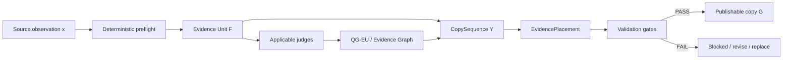
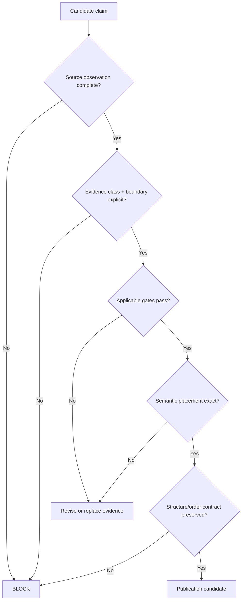

# Copywriting — Evidence-Grounded Publishing System

This repository is the evidence, copywriting, validation, and publication workspace for `mickael-umt.com`.

Its purpose is not to store persuasive text in isolation. It binds every evidence-bearing claim to its source, epistemic status, offer boundary, page semantics, placement target, validation state, and publication decision.

The governing execution model is **DEVICEV**:

`DOMAIN → END GOAL → VARIABLES → INSTRUCTIONS → CONSTRAINTS → EXAMPLES → VALIDATION CRITERIA`

The canonical operational policy is defined in [`.skills/devicev-evidence-copywriting/SKILL.md`](.skills/devicev-evidence-copywriting/SKILL.md). NeoFort remains the policy source of truth; the repository stores reproducible artifacts, contracts, validation outputs, and publication candidates.

## Core model



The canonical transformations are:

```text
x = variable + value + unit + population/workload + period + source
F = f(x, uncertainty, boundary, source identity, evidence class)
G = g(Y, F)
```

Where:

- `x` is an atomic, source-verifiable observation;
- `F` is a bounded Evidence Unit;
- `Y` is the target CopySequence: buyer question, semantic role, assertion class, CTA intent, and exact placement;
- `G` is publication-ready copy only when the evidence entails the factual premises of the copy.

## Fail-closed publication contract

A factual substitution is **not publishable by default**.

Publication requires, at minimum:

1. complete measurement identity for quantitative claims;
2. verified source identity and traceable extract/origin artifact;
3. explicit epistemic class (`OBSERVED`, `DERIVED`, `FORECAST`, `PLANNED`, etc.);
4. deterministic preflight success;
5. all applicable evidence/judge hard gates passing;
6. no unsupported causal, predictive, generalized, or commercial inference;
7. explicit consulting-offer and capability boundary;
8. semantic fit with the target buyer question and copy sequence;
9. an unambiguous page/section/component target;
10. an XPath or equivalent locator resolving to exactly one intended DOM anchor when placement is DOM-bound.

The system separates evidence that supports an **external effect** from evidence that supports a **recommendation or implementation choice**. One must never be silently substituted for the other.

## Repository map

| Path | Role |
|---|---|
| [`.skills/`](.skills/) | Canonical execution skills and embedded policy snapshots, including DEVICEV. |
| [`contracts/`](contracts/) | Machine-readable schemas and structural locks. |
| [`expertises/`](expertises/) | Evidence, avatar, validation, copy, and page-specific artifacts by expertise. |
| [`pages/`](pages/) | Page snapshots and page-level working artifacts. |
| [`publish/`](publish/) | Publication candidates that have reached the publish workflow. |
| [`engagement/`](engagement/) | Engagement/copy artifacts outside expertise-page scope. |
| [`neo4j/`](neo4j/) | Knowledge-graph related artifacts, exports, or mappings. |
| [`src/`](src/) | Reusable implementation code. |
| [`scripts/`](scripts/) | Reproducible automation and transformation scripts. |
| [`tools/`](tools/) | Supporting utilities. |
| [`tests/`](tests/) | Deterministic and regression tests for contracts and transformations. |
| [`reports/`](reports/) | Audits and generated validation reports. |
| [`examples/`](examples/) | Reference examples and fixtures. |
| [`.github/`](.github/) | CI/CD and repository automation. |

## Contracts

Current machine-readable contracts include:

- [`contracts/qgeu-v2.schema.json`](contracts/qgeu-v2.schema.json) — schema contract for QG-EU / graph-evidence artifacts.
- [`contracts/blockchain-offer-structure-lock.json`](contracts/blockchain-offer-structure-lock.json) — structural lock for the Blockchain offer page. The page structure is a contract: commercial copy may evolve without silently changing the locked section topology.

Structural ordering is treated as data, not presentation trivia. When an ordering contract exists, downstream generation, validation, and publication must preserve it unless the owner contract is explicitly updated first.

## Evidence semantics

Quantitative evidence must identify enough dimensions to make the measurement unique. Typical required fields are:

```text
variable
value
unit
denominator (when applicable)
population or workload
geography (when applicable)
period / evidence_date
measurement_context
sample_size (when applicable)
metric_definition
statistic_type
uncertainty / missingness
source identity + locator
```

Derived metrics must additionally carry their formula, input observation IDs, assumptions, dimensional consistency, and reproducible computation.

Charts and graph-based evidence are **proof-carrying artifacts**: their source observations and transformation inputs must be retained so the visualization can be regenerated rather than treated as a detached image.

## Evidence classes

The repository uses explicit epistemic typing. Typical classes include:

`OBSERVED · DESCRIPTIVE · COMPARATIVE · DERIVED · ESTIMATED · PLANNED · FORECAST · HYPOTHESIS · NORMATIVE · ASSOCIATIONAL · CAUSAL · PREDICTIVE`

Rhetoric must not upgrade the evidence class. Examples:

- a roadmap target is `PLANNED`, not automatically a `FORECAST`;
- a computed ratio is `DERIVED`, not source-observed;
- an association is not evidence of `CAUSAL` effect.

## Copy placement model

Evidence is selected for decision relevance, not for statistical density.

A placement should bind at least:

```text
page → section → component → subcomponent → CopySequence
                                      ↓
                              buyer question
                              semantic role
                              assertion class
                              EvidenceUnit / QG-EU
                              target locator
```

This allows copy to remain commercially useful while maintaining traceability from the visible claim back to the observation and source document.

## Blockchain page

The Blockchain expertise workspace currently contains both commercial/macro evidence and technical evidence artifacts.

Key references:

- [`expertises/blockchain/macro-micro-economic-eu-placement-v2.md`](expertises/blockchain/macro-micro-economic-eu-placement-v2.md) — macro/microeconomic Evidence Unit placement for sales-copy decisions.
- [`expertises/blockchain/eu-placement-audit-v1.md`](expertises/blockchain/eu-placement-audit-v1.md) — earlier technical evidence audit covering throughput, latency, proof, security, and cryptographic considerations.
- [`expertises/blockchain/blockchain_avatar_copywriting_devicev_v1.json`](expertises/blockchain/blockchain_avatar_copywriting_devicev_v1.json) and its HTML review artifact — DEVICEV-grounded avatar/copy candidate artifacts.
- [`contracts/blockchain-offer-structure-lock.json`](contracts/blockchain-offer-structure-lock.json) — authoritative section/topology lock for the offer structure.

For commercial copy, economic and decision-value evidence should lead when it better answers the buyer question; technical evidence remains available as the bounded proof layer. Neither layer authorizes claims outside the demonstrated capability boundary.

## Working rule



**Default posture: `FAIL_CLOSED`.** Missing provenance, ambiguous metrics, unsupported inference, failed gates, or structural drift are reasons to block publication rather than weaken the contract.