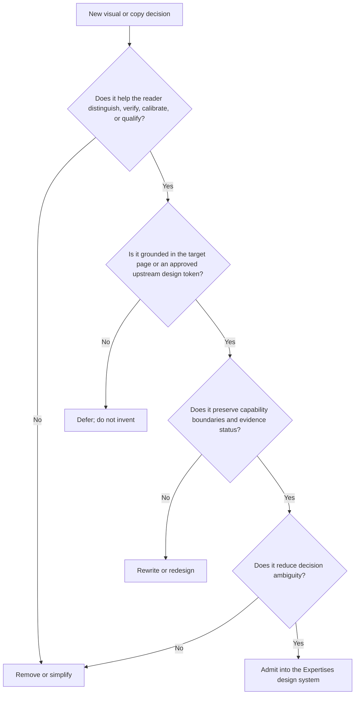

# Expertises — Brand Vibe Report

## Overview

### Source lock

This document is specific to `https://mickael-umt.com/expertises/` and treats that page as the semantic source of truth. It is a pre-visual brand foundation: it defines what the page must *feel like* before choosing concrete colors, typefaces, spacing scales, radii, shadows, or component skins.

The page’s core proposition is not “many technical skills.” It is **distinct specialist capabilities organized into one inspectable delivery chain**. The interface repeatedly moves the reader from breadth to discrimination: categories → expertise cards → capability ranking → evidence → market benchmarks → engagement. The brand therefore has to make complexity feel legible without flattening it into generic consultancy language.

### One Emotion Sentence

**“I can inspect the reasoning before I commit.”**

That is the emotional anchor for this page. The desired reaction is not excitement, prestige, or futurism. It is **controlled confidence**: the reader should feel that the offer landscape is broad, but the distinctions, evidence, limits, and next decision are visible enough to evaluate without surrendering judgment.

### Emotional identity

The page should feel like a **technical decision room with the evidence already on the table**.

Its dominant emotional qualities are:

- **Legibility under complexity.** AI, data, security, blockchain, regulated health, training, and marketing engineering coexist, but they are not presented as an undifferentiated “full-stack” claim. Each expertise has a bounded role and stack.
- **Accountability before persuasion.** Capability scores, evidence units, proof links, market references, and explicit decision routes signal that the reader is expected to verify rather than merely believe.
- **Operational calm.** The site should not feel like a launch page promising transformation at all costs. It should feel usable by someone who has to justify a choice to engineering, procurement, quality, leadership, or another accountable stakeholder.
- **Technical range without identity dilution.** Breadth is credible only when every branch reconnects to the same delivery logic: observable systems, traceable decisions, controlled promotion, verifiable evidence, or measurable adoption.
- **Bounded confidence.** The voice can be decisive about process, architecture, and evidence while remaining explicit about scope, uncertainty, and what still requires human or organizational judgment.

### Emotional arc of the page

The intended emotional progression is:

**uncertainty → orientation → discrimination → verification → economic calibration → controlled next step**.

The reader first sees a wide capability surface. The design then reduces ambiguity by grouping the offers, making each outcome explicit, exposing comparative capability evidence, showing market reference points, and finally offering qualification rather than forcing a premature purchase decision.

This means the page should avoid any visual or verbal move that jumps directly from “many capabilities” to “buy now.” The brand earns momentum by making the reader’s decision model progressively more precise.

### Ideal client avatar — inner world, not demographics

The ideal reader is an **accountable evaluator of technical work**. They may sit in engineering, data, security, regulated operations, product, procurement, transformation, or a hybrid role, but their shared inner state is more important than their job title.

They are likely thinking:

- “I need to know which capability actually owns this problem.”
- “I do not want a generalist claim that collapses AI, data, security, blockchain, and regulated work into one vague promise.”
- “I need enough evidence to defend this choice internally.”
- “I need to separate demonstrated capability from adjacent capability.”
- “I want a path from technical scope to commercial format without losing traceability.”
- “I do not need certainty everywhere; I need uncertainty to be visible and bounded.”

Their desired emotional state is **decision readiness**. They should leave the page with fewer hidden assumptions, clearer category boundaries, and a concrete next action that preserves their autonomy.

### Founder signal

The founder presence conveyed by this page is best described as **operator + systems cartographer + evidence custodian**.

The page does not ask the reader to trust charisma or a lifestyle narrative. It foregrounds the work itself: technical stacks, documented capability rankings, evidence links, experience, certificates, calculation methods, and market benchmarks. That creates a founder signal of someone who prefers to make the operating model inspectable.

The founder energy should therefore remain:

- close enough to the work to speak in mechanisms, constraints, stacks, and acceptance conditions;
- broad enough to connect previously separate domains into one delivery system;
- skeptical of unsupported certainty;
- comfortable exposing how a conclusion, score, or price reference was constructed;
- commercially useful without switching into high-pressure sales theatre.

The founder should feel present through **method and traceability**, not through oversized personal imagery or personality-first storytelling on this page.

### Voice

The voice is **precise, evidence-aware, operational, and buyer-respecting**.

It should sound like a senior technical collaborator explaining a system to another accountable professional. It can use domain language because the page is explicitly about specialization, but jargon must always earn its place by improving discrimination or scope clarity.

Voice rules:

- Prefer **mechanism verbs**: transform, trace, verify, control, promote, measure, qualify, compare, reproduce, govern.
- Prefer **bounded outcomes** over abstract superlatives. “Make security a promotion condition” is stronger and more credible than “world-class AI security.”
- Name the **object being changed**: agents, data, decisions, workflows, evidence, permissions, signals, context, adoption.
- Keep **epistemic boundaries** visible: documented, published, reproducible, to confirm, evidence units, source, method.
- Use numbers only when the page can expose their meaning, population, time basis, unit, or method.
- Treat CTAs as **decision steps**, not pressure devices: compare, verify, qualify, diagnose, inspect, open.
- Avoid hype syntax: “revolutionary,” “cutting-edge,” “game-changing,” “unmatched,” “guaranteed transformation,” and similar language are off-brand unless independently and explicitly evidenced.

The preferred tonal ratio is roughly **70% technical clarity / 20% decision guidance / 10% restrained persuasion**.

### Information-design behavior

The brand is inseparable from how information is organized. On this page, information architecture is part of the emotional experience.

The interface should behave like a **progressive evidence graph** rather than a gallery of unrelated service cards:

1. **Orient** with the single delivery-chain thesis.
2. **Partition** the landscape into meaningful categories.
3. **Differentiate** expertises by outcome and stack, not decorative iconography alone.
4. **Expose evidence** when a claim becomes important to a decision.
5. **Show confidence and limits** instead of compressing all capabilities into the same visual weight.
6. **Calibrate commercially** with market references and a visible calculation method.
7. **Route the reader** to the smallest next action that reduces uncertainty.

Dense information is acceptable when the hierarchy is strong. Excessive whitespace that turns the page into a luxury-brand brochure would weaken the brand because it hides the site’s real advantage: inspectable technical structure.

### Visual direction before tokens

No concrete palette, font, spacing, radius, elevation, or component tokens are authorized by this artifact. However, the *semantic motif family* is already clear from the page subject and repository conventions:

- **chains / linked stages** for the “one delivery chain” thesis;
- **evidence ledgers / provenance trails** for proof-bearing claims;
- **ranked or calibrated marks** for capability confidence and market references;
- **bounded nodes** for distinct expertises that remain interoperable;
- **inspection surfaces** such as matrices, filters, comparisons, and traceable labels;
- **state transitions** from prototype → observable / controlled / exploitable, or dispersed data → traceable decision.

These are information motifs, not decoration. They should only appear when they encode a real relationship already present in the page content.

### Vibe strategy summary

The `/expertises/` brand should feel like **a sovereign technical catalogue that behaves as a decision instrument**.

It is not a conventional agency portfolio and not a CV converted into cards. Its distinctiveness comes from combining three layers in one surface:

**capability map → evidence map → engagement map**.

The emotional promise is that breadth will not create ambiguity. The reader can see where a problem belongs, what outcome each expertise owns, what evidence exists, how strong or limited that evidence is, how the market is calibrated, and what to do next.

A successful future visual system should make the reader think: **“This is complex, but I can interrogate it.”**

### Implementation decision graph

## Do's and Don'ts

- **Do** make distinctions between expertises immediately scannable by outcome, scope, and stack.
- **Do** let proof, confidence, provenance, and calculation logic appear close to the decision they support.
- **Do** use comparison, filtering, ranking, and matrix structures when they reduce ambiguity.
- **Do** preserve the sense that multiple specialties reconnect to one delivery chain.
- **Do** make uncertainty, missing proof, or “to confirm” states visually legitimate rather than hiding them.
- **Do** treat qualification as a service to the reader: the next step should reduce uncertainty before commitment.
- **Don't** turn every expertise into the same card with only a different icon or accent.
- **Don't** use futuristic AI imagery, generic dashboards, glowing networks, shields, chains, or medical motifs unless the graphic encodes a real page concept.
- **Don't** use founder portraiture as the dominant trust mechanism on this index; method and evidence should carry trust first.
- **Don't** let commercial pricing or market benchmarks visually imply guaranteed earnings, outcomes, or project economics.
- **Don't** collapse observed evidence, derived scores, market references, plans, and claims into one undifferentiated “proof” style.
- **Don't** introduce concrete color, typography, spacing, radius, depth, or component tokens until a canonical upstream source is available and can be referenced rather than guessed.
