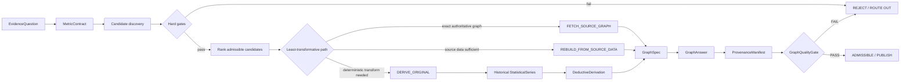

# Question-Driven Graph Evidence Unit (QG-EU) v2

QG-EU v2 is a fail-closed contract for retrieving or producing quantitative graphics that answer a bounded question from historical evidence.

Canonical relation:

`QGEU = f(Q, MetricContract, AdmissibleEvidence, DeterministicDerivation, GraphSpec, Provenance)`

A deductive QG-EU may emit only `OBSERVED` or `DERIVED_DETERMINISTIC`. `MODELLED`, `FORECAST` and `SCENARIO` outputs must route to another evidence type.

## Core invariant

Every historical observation is atomic:

`x_t = (value, unit, population, geography, period, source)`

A historical series is:

`S = {x_1, ..., x_n}`

A derived series or scalar is admitted only if:

`D = phi(S)`

where `phi` is explicit, deterministic, versioned and reproducible.

## Production modes

1. `FETCH_SOURCE_GRAPH`: an authoritative source already publishes a graph that answers the question exactly.
2. `REBUILD_FROM_SOURCE_DATA`: authoritative source data exists and only the rendering is rebuilt.
3. `DERIVE_ORIGINAL`: the answer requires a deterministic transformation of historical observations.
4. Otherwise: `ROUTE_OUT`; do not silently fit or forecast a model.

Selection follows a minimum-transformation principle:

`FETCH_SOURCE_GRAPH > REBUILD_FROM_SOURCE_DATA > DERIVE_ORIGINAL > ROUTE_OUT`

## Hard gates

Hard gates are evaluated before ranking. A candidate that fails one hard gate is not scored.

1. Question is machine-resolvable.
2. Metric identity is explicit: subject, variable, statistic type, unit, population, geography and time semantics.
3. Candidate source is admissible.
4. Every observed point has exact provenance.
5. Definitions are stable or explicitly harmonized.
6. Units and dimensions are valid for the declared transformation.
7. Population/geography and periods are comparable.
8. Missingness is explicit; no silent interpolation or imputation.
9. Deduction is deterministic and reproducible.
10. No hidden fitted model, forecast or extrapolation.
11. No causal language from descriptive arithmetic alone.
12. Rendering preserves graphical integrity.
13. Observed and derived values are distinguishable.
14. Uncertainty is not invented.
15. The answer is entailed by admitted data plus declared derivation.
16. Provenance fingerprints are complete.

## Candidate ranking

Only candidates that pass every hard gate may be ranked:

`score = 30*semantic + 20*population_geography + 15*temporal + 15*authority + 10*completeness + 10*reproducibility`

Each component is normalized to its weight; the result is 0-100.

## Rendering rule

The visual encoding must not imply observations that do not exist. In particular, two historical endpoints should normally be rendered as a slope/dot comparison rather than a continuous time-series line unless intermediate observations are present.

## Relationship to Evidence Units

QG-EU is a specialized Evidence Unit for quantitative questions. It can support copy, claims or placements, but it is valid independently of copywriting. The graph is a projection of the admitted evidence, not the evidence source itself.

## CI contract

Repository CI validates every `*.qgeu.json` under `examples/qgeu/`. The gate is deterministic and network-independent. Live source-availability checks should remain a separate non-deterministic check so historical evidence remains reproducible if an external website changes.
