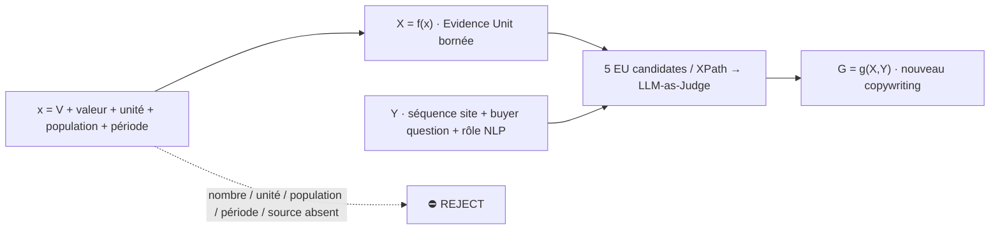

# `/expertises/blockchain/` — Evidence Unit Placement audit v1

Page source of truth: `https://mickael-umt.com/expertises/blockchain/`  
Offer: **Blockchain & Verifiable Computing**  
Promise currently published: **« Relier les affirmations, décisions et exécutions à des preuves vérifiables. »**  
Audit date: **2026-08-31**  
NeoFort audit id: `audit:blockchain:eup:2026-08-31:v1`  
Judge: `judge:evidence-unit:champion-v2` · `LLM_AS_JUDGE` · fail-closed · `EU-CHAMPION-100-v1`

## Admission contract

Une proposition n'est pas considérée comme publiable simplement parce qu'elle a gagné le Judge. Le XPath a été dérivé du rendu public courant par ancrage textuel ; le connecteur utilisé ici ne fournit pas le DOM brut permettant de calculer un `xpath_match_count`. NeoFort marque donc les gagnants `SELECTED_BY_LLM_JUDGE__PENDING_DOM_XPATH_VERIFICATION`.

## Capabilities qui bornent l'offre

| Capability | Score public | Preuve exploitable pour l'offre | Stack / frontière | Conséquence copywriting |
|---|---:|---|---|---|
| Solidity & EVM | #5 · 66/100 · high | Lottery dApp : **26/29 commits** attribués à RickOwri, contribution substantielle sur un fork ; Tokenized Voting Backend : dépôt **non forké**, 4 commits attribués | Solidity · EVM · TypeScript · ethers.js · Hardhat/Foundry | Autorise une offre de smart-contract delivery + tests, sans présenter le bootcamp fork comme création initiale. |
| Rust | #6 · 65/100 · high | Folder Mapper : dépôt **non forké**, **7/7 commits**, Rust | Rust · CLI · filesystem · SQLite | Autorise l'argument d'outillage système et d'intégration Rust ; ne prouve pas à lui seul une production blockchain Rust. |
| Solana | #13 · 42/100 · to-confirm | Certificat Solana Bootcamp ; preuve de dépôt public substantielle à compléter | Solana · Rust · Anchor · account model · TypeScript | À vendre comme capacité encadrée / prototype ; pas comme track-record production équivalent à Solidity. |
| ZK / ZKML | #16 · 34/100 · to-confirm | ZK Bootcamp + zkML Bootcamp ; R&D privacy-preserving ML 2024–présent | ZK proofs · ZKML · EZKL · attestations · selective disclosure | Offre crédible en **R&D/prototypage vérifiable**, pas comme garantie de système ZK production déjà opéré. |

`RickOwri/yield-sol` est volontairement exclu de cette preuve : GitHub le signale comme **fork**, et ce batch n'a pas établi une contribution substantielle suffisante pour satisfaire la règle `/git`.

## Placements sélectionnés — 6 séquences commerciales

| # | XPath text-anchored | Buyer question · rôle NLP | Séquence source (avant) | EU retenue · x atomique | Proposition `G=g(X,Y)` | Judge |
|---:|---|---|---|---|---|---|
| 1 | `//main//h1[normalize-space(.)="Ancrez on-chain ce qu’un tiers doit vérifier, jamais ce qu’il suffit de stocker."]` | **Dois-je réellement mettre cette propriété on-chain ?** · category positioning / anti-maximalism | « Ancrez on-chain ce qu’un tiers doit vérifier, jamais ce qu’il suffit de stocker. » | `EU-BLOCKBENCH-LATENCY-SPREAD-2017` · **V=latency spread; 30.67×; YCSB; 8 clients + 8 serveurs; 2017** | **Commencez par la propriété à prouver, pas par la chaîne : dans BLOCKBENCH, sur 8 clients et 8 serveurs, la latence YCSB variait d’environ ×30,7 entre les implémentations testées. J’ancre on-chain uniquement ce qui exige un engagement public partagé ; le reste demeure dans un mécanisme vérifiable plus simple.** | 97/100 · hard gate PASS · semantic fit 0.97 |
| 2 | `//main//*[self::p or self::li][normalize-space(.)="Un partenaire doit vérifier une affirmation sans avoir accès aux données qui la fondent."]` | **Un tiers peut-il vérifier sans recevoir le secret ?** · problem recognition | « Un partenaire doit vérifier une affirmation sans avoir accès aux données qui la fondent. » | `EU-ZKSA-VERIFY-2021` · **V=ZK verification latency; 1.4 ms/proof; programme 2,000 lignes; CCS 2021** | **Vérifier ne signifie pas divulguer : à ACM CCS 2021, une preuve zero-knowledge de contrôle de flux sur un programme de 2 000 lignes se vérifiait en 1,4 ms sans révéler le programme. Le cadrage choisit ensuite attestation, engagement Merkle ou ZK selon la propriété et le secret à préserver.** | 92/100 · PASS · fit 0.99 |
| 3 | `//main//*[self::p or self::div][contains(normalize-space(.),"Signer les exports ne suffit pas") and contains(normalize-space(.),"réécriture de l’historique")]` | **Comment prouver qu'un historique n'a pas été réécrit ?** · objection reframe | « Signer les exports ne suffit pas : une signature atteste d’un fichier, pas de l’absence de réécriture de l’historique. » | `EU-CROSBY-PROOF-VERIFY-2009` · **V=proof verification throughput; ~9,000 proofs/s; tamper-evident log prototype; USENIX 2009** | **Une signature d’export ne prouve pas à elle seule la continuité de l’historique. Dans l’évaluation USENIX 2009 de journaux tamper-evident, la vérification atteignait environ 9 000 preuves incrémentales ou d’appartenance par seconde ; je sépare donc signature d’objet, engagement d’état et preuve de continuité.** | 98/100 · PASS · fit 0.99 |
| 4 | `//main//*[self::p or self::div][contains(normalize-space(.),"Qui signe, qui révoque") and contains(normalize-space(.),"perte ou de départ")]` | **Que se passe-t-il lorsque la clé, le signataire ou l'autorité change ?** · operational risk | « Qui signe, qui révoque, qui récupère l’accès en cas de perte ou de départ ? … » | `EU-AFT-KEY-RECOVERY-CORPUS-2026` · **V=synthesis corpus; 77 papers/systems; 118 discovered; AFT 2026** | **La gouvernance d’une clé est un workflow explicite : la SoK AFT 2026 part d’un corpus de 118 articles et retient 77 systèmes pour montrer que « recovery » peut signifier reconstruction, réémission, migration d’autorité ou transfert d’actifs. Avant déploiement, je spécifie perte, révocation, départ, seuils, délai et état post-récupération.** | 90/100 · PASS · fit 0.99 |
| 5 | `//main//*[self::p or self::div][contains(normalize-space(.),"La plupart des projets blockchain paient pour stocker") and contains(normalize-space(.),"frontière claim/evidence")]` | **Quelle différence matérielle vient du mécanisme choisi ?** · value differentiator | « La plupart des projets blockchain paient pour stocker ce qu’aucun tiers ne vérifiera jamais… » | `EU-BLOCKBENCH-THROUGHPUT-SPREAD-2017` · **V=throughput spread; 28.29×; 45–1,273 tx/s; YCSB; 8+8; 2017** | **Le choix de mécanisme change matériellement le coût d’exécution : dans BLOCKBENCH, sur 8 clients et 8 serveurs, le débit YCSB allait de 45 à 1 273 tx/s — ×28,3 entre les plateformes testées. Le cadrage part donc du claim à rendre vérifiable et accepte « pas de blockchain » comme résultat.** | 97/100 · PASS · fit 0.99 |
| 6 | `//main//*[self::p or self::div][contains(normalize-space(.),"La preuve va on-chain") and contains(normalize-space(.),"donnée confidentielle reste off-chain")]` | **Peut-on garder la donnée privée tout en rendant une propriété vérifiable ?** · mechanism explanation | « La preuve va on-chain, la donnée confidentielle reste off-chain. » | `EU-JISA-BBS-VERIFY-2024` · **V=BBS presentation verification latency; 2.136 ms; credentials ≤33 attributs; Ryzen 7 5800X; 2024** | **La confidentialité peut rester hors chaîne sans rendre la vérification théorique : sur des credentials de jusqu’à 33 attributs, l’évaluation JISA 2024 mesure environ 2,14 ms pour vérifier une présentation BBS sur CPU desktop. Je publie seulement l’engagement ou la preuve nécessaire ; les attributs non requis restent non divulgués.** | 91/100 · PASS · fit 0.99 |

## Les 5 EU évaluées avant sélection, pour chaque XPath

Chaque ligne ci-dessous a été matérialisée comme `EvidenceCandidateMatch` et `EvidencePlacement` dans NeoFort. Le rang 1 est le gagnant ; les 4 autres restent traçables comme candidats jugés mais non sélectionnés.

| Seq | Rang | Evidence Unit | x = V · valeur · unité · population · période | Source primaire ouverte | Score Judge | Fit |
|---|---:|---|---|---|---:|---:|
| Hero | 1 | `EU-BLOCKBENCH-LATENCY-SPREAD-2017` | latency spread · **30.67 · ×** · YCSB, 8 clients/8 serveurs, 3 plateformes · 2017 | https://www.comp.nus.edu.sg/~ooibc/blockbench.pdf | 97 | .97 |
| Hero | 2 | `EU-BLOCKBENCH-THROUGHPUT-SPREAD-2017` | throughput spread · **28.29 · ×** · même benchmark · 2017 | https://www.comp.nus.edu.sg/~ooibc/blockbench.pdf | 97 | .95 |
| Hero | 3 | `EU-CROSBY-LOG-INSERT-2009` | insertion throughput · **66,000 · events/s** · tamper-evident log prototype · 2009 | https://static.usenix.org/events/sec09/tech/full_papers/crosby.pdf | 98 | .91 |
| Hero | 4 | `EU-CONIKS-AUDIT-OVERHEAD-2015` | audit bandwidth · **2.5 · kB/provider/day** · CONIKS collective audit · 2015 | https://www.usenix.org/conference/usenixsecurity15/technical-sessions/presentation/melara | 97 | .89 |
| Hero | 5 | `EU-JISA-BBS-VERIFY-2024` | BBS verify · **2.136 · ms/presentation** · credentials ≤33 attrs · 2024 | https://iris.unitn.it/handle/11572/438150 | 91 | .82 |
| Verify without disclosure | 1 | `EU-ZKSA-VERIFY-2021` | verifier latency · **1.4 · ms/proof** · 2,000-line control-flow analysis · 2021 | https://david.darais.com/assets/papers/zk-sa/zk-sa.pdf | 92 | .99 |
| Verify without disclosure | 2 | `EU-ZKSA-PROOF-SIZE-2021` | proof size · **128 · bytes/proof** · même programme · 2021 | https://david.darais.com/assets/papers/zk-sa/zk-sa.pdf | 92 | .98 |
| Verify without disclosure | 3 | `EU-JISA-BBS-VERIFY-2024` | BBS verify · **2.136 · ms/presentation** · credentials ≤33 attrs · 2024 | https://iris.unitn.it/handle/11572/438150 | 91 | .94 |
| Verify without disclosure | 4 | `EU-CURVETREES-PROOF-SIZE-2023` | membership proof size · **2.9 · kB/proof** · set 2^40, 128-bit security · 2023 | https://www.usenix.org/conference/usenixsecurity23/presentation/campanelli | 93 | .92 |
| Verify without disclosure | 5 | `EU-ZKCNN-VERIFY-2021` | verifier latency · **59.3 · ms/proof** · VGG16 15M params/16 layers · 2021 | https://eprint.iacr.org/2021/673 | 90 | .83 |
| History | 1 | `EU-CROSBY-PROOF-VERIFY-2009` | proof verify throughput · **9,000 · proofs/s** · authenticated log prototype · 2009 | https://static.usenix.org/events/sec09/tech/full_papers/crosby.pdf | 98 | .99 |
| History | 2 | `EU-CROSBY-LOG-INSERT-2009` | log insertion · **66,000 · events/s** · prototype · 2009 | idem | 98 | .97 |
| History | 3 | `EU-CONIKS-AUDIT-OVERHEAD-2015` | collective audit · **2.5 · kB/provider/day** · key transparency · 2015 | https://www.usenix.org/conference/usenixsecurity15/technical-sessions/presentation/melara | 97 | .94 |
| History | 4 | `EU-CONIKS-LOOKUP-SIZE-2015` | lookup proof · **1,216 · bytes/lookup** · 10M-user server evaluation · 2015 | idem | 97 | .90 |
| History | 5 | `EU-BLOCKBENCH-LATENCY-SPREAD-2017` | latency spread · **30.67 · ×** · YCSB 8+8 · 2017 | BLOCKBENCH PDF | 97 | .70 |
| Key governance | 1 | `EU-AFT-KEY-RECOVERY-CORPUS-2026` | synthesis corpus · **77 · papers** · 118-paper discovery corpus · 2026 | https://zenodo.org/records/21837559 | 90 | .99 |
| Key governance | 2 | `EU-WALLET-INCIDENTS-2025` | incident count · **85 · incidents** · wallet/exchange incidents 2012–2025 · published 2025 | https://discovery.ucl.ac.uk/id/eprint/10220647 | 92 | .94 |
| Key governance | 3 | `EU-ZEUS-VULNERABLE-SHARE-2018` | contracts flagged · **94.6 · %** · 22,493-contract historical corpus · 2018 | https://research.ibm.com/publications/zeus-analyzing-safety-of-smart-contracts | 94 | .82 |
| Key governance | 4 | `EU-ETH-BYTECODE-SKELETONS-2024` | dataset size · **248,328 · contract skeletons** · 48M deployed contracts reduced by skeleton · paper 2024 | https://link.springer.com/article/10.1007/s10664-023-10414-8 | 91 | .76 |
| Key governance | 5 | `EU-CONIKS-AUDIT-OVERHEAD-2015` | audit bandwidth · **2.5 · kB/provider/day** · key-transparency auditor · 2015 | CONIKS | 97 | .72 |
| Mechanism before platform | 1 | `EU-BLOCKBENCH-THROUGHPUT-SPREAD-2017` | throughput spread · **28.29 · ×** · 45–1,273 tx/s, YCSB 8+8 · 2017 | BLOCKBENCH PDF | 97 | .99 |
| Mechanism before platform | 2 | `EU-BLOCKBENCH-LATENCY-SPREAD-2017` | latency spread · **30.67 · ×** · YCSB 8+8 · 2017 | BLOCKBENCH PDF | 97 | .98 |
| Mechanism before platform | 3 | `EU-CROSBY-LOG-INSERT-2009` | log insertion · **66,000 · events/s** · authenticated log · 2009 | Crosby/Wallach PDF | 98 | .91 |
| Mechanism before platform | 4 | `EU-CONIKS-AUDIT-OVERHEAD-2015` | audit bandwidth · **2.5 · kB/provider/day** · key transparency · 2015 | CONIKS | 97 | .86 |
| Mechanism before platform | 5 | `EU-JISA-BBS-VERIFY-2024` | selective disclosure verify · **2.136 · ms** · ≤33 attrs · 2024 | JISA open record | 91 | .82 |
| Selective disclosure | 1 | `EU-JISA-BBS-VERIFY-2024` | BBS verification · **2.136 · ms/presentation** · ≤33 attrs · 2024 | https://iris.unitn.it/handle/11572/438150 | 91 | .99 |
| Selective disclosure | 2 | `EU-CURVETREES-PROOF-SIZE-2023` | ZK membership proof · **2.9 · kB** · set 2^40 · 2023 | USENIX | 93 | .97 |
| Selective disclosure | 3 | `EU-ZKSA-VERIFY-2021` | ZK verification · **1.4 · ms** · 2,000-line program · 2021 | CCS open author PDF | 92 | .91 |
| Selective disclosure | 4 | `EU-ZKSA-PROOF-SIZE-2021` | ZK proof · **128 · bytes** · 2,000-line program · 2021 | CCS open author PDF | 92 | .89 |
| Selective disclosure | 5 | `EU-ZKCNN-VERIFY-2021` | ZKML verification · **59.3 · ms** · VGG16 15M params · 2021 | IACR ePrint | 90 | .75 |

## Judge — règles appliquées

Le Judge n'a pas sélectionné l'EU au score global maximal mécaniquement. Le score de recherche est combiné à la proximité sémantique `X↔Y`. Exemple : pour **Key governance**, `EU-CONIKS-AUDIT-OVERHEAD-2015` score 97 globalement mais ne vaut que `.72` de semantic fit ; la SoK AFT 2026 score 90 mais vaut `.99` et traite directement de recovered object, recovery semantics, authority migration et post-recovery state. Elle gagne donc cette séquence.

Les métriques ne doivent jamais être transformées en promesses de résultat client. BLOCKBENCH est un benchmark 2017 de configurations précises ; Crosby/Wallach est un prototype 2009 ; ZKSA et zkCNN sont des prototypes de recherche ; JISA mesure des credentials, pas le coût on-chain ; les 85 incidents wallet sont hétérogènes et **ne peuvent pas être attribués intégralement à la gouvernance de clés**.

## Offres effectivement défendables à partir de `/cv` + `/git`

| Offre productisable sur cette landing page | Preuve capability | Niveau de revendication conseillé |
|---|---|---|
| **Verification Fit / on-chain vs off-chain assessment** | Solidity/EVM + Rust + privacy/ZK + expérience data/evidence | **Fort** : le résultat peut explicitement être « pas de blockchain ». |
| **Smart-contract delivery + independent verifier** | Lottery dApp 26/29 commits + Voting Backend non-forké + Solidity certificates | **Fort à borné** : delivery et tests, mais pas « audit formel indépendant ». |
| **Selective-disclosure / ZK prototype** | ZK + zkML certificates, privacy-preserving ML R&D, EZKL | **R&D / prototype** : ne pas présenter comme historique production ZK à grande échelle. |
| **Key-governance & recovery design** | smart-contract design, multisig/account abstraction vocabulary, security/assurance capabilities | **Architecture / governance** : écrire les états, seuils, révocation, recovery et handover ; ne pas promettre prévention d'incident. |
| **Verifiable AI / attestations** | intersection AI systems + provenance/evidence + ZK/ZKML | **Différenciateur transversal** : à vendre quand la propriété à prouver concerne un calcul ou une exécution AI/data. |

## Corrections de provenance recommandées sur le copywriting existant

La phrase **« Lottery dApp développée à 90 % »** doit être préférentiellement remplacée par **« 26 commits sur 29 attribués à RickOwri sur le fork audité »**. `26/29 = 89.7 %` mesure une part de commits, pas une part du code ou de la conception. Le backend de vote peut être présenté comme dépôt non forké, tandis que Solana et ZK/ZKML doivent rester explicitement certificat/R&D tant qu'une preuve publique d'implémentation plus forte n'est pas reliée au CV.

## État NeoFort après matérialisation

- 6 séquences `CopySequence` auditées dans ce batch.
- 5 `EvidenceCandidateMatch` par séquence = **30 matches**.
- 5 `EvidencePlacement` par séquence = **30 placements**.
- 6 `CopyRewriteProposal` sélectionnées.
- 15 Evidence Units quantitatives distinctes materialisées/réutilisées dans les 30 positions.
- Toutes les EU candidates ont `quant_variable`, `quant_value`, `quant_unit`, `population`, `period`, source primaire et boundary.
- Les 6 gagnants sont `PENDING_DOM_XPATH_VERIFICATION`, pas `PUBLISHED`.
