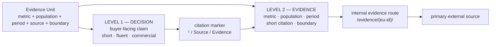
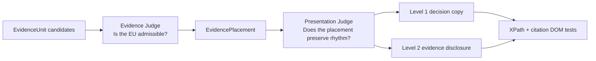
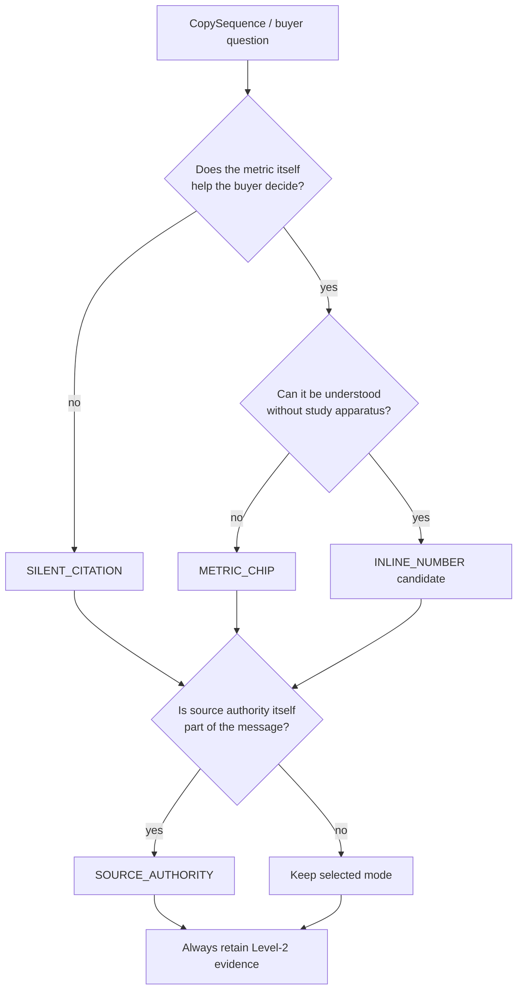

# `/expertises/blockchain/` — Evidence presentation & citation layer v2

Target page: `https://mickael-umt.com/expertises/blockchain/`  
Purpose: keep the commercial rhythm of the landing page while preserving claim-level Evidence Unit traceability.  
Inputs: `eu-placement-audit-v1.md` (Technical POV), `macro-micro-economic-eu-placement-v2.md` (Strategic POV), `governance-eu-placement-v1.md` (Governance POV).  
Status: design/presentation policy; EvidenceUnit admission rules remain unchanged.

## 1. Problem diagnosis

The current EvidenceUnit system is strong at **selection and provenance** but weak at **presentation**.

Current rewrites frequently inject, in the same sentence, the source institution, venue, sample, period, metric and inference. This makes the evidence visible, but it also changes the sentence from buyer-oriented copy into a compressed research abstract.

Examples of the structural problem:

- `Dans BLOCKBENCH, sur 8 clients et 8 serveurs...`
- `Selon Huang et al. (USENIX Security 2026), plus de 63 %...`
- `La SoK AFT 2026 part d’un corpus de 118 articles et retient 77 systèmes...`
- `Le BIS estime à 390 Md$...`

The evidence is not the problem. **The evidence metadata is occupying the Level-1 narrative.**

The new rule is therefore:

> **Evidence must constrain the copy without necessarily appearing inside the copy.**

The landing page should present the decision first and disclose the evidence on demand.

## 2. Two levels of technicality



### Level 1 — Decision layer

Audience: CTO, Head of Product, Innovation, Operations, Risk, business decision-maker.

Level 1 answers:

- what should I decide?
- what risk or opportunity changes the decision?
- what does this offer do about it?

Level 1 should **not** read like a bibliography. Source author, venue, population and experimental apparatus are metadata unless the authority itself is commercially relevant.

### Level 2 — Evidence layer

Opened by hover/focus on desktop and tap on mobile.

It contains, in compact form:

1. the bounded metric;
2. population / measurement context;
3. period;
4. short bibliographic citation;
5. inference boundary;
6. internal `Voir l’EU` link;
7. external `Source primaire` link.

This preserves the full `X=f(x)` contract without making the buyer parse it in the main narrative.

## 3. Bibliographic and intra-web mechanism

### 3.1 Visible citation marker

Use a small superscript or evidence icon immediately after the factual claim:

`Un multisig fixe un seuil. La gouvernance définit l’autorité, l’exception et la reprise. ⁵`

The rendered number is positional. The stable machine identity remains the `eu_id`.

Recommended DOM contract:

```html
<p data-claim-id="claim-multisig-governance">
  Un multisig fixe un seuil. La gouvernance définit l’autorité, l’exception et la reprise.
  <sup>
    <button
      class="evidence-citation"
      popovertarget="eu-bc-gov-05"
      data-eu-id="EU-BC-EIP7702-MALICIOUS-AUTH-2026"
      aria-label="Voir la preuve de ce claim">5</button>
  </sup>
</p>

<aside id="eu-bc-gov-05" popover role="note" class="evidence-popover">
  <strong>&gt;63 % des transactions d’autorisation observées</strong>
  <p>Population : activité EIP-7702 sur 7 blockchains étudiées.</p>
  <cite>Huang et al., USENIX Security, 2026.</cite>
  <p class="evidence-boundary">Ne mesure pas un taux de compromission des multisigs.</p>
  <a href="/evidence/EU-BC-EIP7702-MALICIOUS-AUTH-2026/">Voir l’EU</a>
  <a href="https://www.usenix.org/conference/usenixsecurity26/presentation/huang-mingyuan">Source primaire</a>
</aside>
```

Accessibility rule: the evidence must never be hover-only. `focus`, keyboard activation and mobile tap must expose the same content.

### 3.2 Internal evidence route

Create one canonical page per admitted EU:

`/evidence/{eu-id}/`

The internal page is the bibliographic bridge between commercial copy and primary research. It should expose:

- Evidence Unit ID;
- atomic observation `V + value + unit + population + period`;
- source title / author or institution / venue / year;
- DOI or canonical URL when available;
- exact support relation;
- inference boundary;
- Judge status and score;
- pages and claims using the EU;
- link to the primary source.

This creates **intra-web provenance**: the landing page cites an internal evidence object, which in turn cites the primary external source.

### 3.3 Collapsed bibliography

At the bottom of the landing page, add a collapsed block:

`Sources & méthodes (N)`

Each entry uses a short citation, e.g.:

`[5] Huang et al. — USENIX Security, 2026 · EU-BC-EIP7702-MALICIOUS-AUTH-2026`

The bibliography is generated from the actual EvidencePlacement graph, never handwritten independently.

## 4. Four rendering modes

A selected EU does **not** imply that its number must appear in the main prose.

| Mode | Level-1 treatment | Use when |
|---|---|---|
| `SILENT_CITATION` | fluent claim + superscript only | the evidence proves/supports the claim but the metric is not itself the buyer message |
| `METRIC_CHIP` | claim remains fluent; metric appears in a separate visual chip | the number has strong strategic salience but would break the sentence |
| `INLINE_NUMBER` | one bounded number is allowed inside the sentence | the metric itself answers the buyer question and needs almost no experimental context |
| `SOURCE_AUTHORITY` | institution/source may be named in Level 1 | the authority itself matters, e.g. regulator, central bank, formal standard |

Default: `SILENT_CITATION`.

`SOURCE_AUTHORITY` is an exception, not the default.

## 5. Proposed Level-1 copy for the 10 canonical blockchain sequences

The source metadata is intentionally removed from the main prose. The associated EU remains mandatory and visible through Level 2.

| Sequence | Level-1 buyer copy | Presentation mode | Level-2 EU |
|---|---|---|---|
| `seq:blockchain:hero:h1` | **Rendez les décisions et transactions vérifiables sans sur-construire l’infrastructure.** | `METRIC_CHIP` | `EU-MACRO-TOKENIZED-ASSETS-GROWTH-5X-2025-2026` |
| `seq:blockchain:proposition:mechanism` | **Le cadrage peut conclure à une blockchain, une attestation, une preuve ZK — ou à aucune blockchain. Je pars de la propriété à prouver, puis du mécanisme le plus simple qui la rend vérifiable.** | `METRIC_CHIP` | `EU-MACRO-TOKENIZED-ASSETS-23.3B-2026Q1` |
| `seq:blockchain:consequences:platform-first` | **Le choix de plateforme vient après le flux économique, les contreparties et la propriété à vérifier.** | `SILENT_CITATION` | `EU-MACRO-STABLECOIN-PAYMENT-390B-2025` |
| `seq:blockchain:consequence:key-governance` | **Les droits de signature, de révocation et de reprise sont spécifiés avant le déploiement — pas après l’incident.** | `SILENT_CITATION` | `EU-AFT-KEY-RECOVERY-CORPUS-2026` |
| `seq:blockchain:consequences:multisig-governance` | **Un multisig fixe un seuil. La gouvernance définit l’autorité, l’exception et la reprise.** | `SILENT_CITATION` | `EU-BC-EIP7702-MALICIOUS-AUTH-2026` |
| `seq:blockchain:consequence:history` | **Signer un fichier ne prouve pas la continuité de son historique.** | `SILENT_CITATION` | `EU-CROSBY-PROOF-VERIFY-2009` |
| `seq:blockchain:engagements:crypto-not-audit` | **Une preuve cryptographique démontre une propriété ; elle ne remplace ni audit, ni gouvernance, ni contrôle.** | `SILENT_CITATION` | current technical security-assurance EU |
| `seq:blockchain:functional:selective-disclosure` | **Rendez la propriété nécessaire vérifiable sans publier les données qui n’ont pas à l’être.** | `METRIC_CHIP` | `EU-JISA-BBS-VERIFY-2024` |
| `seq:blockchain:trigger:privacy` | **Un partenaire peut vérifier l’affirmation sans recevoir le secret qui la fonde.** | `SILENT_CITATION` | `EU-ZKSA-VERIFY-2021` |
| `seq:blockchain:resultats:independent-verifier` | **Le résultat reste vérifiable sans dépendre de l’opérateur qui l’a produit.** | `SILENT_CITATION` | `EU-MACRO-APPIA-PARTICIPANTS-61-2026`, pending governance challenger review |

The two legacy aliases remain aliases and must not create extra public citation markers.

## 6. Level-2 evidence payload examples

### Hero — strategic evidence chip

Level 1:

> **Rendez les décisions et transactions vérifiables sans sur-construire l’infrastructure.** ¹

Visible chip below or beside the copy:

> **×5** — actifs traditionnels tokenisés sur blockchains publiques, T1 2025 → T1 2026

Level 2:

- EU: `EU-MACRO-TOKENIZED-ASSETS-GROWTH-5X-2025-2026`
- Source: ECB, 2026.
- Observation: approximately 5× growth from EUR 4.7bn to EUR 23.3bn between Q1 2025 and Q1 2026.
- Boundary: growth from a small base; does not prove that blockchain is the correct architecture for a given project.

### Key governance

Level 1:

> **Les droits de signature, de révocation et de reprise sont spécifiés avant le déploiement — pas après l’incident.** ⁴

Level 2:

- EU: `EU-AFT-KEY-RECOVERY-CORPUS-2026`
- Observation: 77 retained systems/papers from a 118-paper discovery corpus.
- Source: AFT 2026 systematic key-recovery synthesis.
- Meaning: recovery can involve reconstruction, reissuance, authority migration or asset transfer.
- Boundary: corpus size is not an incident or failure rate.

### Multisig governance

Level 1:

> **Un multisig fixe un seuil. La gouvernance définit l’autorité, l’exception et la reprise.** ⁵

Level 2:

- EU: `EU-BC-EIP7702-MALICIOUS-AUTH-2026`
- Observation: more than 63% of observed EIP-7702 authorization transactions in the study were associated with malicious EOA-targeted attacks across seven blockchains.
- Source: Huang et al., USENIX Security 2026.
- Boundary: this is not a multisig compromise-rate estimate; it supports explicit authorization/revocation/recovery controls.

### History integrity

Level 1:

> **Signer un fichier ne prouve pas la continuité de son historique.** ⁶

Level 2:

- EU: `EU-CROSBY-PROOF-VERIFY-2009`
- Observation: approximately 9,000 incremental/membership proofs verified per second in the evaluated tamper-evident log prototype.
- Source: USENIX 2009.
- Boundary: prototype benchmark; not a universal throughput guarantee.

### Selective disclosure

Level 1:

> **Rendez la propriété nécessaire vérifiable sans publier les données qui n’ont pas à l’être.** ⁸

Visible chip:

> **≈2.14 ms** — vérification d’une présentation BBS dans l’évaluation publiée

Level 2:

- EU: `EU-JISA-BBS-VERIFY-2024`
- Population/context: credentials up to 33 attributes; desktop CPU evaluation.
- Source: JISA 2024.
- Boundary: benchmark-specific latency; does not imply identical performance for every credential architecture.

## 7. EvidencePlacement presentation contract

Extend presentation metadata without changing the scientific EvidenceUnit itself.

Recommended properties on `EvidencePlacement` or a linked `EvidenceDisclosure` object:

```yaml
presentation_policy_id: policy:evidence-presentation:progressive-disclosure-v1
presentation_level: L1_DECISION
render_mode: SILENT_CITATION | METRIC_CHIP | INLINE_NUMBER | SOURCE_AUTHORITY
citation_key: BC-05
citation_marker_style: NUMERIC_SUPERSCRIPT
l1_copy: "Un multisig fixe un seuil. La gouvernance définit l’autorité, l’exception et la reprise."
l2_title: "Authorization risk"
l2_metric: ">63% authorization transactions"
l2_population: "EIP-7702 authorization activity across seven studied blockchains"
l2_period: "USENIX Security 2026 study"
l2_source_short: "Huang et al., USENIX Security, 2026"
l2_boundary: "Not a multisig compromise-rate estimate."
internal_evidence_href: "/evidence/EU-BC-EIP7702-MALICIOUS-AUTH-2026/"
external_source_href: "https://www.usenix.org/conference/usenixsecurity26/presentation/huang-mingyuan"
source_visibility: ON_DEMAND
```

## 8. Add a presentation Judge after the Evidence Judge

Evidence selection and copy presentation are different optimization problems.



Suggested `EvidencePlacementPresentationJudge` score:

`P = 30% semantic fit + 25% executive readability + 20% rhythm continuity + 15% traceability + 10% progressive-disclosure accessibility`

Hard gates:

1. Level-1 factual premise must be entailed by the admitted EU.
2. Default Level-1 claim: no author, paper title, venue, sample apparatus or DOI.
3. Maximum one numeric datum inline unless the sequence is explicitly `DATA_EXPLANATION`.
4. `SILENT_CITATION` is default; `INLINE_NUMBER` requires explicit Judge justification.
5. Level 2 must include value/unit, population/context, period, short source and boundary.
6. Every citation marker must resolve to exactly one admitted EU.
7. Every internal evidence URL must resolve.
8. Every external source URL must be verified/non-hallucinated.
9. Citation control must work with pointer, keyboard and touch.
10. XPath / claim anchor must match exactly once before publication.

## 9. Placement decision graph



## 10. CI/CD checks

The copywriting pipeline should distinguish three gates:

`Evidence validity → Placement validity → Presentation validity`

Recommended checks:

- every assertive `CopySequence` has one current primary `EvidencePlacement`;
- every primary placement has an admitted EU;
- every rendered citation contains `data-eu-id`;
- every `data-eu-id` exists in the evidence graph;
- internal evidence URL resolves;
- primary source URL resolves and matches the SourceDocument;
- no Level-1 `SILENT_CITATION` copy leaks bibliographic apparatus;
- `METRIC_CHIP` numbers match the EU exactly;
- Level-2 boundary is present;
- DOM has one and only one target claim and citation anchor;
- aliases do not create duplicate citations.

## 11. Commercial effect

The landing page becomes a **progressive evidence interface** rather than a research memo.

The decision-maker reads:

> **Un multisig fixe un seuil. La gouvernance définit l’autorité, l’exception et la reprise.** ⁵

The technical evaluator can immediately inspect:

> `>63% · 7 blockchains · USENIX Security 2026 · bounded interpretation · primary source`

The same Evidence Unit therefore serves two audiences without forcing both audiences to read the same information density.
