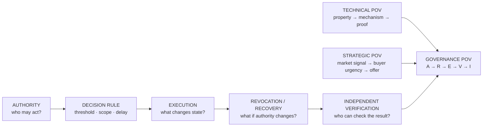
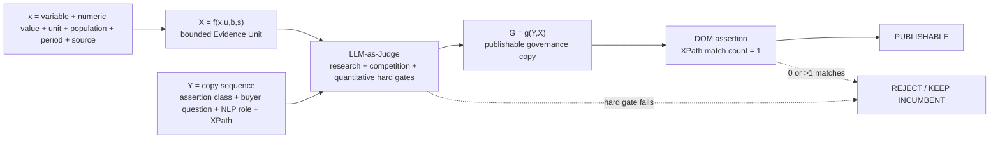
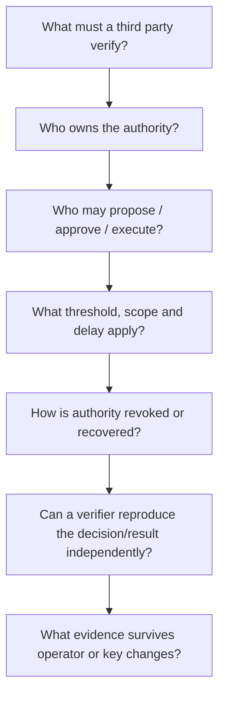
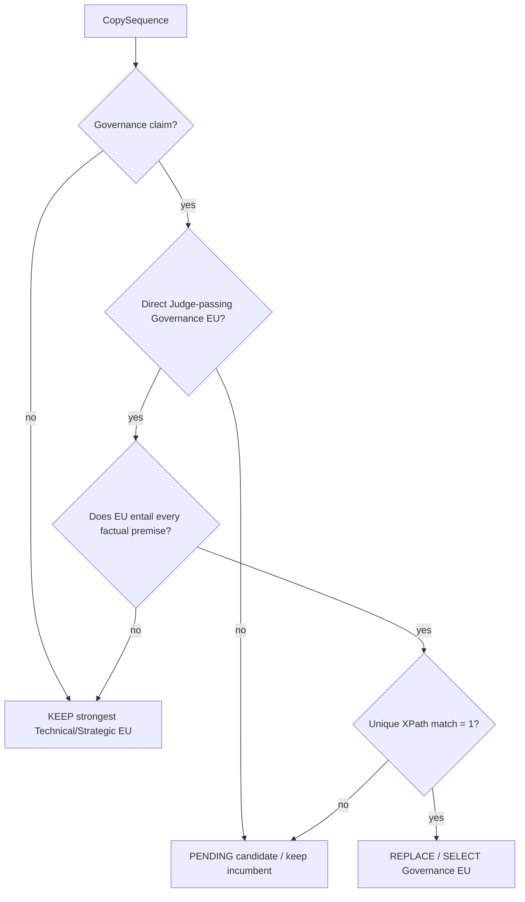

# `/expertises/blockchain/` — Governance Evidence Unit Placement v1

Target page: `https://mickael-umt.com/expertises/blockchain/`  
Audit date: **2026-08-31**  
Axis: **Governance / authority / decision rights / revocation / recovery / independent verification**  
Input documents: `eu-placement-audit-v1.md` (**Technical POV**) + `macro-micro-economic-eu-placement-v2.md` (**Strategic POV**)  
NeoFort run: `run:blockchain:governance-eu:2026-08-31:v1`  
Judge: `judge:evidence-unit:champion-v2` · `LLM_AS_JUDGE` · fail-closed · `EU-CHAMPION-100-v1`

## 1. Why a third POV is necessary

The two existing audits answer two different questions:

- **Technical POV** — *What property must be verifiable, and by which mechanism?*
- **Strategic POV** — *Why does the buyer have enough economic or institutional pressure to act now?*
- **Governance POV** — *Who may propose, authorize, execute, revoke, recover, override and independently verify the consequential action?*

Governance is therefore **not a synonym for multisig**. A multisig is one authorization primitive. Governance is the full lifecycle of authority and decision state around it.

## 2. Evidence contract

The same fail-closed Evidence Unit contract is retained.

For `COPY_REPLACEMENT|EUP`, a Governance EU is invalid if it lacks a quantitative observation, population, period, open/verifiable primary source, research-quality evidence and an explicit inference boundary.

## 3. Capability boundary

The Governance POV must remain inside the same capability envelope already established by the Technical and Strategic documents:

| Capability | Governance use that is defensible | Boundary |
|---|---|---|
| Solidity / EVM | authorization state machines, role/permission logic, multisig/timelock integration, contract tests | do not claim regulated custody or institutional market-operation history |
| Rust / systems tooling | deterministic verification tooling, local evidence processing, infrastructure components | do not imply years of production blockchain operations in Rust |
| ZK / attestations | selective disclosure, privacy-preserving verification R&D/prototypes | do not promise production-scale ZK performance without project-specific validation |
| IAM / provenance / evidence stores | ownership, authority scopes, lineage, approval/review state, audit evidence | strong governance differentiator; separate architecture capability from legal certification |
| CI/CD / quality gates | executable release conditions, evidence retention, approval boundaries | quality-gate design is not itself a security audit or regulatory approval |

Commercially, this page should sell **fit assessment, governed architecture, authority modelling, verifiable prototypes and evidence-oriented delivery** — not custody, trading, financial advice or reserve management.

## 4. Token/NLP integrity status

NeoFort currently indexes **12 `CopySequence` rows** for the blockchain page: **10 canonical public sequences + 2 aliases**. Every indexed row has an NLP semantic role / role family and current text/XPath mapping.

However, `token_count` and `information_density_score` are currently `NULL` for these sequences. This audit therefore **does not invent token counts**. Before a token-level density ranking is persisted, define at minimum:

`tokenizer_id` · `tokenizer_version` · `normalization_rule` · `token_count_method` · `density_formula_version`.

Until then, “token NLP sequence analysis” means **semantic-sequence coverage**, not a fabricated tokenizer metric.

## 5. Governance Evidence Unit register

### Already Judge-passing governance evidence

| Evidence Unit | x = variable · value · unit · population · period | Governance meaning | Judge |
|---|---|---|---|
| `EU-BC-EIP7702-MALICIOUS-AUTH-2026` | malicious-attack association · **>63 · % authorization transactions** · EIP-7702 activity across **7 blockchains** · USENIX Security 2026 | programmable authorization is an attack surface; authorization/revocation/recovery must be explicit | **99/100 · DOMINANT · hard gate PASS** |
| `EU-AFT-KEY-RECOVERY-CORPUS-2026` | retained key-recovery synthesis corpus · **77 · papers/systems** from 118 discovered · AFT 2026 | “recovery” is not one operation; reconstruction, reissuance, authority migration and asset transfer need explicit policy | **90/100 · PASS** |

### New Governance EU candidates inserted into NeoFort

These are deliberately stored as `PENDING_ADMISSION_REVIEW`: they are **not presented as Judge-passing until the external Judge execution completes**.

| Evidence Unit | x = variable · value · unit · population · period | Primary source | Current gate status |
|---|---|---|---|
| `EU-BC-EIP7702-MALICIOUS-CONTRACTS-924-2026` | malicious contract accounts · **924 · accounts** · EIP-7702 activity on 7 supporting blockchains · USENIX Security 2026 | `https://www.usenix.org/conference/usenixsecurity26/presentation/huang-mingyuan` | `PENDING_JUDGE` · elite research / bibliometrics verified |
| `EU-BC-ADDR-MISUSE-LOSS-574.8M-2026` | losses associated with high-risk address misuse · **>574.8 · USD million** · 65,340 high-risk instances / ~2.5M related transactions on Ethereum+BSC · USENIX Security 2026 | `https://www.usenix.org/conference/usenixsecurity26/presentation/shao-zhenzhe` | `PENDING_JUDGE` · elite-venue **bibliometric exception review** |
| `EU-BC-APPROVAL-ACTIVE-CANCEL-48.61-2026` | phishing-task cancellation under active spender warning · **48.61 · %** · controlled n=364 approval-phishing experiment · USENIX Security 2026 | `https://www.usenix.org/conference/usenixsecurity26/presentation/guan` | `PENDING_JUDGE` · bibliometric verification pending |
| `EU-BC-APPROVAL-DELAY-CANCEL-32.88-2026` | phishing-task cancellation under delayed confirmation · **32.88 · %** · controlled n=364 approval-phishing experiment · USENIX Security 2026 | same paper | `PENDING_JUDGE` · bibliometric verification pending |
| `EU-BC-X402-FACILITATOR-VIOLATIONS-15OF15-2026` | evaluated shared payment facilitators with security-rule violations · **15/15 · facilitators** · deployments collectively used by >60k sellers and >360k buyers · USENIX Security 2026 | `https://www.usenix.org/conference/usenixsecurity26/presentation/wang-qinying` | `PENDING_JUDGE` · elite research / senior-author bibliometrics verified; `METHOD_ONLY` |

Important boundary: the source protocol/vendor name for the `15/15` study must **not** become the hero of public copy. The commercial inference survives removal of the protocol name: a shared component that both validates and executes can become an excessive trust boundary.

### Rejected governance evidence remains rejected

`EU-BC-GOV-MULTISIG-ATTRIBUTION-2026` has strong semantic fit but remains `REJECT_HARD_GATE` under the current Judge because the configured research-authority/bibliometric gate is not satisfied. It must not be silently promoted because it “sounds more governance-specific”.

## 6. Complete CopySequence → Governance EU map

Legend:

- **REPLACE / SELECT** — governance evidence dominates the incumbent for this claim.
- **CHALLENGER** — candidate is semantically better but cannot publish before Judge + DOM verification.
- **KEEP** — technical or strategic incumbent is more direct than the governance candidate.
- **SUPPORT ONLY** — governance EU can reinforce the reasoning but must not replace the primary evidence.
- **ALIAS** — no additional public EU; points to canonical sequence to preserve placement uniqueness.

| # | CopySequence | NLP role / buyer question | Current copy anchor | Governance decision | EU mapping |
|---:|---|---|---|---|---|
| 1 | `seq:blockchain:hero:h1` | category positioning · “Dois-je réellement mettre cette propriété on-chain ?” | `Ancrez on-chain ce qu’un tiers doit vérifier…` | **KEEP** | retain Technical/Strategic fit evidence; governance evidence is less direct here |
| 2 | `seq:blockchain:proposition:mechanism` | value differentiator · “Quel mécanisme est économiquement et techniquement justifié ?” | `La plupart des projets blockchain paient pour stocker…` | **KEEP** | retain mechanism/market incumbent; authority evidence belongs to later governance claims |
| 3 | `seq:blockchain:consequences:platform-first` | fit discriminator · “La plateforme a-t-elle été choisie avant la propriété et l’autorité à gouverner ?” | `Le projet démarre par une plateforme…` | **CHALLENGER** | `EU-BC-EIP7702-MALICIOUS-CONTRACTS-924-2026` pending Judge; would challenge `EU-MACRO-STABLECOIN-PAYMENT-390B-2025` |
| 4 | `seq:blockchain:consequence:key-governance` | operational risk · “Qui signe, révoque et récupère ?” | `Qui signe, qui révoque, qui récupère…` | **KEEP governance incumbent + CHALLENGER** | keep `EU-AFT-KEY-RECOVERY-CORPUS-2026`; `EU-BC-ADDR-MISUSE-LOSS-574.8M-2026` remains challenger pending exception/Judge |
| 5 | `seq:blockchain:consequences:multisig-governance` | governance risk · “Le seuil de signatures définit-il réellement l’autorité ?” | `Un multisig ne répond pas à la question…` | **SELECT existing Judge-passing governance EU** | `EU-BC-EIP7702-MALICIOUS-AUTH-2026` **99/100** should dominate the strategic proxy `EU-MACRO-EU-SAME-CSD-SETTLEMENT-95PCT-2023` for this exact claim |
| 6 | `seq:blockchain:consequence:history` | objection reframe · “Comment prouver la continuité de l’historique ?” | `Signer les exports ne suffit pas…` | **KEEP TECHNICAL** | `EU-CROSBY-PROOF-VERIFY-2009`; governance does not dominate a tamper-evident-history mechanism claim |
| 7 | `seq:blockchain:engagements:crypto-not-audit` | boundary condition · “Une preuve cryptographique suffit-elle à sécuriser la décision ?” | `Un engagement cryptographique n’est pas un audit…` | **KEEP technical + SUPPORT ONLY** | keep security-assurance incumbent; `EU-BC-APPROVAL-ACTIVE-CANCEL-48.61-2026` can support human decision-gate reasoning after Judge |
| 8 | `seq:blockchain:functional:selective-disclosure` | mechanism explanation · “Peut-on vérifier sans divulguer ?” | `La preuve va on-chain, la donnée confidentielle reste off-chain.` | **KEEP TECHNICAL** | `EU-JISA-BBS-VERIFY-2024`; selective disclosure is first a cryptographic mechanism claim |
| 9 | `seq:blockchain:trigger:privacy` | problem recognition · “Un partenaire doit-il vérifier sans recevoir le secret ?” | `Un partenaire doit vérifier une affirmation…` | **KEEP TECHNICAL** | `EU-ZKSA-VERIFY-2021`; direct verification-without-disclosure evidence dominates governance evidence |
| 10 | `seq:blockchain:resultats:independent-verifier` | acceptance criterion · “Le même opérateur peut-il rester la seule source de vérité ?” | `Un tiers recalcule la preuve sans accès à vos systèmes…` | **CHALLENGER** | `EU-BC-X402-FACILITATOR-VIOLATIONS-15OF15-2026` pending Judge; would challenge strategic `EU-MACRO-APPIA-PARTICIPANTS-61-2026` |
| 11 | `seq:blockchain:consequences:history-integrity` | alias of history | duplicate history anchor | **ALIAS** | no extra EU; canonical = `seq:blockchain:consequence:history` |
| 12 | `seq:blockchain:proposition:onchain-offchain` | alias of selective disclosure | duplicate on-chain/off-chain anchor | **ALIAS** | no extra EU; canonical = `seq:blockchain:functional:selective-disclosure` |

NeoFort persists these 12 decisions as `EvidenceSubstitutionDecision` objects under `run:blockchain:governance-eu:2026-08-31:v1`.

## 7. Proposed Governance copy only where the evidence semantics fit

### 7.1 Multisig governance — immediate strongest governance mapping

**Before**

> Un multisig ne répond pas à la question : il déplace la décision sans dire qui l’arbitre ni sous quel délai.

**Selected evidence** — `EU-BC-EIP7702-MALICIOUS-AUTH-2026` · **>63%** of observed EIP-7702 authorization transactions associated with malicious EOA-targeted attacks across **7 blockchains** · **99/100** Judge.

**Governance rewrite**

> Selon Huang et al. (USENIX Security 2026), plus de 63 % des transactions d’autorisation EIP-7702 observées sur sept blockchains étaient associées à des attaques ciblant des comptes EOA. Le seuil de signatures n’est donc pas toute la gouvernance : avant déploiement, je rends explicites les droits d’autorisation, de révocation et de reprise.

**Boundary** — EIP-7702 evidence does **not** establish a multisig compromise rate. It supports the narrower proposition that authorization surfaces require explicit governance.

### 7.2 Key governance — keep the governance-native incumbent

**Before**

> Qui signe, qui révoque, qui récupère l’accès en cas de perte ou de départ ? Si la réponse n’est pas écrite avant le déploiement, elle devient une migration après le déploiement.

**Keep** — `EU-AFT-KEY-RECOVERY-CORPUS-2026`.

**Governance rewrite**

> La gouvernance d’une clé est un workflow explicite : la SoK AFT 2026 part d’un corpus de 118 articles et retient 77 systèmes pour distinguer reconstruction, réémission, migration d’autorité ou transfert d’actifs. Avant déploiement, je spécifie perte, révocation, départ, seuils, délai et état post-récupération.

**Challenger** — `EU-BC-ADDR-MISUSE-LOSS-574.8M-2026` has higher impact salience but must remain unpublished while the Judge’s bibliometric exception is unresolved.

### 7.3 Platform-first — challenger, not yet publishable

**Current strategic anchor**

> Le projet démarre par une plateforme et cherche ensuite ce qu’elle résout.

**Pending governance EU** — `EU-BC-EIP7702-MALICIOUS-CONTRACTS-924-2026`.

**Candidate rewrite**

> Une plateforme ne gouverne pas l’autorité. Dans l’étude USENIX Security 2026 consacrée à EIP-7702 sur sept blockchains, 924 comptes-contracts malveillants ont été détectés. Je spécifie donc qui peut déléguer, révoquer et récupérer une autorité avant de choisir le mécanisme de compte ou la chaîne.

**Boundary** — the 924 count is study-specific; do not generalize it to every smart-account architecture.

**Status** — `CHALLENGER_PENDING_JUDGE`; retain incumbent until Judge + DOM assertion pass.

### 7.4 Independent verifier — challenger, not yet publishable

**Before**

> Un tiers recalcule la preuve sans accès à vos systèmes, avec l’outil de son choix, et obtient le même résultat.

**Pending governance EU** — `EU-BC-X402-FACILITATOR-VIOLATIONS-15OF15-2026`.

**Candidate public rewrite with protocol/vendor name removed**

> Déléguer la vérification à un composant partagé ne suffit pas : dans une étude USENIX Security 2026, les 15 facilitateurs évalués présentaient des violations de règles de sécurité. Je sépare l’autorité de décision, la vérification et l’exécution afin qu’un opérateur partagé ne devienne pas la seule source de vérité.

**Boundary** — this is evidence from a specific facilitator-mediated payment ecosystem; it does not prove that every third-party verifier is insecure.

**Status** — `CHALLENGER_PENDING_JUDGE`; keep the incumbent until Judge + DOM assertion pass.

### 7.5 Cryptographic proof ≠ governance — support only

`EU-BC-APPROVAL-ACTIVE-CANCEL-48.61-2026` and `EU-BC-APPROVAL-DELAY-CANCEL-32.88-2026` are useful because the controlled n=364 study observes different cancellation behaviour under an active warning and a delayed confirmation.

They **do not prove** that a particular enterprise/DAO governance design will reduce incidents by 48.61% or 32.88%. Their safe role is narrower:

> a cryptographically valid authorization can still require an active human decision gate or a review delay when the action is consequential.

Therefore these EUs are mapped as **SUPPORT ONLY**, pending Judge, rather than used to replace the technical security-assurance EU.

## 8. Governance message architecture

This changes the commercial vocabulary from **“blockchain implementation”** to a higher-value decision sequence:

**property → authority → decision rule → execution → recovery → independent proof**.

That sequence is consistent with the existing offer promise: *relier les affirmations, décisions et exécutions à des preuves vérifiables*.

## 9. Publication decision graph

Current result:

- **1 canonical governance sequence** has an immediately stronger already-Judged governance EU: `multisig-governance` → `EU-BC-EIP7702-MALICIOUS-AUTH-2026`.
- **1 canonical sequence** already has a governance-native incumbent: `key-governance` → `EU-AFT-KEY-RECOVERY-CORPUS-2026`.
- **2 canonical sequences** have high-value Governance challengers pending Judge: `platform-first` and `independent-verifier`.
- **1 canonical sequence** has Governance support evidence pending Judge, but the primary Technical evidence should remain: `crypto-not-audit`.
- **5 canonical sequences** should keep their Technical/Strategic EU because governance evidence would reduce semantic precision.
- **2 sequences are aliases** and receive no duplicate public Evidence Unit.

## 10. Remaining hard blockers

1. **Run the external LLM Judge** for the five newly inserted Governance EUs. NeoFort intentionally marks them `PENDING_ADMISSION_REVIEW`; no score has been invented in this document.
2. **Resolve bibliometrics** for the approval-phishing corresponding/senior author(s); the configured default strong-author threshold is `h-index >= 40` unless a field-normalized/venue exception is justified.
3. **Decide the elite-venue exception** for `EU-BC-ADDR-MISUSE-LOSS-574.8M-2026`: corresponding-author h-index currently falls below the default threshold even though the paper is at USENIX Security 2026.
4. **Verify raw DOM selectors** and require `xpath_match_count = 1` before any replacement reaches public copy.
5. **Define tokenizer/version contract** before persisting `token_count` or information-density rankings.
6. **Preserve EU uniqueness**: the two aliases must not produce additional public placements.

## 11. Source register

- USENIX Security 2026 — EIP-7702 smart-account authorization risks: `https://www.usenix.org/conference/usenixsecurity26/presentation/huang-mingyuan`
- USENIX Security 2026 — blockchain address misuse: `https://www.usenix.org/conference/usenixsecurity26/presentation/shao-zhenzhe`
- USENIX Security 2026 — approval-phishing user intervention: `https://www.usenix.org/conference/usenixsecurity26/presentation/guan`
- USENIX Security 2026 — shared facilitator trust-boundary study: `https://www.usenix.org/conference/usenixsecurity26/presentation/wang-qinying`
- AFT 2026 key-recovery synthesis: `https://zenodo.org/records/21837559`

## 12. NeoFort objects written by this audit

Governance Evidence Unit candidates:

- `EU-BC-EIP7702-MALICIOUS-CONTRACTS-924-2026`
- `EU-BC-ADDR-MISUSE-LOSS-574.8M-2026`
- `EU-BC-APPROVAL-ACTIVE-CANCEL-48.61-2026`
- `EU-BC-APPROVAL-DELAY-CANCEL-32.88-2026`
- `EU-BC-X402-FACILITATOR-VIOLATIONS-15OF15-2026`

Mapping run:

- `run:blockchain:governance-eu:2026-08-31:v1`
- **12** `EvidenceSubstitutionDecision` objects — one for every indexed `CopySequence` row, including the two aliases.

The graph deliberately distinguishes **observed source evidence**, **governance interpretation**, **copy proposal**, **Judge admission** and **DOM publication gate**. No pending candidate is represented as published evidence.