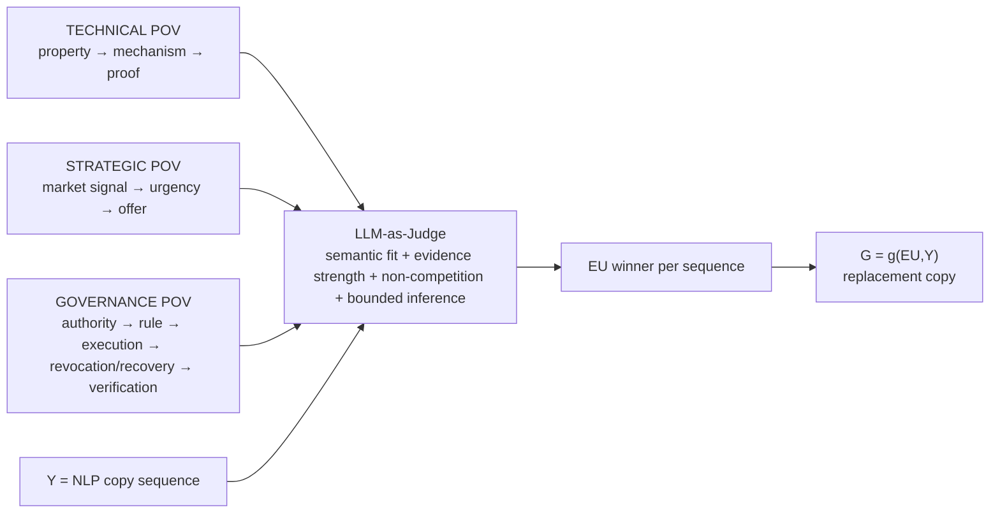

# `/expertises/blockchain/` — Governance Evidence Unit Placement v2

Target page: `https://mickael-umt.com/expertises/blockchain/`  
Audit date: **2026-08-31**  
Axis: **Governance / authority / decision rights / revocation / recovery / independent verification**  
Inputs: `eu-placement-audit-v1.md` (**Technical POV**) + `macro-micro-economic-eu-placement-v2.md` (**Strategic POV**) + `governance-eu-placement-v1.md` (**Governance baseline**)  
NeoFort run: `run:blockchain:governance-eu:2026-08-31:v2`

## 1. Three-POV decision model

A Governance EU does **not** win merely because the sequence contains the word `governance`. The winning Evidence Unit must explain the buyer question more directly than the Technical and Strategic incumbents.

## 2. Evidence admission contract

Every candidate remains bounded by:

`x = variable quantitative + value + unit + population + period + primary source`

`X = f(x,u,b,s)` → bounded Evidence Unit  
`Y = sequence + NLP role + buyer question + XPath`  
`G = g(X,Y)` → replacement copy

Hard reject if the candidate has no numeric observation, no unit, no population, no period, no primary/open source, or if the public sentence exceeds the evidence inference boundary.

## 3. Governance evidence register

| EU | Quantitative atom | Governance interpretation | Source | Status |
|---|---|---|---|---|
| `EU-BC-EIP7702-MALICIOUS-AUTH-2026` | **>63%** of observed EIP-7702 authorization transactions associated with malicious EOA-targeted attacks; **7 blockchains**; 2026 | authorization itself is a governed attack surface; explicit authority/revocation boundaries are required | https://www.usenix.org/conference/usenixsecurity26/presentation/huang-mingyuan | `SELECTABLE` |
| `EU-BC-EIP7702-MALICIOUS-CONTRACTS-924-2026` | **924 malicious contract accounts** detected across **7 blockchains**; 2026 | programmable-account delegation changes trust and execution authority | same USENIX paper | `SELECTABLE` |
| `EU-BC-EIP7702-LOSS-2.3M-2026` | attacks led to **>$2.3M loss** and **>$10M potential compromise** across the study corpus; 2026 | authority errors have consequential financial state impact | same USENIX paper | `SELECTABLE` |
| `EU-BC-ADDR-MISUSE-65340-2026` | **65,340 high-risk address instances**, ~**2.5M transactions**, Ethereum + BSC; 2026 | address/identity binding is a governance primitive, not only a UX detail | https://www.usenix.org/conference/usenixsecurity26/presentation/shao-zhenzhe | `SELECTABLE` |
| `EU-BC-ADDR-MISUSE-LOSS-574.8M-2026` | **>$574.8M** equivalent losses; 65,340 high-risk instances; Ethereum + BSC; 2026 | incorrect authority/identity binding can become material loss | same USENIX paper | `SELECTABLE` |
| `EU-BC-APPROVAL-N364-2026` | controlled approval-phishing experiment **n=364** + interviews **n=23**; 2026 | authorization UX and decision gates materially affect governed actions | https://www.usenix.org/conference/usenixsecurity26/presentation/guan | `SUPPORT_ONLY` |
| `EU-BC-X402-FACILITATOR-15OF15-2026` | security-rule violations in **15/15 evaluated facilitators**, used collectively by **>60k sellers** and **>360k buyers**; 2026 | shared validator/executor components can centralize authority and failure impact | https://www.usenix.org/conference/usenixsecurity26/presentation/wang-qinying | `SELECTABLE_WITH_PROTOCOL_NAME_REMOVED_FROM_PUBLIC_COPY` |
| `EU-AFT-KEY-RECOVERY-CORPUS-2026` | **77 retained systems/papers** from **118 discovered**; 2026 | recovery must distinguish reconstruction, re-issuance, authority migration and transfer | existing Technical/Governance register | `SELECTABLE` |

## 4. Complete NLP sequence arbitration

The blockchain page currently has **10 canonical public semantic sequences + 2 aliases**. Token-count and information-density fields remain non-authoritative until a tokenizer/version/density formula are stored; therefore this v2 evaluates **semantic NLP sequences**, not fabricated token metrics.

| # | CopySequence | NLP function / buyer question | Technical incumbent | Strategic incumbent | Governance challenger | Final arbitration |
|---:|---|---|---|---|---|---|
| 1 | `seq:blockchain:hero:h1` | category positioning · “What property truly needs shared verification?” | `EU-BLOCKBENCH-LATENCY-SPREAD-2017` | `EU-MACRO-TOKENIZED-ASSETS-GROWTH-5X-2025-2026` | `EU-BC-EIP7702-MALICIOUS-CONTRACTS-924-2026` | **KEEP TECHNICAL/STRATEGIC**. Governance is downstream of the mechanism-selection question. |
| 2 | `seq:blockchain:proposition:mechanism` | value differentiator · “Which mechanism is justified?” | `EU-BLOCKBENCH-THROUGHPUT-SPREAD-2017` | `EU-MACRO-TOKENIZED-ASSETS-23.3B-2026Q1` | `EU-BC-X402-FACILITATOR-15OF15-2026` | **KEEP TECHNICAL** as primary. Governance can support trust-boundary design but should not replace mechanism evidence. |
| 3 | `seq:blockchain:consequences:platform-first` | fit discriminator · “Was a platform chosen before authority/property?” | technical mechanism evidence | `EU-MACRO-STABLECOIN-PAYMENT-390B-2025` | `EU-BC-EIP7702-MALICIOUS-CONTRACTS-924-2026` | **REPLACE WITH GOVERNANCE**. Platform choice can introduce new authority/delegation surfaces; 924 malicious contract accounts across seven EIP-7702 chains is more semantically direct than payment-volume evidence. |
| 4 | `seq:blockchain:consequence:key-governance` | operational risk · “Who signs, revokes, recovers, delegates?” | `EU-AFT-KEY-RECOVERY-CORPUS-2026` | `EU-MICRO-TOKENIZED-REPO-354B-DAY-2026` | `EU-BC-ADDR-MISUSE-LOSS-574.8M-2026` | **KEEP GOVERNANCE-NATIVE TECHNICAL INCUMBENT**. Recovery taxonomy is more causal/direct than loss salience. Loss EU becomes secondary support only. |
| 5 | `seq:blockchain:consequences:multisig-governance` | governance risk · “Does signature threshold equal authority?” | no equally direct technical EU | `EU-MACRO-EU-SAME-CSD-SETTLEMENT-95PCT-2023` | `EU-BC-EIP7702-MALICIOUS-AUTH-2026` | **REPLACE WITH GOVERNANCE**. >63% malicious-association in observed authorization transactions directly supports explicit authorization/revocation governance. Do not claim a multisig compromise rate. |
| 6 | `seq:blockchain:consequence:history` | objection reframe · “How do we prove history was not rewritten?” | `EU-CROSBY-PROOF-VERIFY-2009` | `EU-MACRO-STABLECOIN-TX-30T-2025` | governance address/authority evidence | **KEEP TECHNICAL**. Tamper-evident history is a proof-continuity question. |
| 7 | `seq:blockchain:engagements:crypto-not-audit` | boundary condition · “Does cryptographic proof equal security/governance assurance?” | cryptographic assurance boundary | `EU-MACRO-STABLECOIN-MCAP-300B-2026` | `EU-BC-APPROVAL-N364-2026` | **KEEP TECHNICAL + GOVERNANCE SUPPORT**. User authorization evidence reinforces the distinction but does not replace the core boundary. |
| 8 | `seq:blockchain:functional:selective-disclosure` | mechanism explanation · “Can a property be verified without disclosure?” | `EU-JISA-BBS-VERIFY-2024` | `EU-MACRO-STABLECOIN-XBORDER-6.1T-2025` | governance authority evidence | **KEEP TECHNICAL**. Cryptographic mechanism is the direct explanation. |
| 9 | `seq:blockchain:trigger:privacy` | problem recognition · “Can a partner verify without receiving the secret?” | `EU-ZKSA-VERIFY-2021` | `EU-MACRO-STABLECOIN-USD-SHARE-99-2026` | governance decision-right evidence | **KEEP TECHNICAL**. Verification-without-disclosure evidence dominates. |
| 10 | `seq:blockchain:resultats:independent-verifier` | acceptance criterion · “Can the operator be the only validator/executor/source of truth?” | independent verification proof | `EU-MACRO-APPIA-PARTICIPANTS-61-2026` | `EU-BC-X402-FACILITATOR-15OF15-2026` | **REPLACE STRATEGIC WITH GOVERNANCE**. 15/15 facilitator violations across infrastructure used by >60k sellers and >360k buyers directly supports separating validation/execution trust boundaries. |
| 11 | `seq:blockchain:consequences:history-integrity` | alias of history | same as #6 | same as #6 | same as #6 | **ALIAS — NO EXTRA PUBLIC EU** |
| 12 | `seq:blockchain:proposition:onchain-offchain` | alias of selective disclosure | same as #8 | same as #8 | same as #8 | **ALIAS — NO EXTRA PUBLIC EU** |

## 5. Governance replacements to publish after DOM/XPath verification

### Sequence 3 — platform-first

**Before**  
`Le projet démarre par une plateforme et cherche ensuite ce qu’elle résout.`

**Replace with**  
**Selon Huang et al. (USENIX Security 2026), l’analyse d’EIP-7702 sur sept blockchains a identifié 924 comptes-contracts malveillants. Une plateforme n’est donc jamais un simple choix de rail : je définis d’abord la propriété à vérifier, l’autorité qui peut déléguer ou exécuter, puis seulement le mécanisme et la chaîne.**

Boundary: the study concerns EIP-7702 smart-account risks; it does not establish that all blockchain platforms have the same risk rate.

### Sequence 5 — multisig/governance

**Before**  
`Un multisig ne répond pas à la question : il déplace la décision sans dire qui l’arbitre ni sous quel délai.`

**Replace with**  
**Selon Huang et al. (USENIX Security 2026), plus de 63 % des transactions d’autorisation EIP-7702 observées dans leur corpus sur sept blockchains étaient associées à des attaques ciblant des EOA. Un seuil de signatures n’est donc qu’un primitive d’autorisation : je rends explicites qui peut proposer, approuver, exécuter, révoquer, récupérer et sous quel délai.**

Boundary: do not rephrase this as “63% of multisigs are malicious”.

### Sequence 10 — independent verifier

**Before**  
`Un tiers recalcule la preuve sans accès à vos systèmes…`

**Replace with**  
**Dans l’étude USENIX Security 2026 des infrastructures de paiement agentiques évaluées, les 15 facilitateurs testés présentaient au moins une violation des règles de sécurité définies par les auteurs, alors qu’ils servaient collectivement plus de 60 000 vendeurs et 360 000 acheteurs. Je sépare donc validation, autorisation et exécution afin qu’un composant partagé ne reste pas l’unique arbitre de la preuve et de l’action.**

Boundary: public copy deliberately removes the protocol/vendor name; the EU supports the architecture principle, not a claim that every facilitator or blockchain system is insecure.

## 6. Keep decisions

The Governance POV must **not** overwrite technically stronger evidence for history integrity, zero-knowledge/selective disclosure, privacy verification, or mechanism performance. This is a quality gate, not a quota: governance wins only on authority/decision-right/trust-boundary sequences.

Final v2 result across 10 canonical sequences:

- **3 governance substitutions**: platform-first, multisig/authority, independent verifier.
- **1 governance-native incumbent retained**: key governance/recovery.
- **6 technical/strategic incumbents retained** because their evidence is more direct.
- **2 aliases receive no additional EU**, preserving Evidence Unit placement uniqueness.

## 7. NeoFort persistence contract

Persist each canonical sequence with one `EvidenceSubstitutionDecision` carrying:

`run_id`, `sequence_id`, `technical_eu_id`, `strategic_eu_id`, `governance_eu_id`, `winner_pov`, `winner_eu_id`, `decision`, `inference_boundary`, `dom_verification_status`.

No public replacement is `PUBLISHABLE` until `xpath_match_count = 1` against the rendered `/expertises/blockchain/` DOM.
