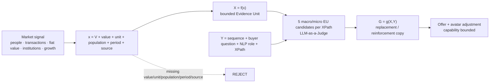
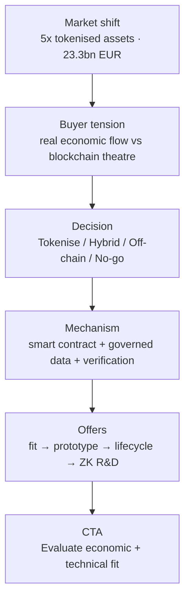

# `/expertises/blockchain/` — Macro/Microeconomic Evidence Unit Placement v2

Target page: `https://mickael-umt.com/expertises/blockchain/`  
Audit date: **2026-08-31**  
Purpose: replace a technology-first evidence layer with market evidence that explains **why the buyer should act now**, then constrain the offer to capabilities that are defensible from `/cv`.

## 1. Evidence contract

Hard rule: **exactly five macro/microeconomic Evidence Units are considered for each target XPath before the winning placement is selected.** Technical throughput, latency, proof-size and cryptographic-performance benchmarks are out of scope for this version.

## 2. Capability boundary from `/cv`

| Capability | Earliest defensible evidence | What this page may sell | Boundary |
|---|---|---|---|
| Solidity / EVM | Public smart-contract implementation from May 2023 | smart-contract architecture, state machines, token logic, testing, verification interfaces | do not imply bank/CSD/CCP production operating history |
| Rust | Public implementation from Sep 2023 | systems tooling, deterministic processing, verifiable infrastructure components | do not present as years of institutional blockchain production |
| Solana | Public project from Oct 2023 + training | bounded prototype / implementation rail | secondary proof compared with Solidity/EVM |
| ZK / ZKML | specialised training + applied R&D from 2024 | selective-disclosure and privacy-preserving verification R&D / prototype | not a production-scale ZK track record claim |
| Data architecture / provenance / IAM / evidence stores | 2024-present internal and consulting work | governed on/off-chain architecture, evidence lineage, authority and auditability | strong differentiator; avoid claiming regulated financial certification |

The commercial implication is that the landing page should sell **architecture, fit assessment, governed prototypes and verification design**, not custody, trading, financial advice, reserve management or regulated-market operation.

## 3. Macro / microeconomic Evidence Unit pool

| Evidence Unit | x = V · value · unit · population · period | Source | Judge | Boundary |
|---|---|---|---:|---|
| `EU-MACRO-STABLECOIN-MCAP-300B-2026` | stablecoin market cap · ~300 · USD bn · global market · Aug 2026 | IMF, 2026-08-07 | 97 | stock value, not payment volume or consulting TAM |
| `EU-MACRO-STABLECOIN-USD-SHARE-99-2026` | USD-denomination share · ~99 · % · global stablecoins · Aug 2026 | IMF | 97 | denomination, not user/payment share |
| `EU-MACRO-STABLECOIN-TX-30T-2025` | annual stablecoin transaction volume · >30 · USD tn/year · global · 2025 | IMF | 92 | IMF notes bulk remains crypto-ecosystem activity; bots/arbitrage matter |
| `EU-MACRO-STABLECOIN-XBORDER-6.1T-2025` | cross-border stablecoin activity · 6.1 · USD tn/year · global · 2025 | IMF | 92 | not equivalent to commercial-payment value |
| `EU-MACRO-STABLECOIN-PAYMENT-390B-2025` | payment-related stablecoin flows · 390 · USD bn/year · global · 2025 | IMF citing BIS | 96 | payment-related estimate only |
| `EU-MACRO-XBORDER-PAYMENTS-1Q-2026` | global cross-border payments market · ~1 · USD quadrillion/year · global · cited Aug 2026 | IMF | 93 | broad denominator; not a penetration claim |
| `EU-MICRO-REMITTANCE-COST-6.5PCT-2026` | average remittance cost · 6.5 · % of transfer value · global · cited Aug 2026 | IMF | 95 | corridor economics vary |
| `EU-MACRO-TOKENIZED-ASSETS-23.3B-2026Q1` | tokenized traditional assets on public blockchains · 23.3 · EUR bn · worldwide · end-Q1 2026 | ECB, 2026-08-26 | 99 | ECB says market remains small vs global markets |
| `EU-MACRO-TOKENIZED-ASSETS-GROWTH-5X-2025-2026` | YoY growth multiple · ~5 · x · tokenized traditional assets · Q1 2025→Q1 2026 | ECB | 99 | growth from a small base: EUR 4.7bn → EUR 23.3bn |
| `EU-MICRO-TOKENIZED-REPO-354B-DAY-2026` | tokenized repo value · 354 · USD bn/day · one US platform · Mar 2026 | ECB | 98 | one platform / one segment only |
| `EU-MICRO-TOKENIZED-REPO-GROWTH-4X-2025-2026` | YoY tokenized-repo growth · 4 · x · same platform · Mar 2025→Mar 2026 | ECB | 97 | platform-specific |
| `EU-MICRO-TOKENIZED-REPO-US-SHARE-7PCT-2026` | share of US daily repo activity · ~7 · % · one platform · Mar 2026 | ECB | 96 | ECB cautions turnover comparison is imperfect |
| `EU-MACRO-EU-CSD-COUNT-31-2026` | CSD count · 31 · CSDs · EU market infrastructure · current landscape cited Aug 2026 | ECB | 98 | count alone does not prove inefficiency |
| `EU-MACRO-EU-CCP-COUNT-14-2026` | CCP count · 14 · CCPs · EU market infrastructure · Aug 2026 | ECB | 98 | count alone does not prove inefficiency |
| `EU-MACRO-EU-TRADING-VENUES-323-2026` | trading venues · 323 · venues · EU market infrastructure · Aug 2026 | ECB | 98 | fragmentation signal, not proof DLT is superior |
| `EU-MACRO-EU-SAME-CSD-SETTLEMENT-95PCT-2023` | same-CSD settlement share · >95 · % by volume and value · European CSD transactions · 2023 | ECB | 99 | DLT improvement must not be assumed |
| `EU-MACRO-APPIA-PARTICIPANTS-61-2026` | Appia participants selected · 61 · financial-market/public institutions · Eurosystem programme · Aug 2026 | ECB, 2026-08-19 | 99 | participation signal, not investment or transaction value |

Primary sources:

- IMF — `https://www.imf.org/en/news/articles/2026/08/07/sp080726-stablecoins-emerging-markets-dan-katz`
- ECB — `https://www.ecb.europa.eu/press/key/date/2026/html/ecb.sp260826~3641116314.fr.html`
- ECB Appia — `https://www.ecb.europa.eu/press/intro/news/html/ecb.mipnews260819.cs.html`

## 4. Five-EU shortlist per XPath, then LLM-as-a-Judge

| Sequence / XPath anchor | Buyer question · NLP role | Five candidates before Judge | Winner |
|---|---|---|---|
| `seq:blockchain:hero:h1` · `//main//h1[normalize-space(.)="Ancrez on-chain ce qu’un tiers doit vérifier, jamais ce qu’il suffit de stocker."]` | Why act now, before choosing a chain? · category positioning | `5X-2025-2026`; `23.3B-2026Q1`; `354B-DAY-2026`; `APPIA-61-2026`; `SAME-CSD-95PCT-2023` | `EU-MACRO-TOKENIZED-ASSETS-GROWTH-5X-2025-2026` |
| `seq:blockchain:proposition:mechanism` · text anchor `La plupart des projets blockchain paient pour stocker…` | Is the market real enough to invest, but early enough that architecture matters? · value differentiator | `23.3B-2026Q1`; `PAYMENT-390B-2025`; `SAME-CSD-95PCT-2023`; `354B-DAY-2026`; `MCAP-300B-2026` | `EU-MACRO-TOKENIZED-ASSETS-23.3B-2026Q1` |
| `seq:blockchain:consequences:platform-first` · text anchor `Le projet démarre par une plateforme…` | What share is economic use rather than raw on-chain activity? · fit discriminator | `PAYMENT-390B-2025`; `TX-30T-2025`; `XBORDER-6.1T-2025`; `MCAP-300B-2026`; `REMITTANCE-6.5PCT-2026` | `EU-MACRO-STABLECOIN-PAYMENT-390B-2025` |
| `seq:blockchain:consequence:key-governance` · text anchor `Qui signe, qui révoque…` | When does key governance become an economic control? · operational risk | `354B-DAY-2026`; `REPO-US-SHARE-7PCT`; `23.3B-2026Q1`; `MCAP-300B`; `APPIA-61` | `EU-MICRO-TOKENIZED-REPO-354B-DAY-2026` |
| `seq:blockchain:consequences:multisig-governance` · text anchor `Un multisig ne répond pas à la question…` | Is the problem signature or coordination across infrastructures? · governance risk | `SAME-CSD-95PCT`; `VENUES-323`; `CSD-31`; `CCP-14`; `APPIA-61` | `EU-MACRO-EU-SAME-CSD-SETTLEMENT-95PCT-2023` |
| `seq:blockchain:consequence:history` · text anchor `Signer les exports ne suffit pas…` | Does activity scale justify treating history as evidence? · objection reframe | `TX-30T`; `PAYMENT-390B`; `354B-DAY`; `23.3B-ASSETS`; `SAME-CSD-95PCT` | `EU-MACRO-STABLECOIN-TX-30T-2025` |
| `seq:blockchain:engagements:crypto-not-audit` · text anchor `Un engagement cryptographique n’est pas un audit de sécurité.` | Does market size make proof/security/governance separation more important? · boundary condition | `MCAP-300B`; `USD-SHARE-99`; `PAYMENT-390B`; `APPIA-61`; `REMITTANCE-6.5PCT` | `EU-MACRO-STABLECOIN-MCAP-300B-2026` |
| `seq:blockchain:functional:selective-disclosure` · text anchor `La preuve va on-chain…` | At what cross-border scale do counterparties need selective disclosure? · mechanism explanation | `XBORDER-6.1T`; `USD-SHARE-99`; `PAYMENT-390B`; `XBORDER-MARKET-1Q`; `VENUES-323` | `EU-MACRO-STABLECOIN-XBORDER-6.1T-2025` |
| `seq:blockchain:trigger:privacy` · exact text `Un partenaire doit vérifier une affirmation sans avoir accès aux données qui la fondent.` | Which signals show flows crossing currencies, jurisdictions and organisations? · problem recognition | `USD-SHARE-99`; `XBORDER-6.1T`; `XBORDER-MARKET-1Q`; `REMITTANCE-6.5PCT`; `VENUES-323` | `EU-MACRO-STABLECOIN-USD-SHARE-99-2026` |
| `seq:blockchain:resultats:independent-verifier` · text anchor `Un tiers recalcule la preuve sans accès à vos systèmes…` | Is the market becoming multi-party enough that the operator cannot be the only source of truth? · acceptance criterion | `APPIA-61`; `VENUES-323`; `CSD-31`; `SAME-CSD-95PCT`; `CCP-14` | `EU-MACRO-APPIA-PARTICIPANTS-61-2026` |

Two legacy duplicates should be treated as aliases, not additional public placements: `seq:blockchain:consequences:history-integrity` and `seq:blockchain:proposition:onchain-offchain`.

## 5. Before → proposed replacement copy

| Sequence | Before | Proposed `G=g(X,Y)` |
|---|---|---|
| Hero | `Ancrez on-chain ce qu’un tiers doit vérifier, jamais ce qu’il suffit de stocker.` | **Les actifs traditionnels tokenisés sur blockchains publiques ont été multipliés par environ 5 entre T1 2025 et T1 2026. J’interviens avant le choix de chaîne : quel actif, quel règlement, quelle propriété doit être vérifiable — et quand une architecture sans blockchain reste meilleure.** |
| Proposition | generic claim/evidence mechanism copy | **À fin T1 2026, les actifs traditionnels tokenisés sur blockchains publiques représentaient 23,3 Md€. Le marché est réel mais encore jeune : je cadre l’usage économique, les contreparties, le règlement et la propriété à prouver avant de choisir smart contract, attestation, identité ou ZK.** |
| Platform-first | `Le projet démarre par une plateforme et cherche ensuite ce qu’elle résout.` | **Le BIS estime à 390 Md$ les flux stablecoin liés aux paiements en 2025. Je pars du flux économique à régler et du besoin de vérification, pas de la plateforme : si une base de données ou un rail existant suffit, le cadrage doit pouvoir conclure « pas de blockchain ».** |
| Key governance | `Qui signe, qui révoque, qui récupère l’accès…` | **En mars 2026, une plateforme américaine de repo tokenisé traitait en moyenne 354 Md$ par jour. À cette échelle, signer, révoquer, récupérer et déléguer une autorité sont des contrôles économiques : je les spécifie avant le déploiement, avec états, seuils et délais de reprise.** |
| Multisig governance | `Un multisig ne répond pas à la question…` | **En 2023, plus de 95 % des transactions de CSD européens, en volume comme en valeur, restaient réglées au sein du même CSD. Ajouter un multisig ne résout pas cette coordination : je définis qui décide, sur quel périmètre, avec quel seuil, quel délai et quelle voie d’exception.** |
| History | `Signer les exports ne suffit pas…` | **Plus de 30 000 Md$ de transactions stablecoin ont été observées en 2025, mais l’IMF précise que l’essentiel reste lié à l’écosystème crypto, notamment bots et arbitrage. À ce volume, je distingue signature d’un objet, preuve de séquence, provenance et non-réécriture de l’historique.** |
| Crypto != audit | `Un engagement cryptographique n’est pas un audit de sécurité.` | **Le marché des stablecoins se situe autour de 300 Md$ en 2026. Une preuve cryptographique peut démontrer une propriété du système ; elle ne remplace ni audit de sécurité, ni gouvernance, ni contrôle réglementaire. Je sépare ce qui est prouvé de ce qui doit être contrôlé.** |
| Selective disclosure | `La preuve va on-chain, la donnée confidentielle reste off-chain.` | **6 100 Md$ de transactions stablecoin ont été classées transfrontalières en 2025. Quand les contreparties et juridictions se multiplient, la question devient : quelle information chaque partie doit-elle voir ? Je garde la donnée confidentielle hors chaîne et n’expose que la preuve nécessaire.** |
| Privacy trigger | `Un partenaire doit vérifier une affirmation sans avoir accès aux données qui la fondent.` | **Près de 99 % des stablecoins sont libellés en dollars. Pour un flux international, cela concentre une dépendance monétaire et multiplie les contreparties de vérification : je cadre les données nécessaires à chaque acteur avant de décider ce qui doit être public, attesté ou gardé confidentiel.** |
| Independent verifier | `Un tiers recalcule la preuve sans accès à vos systèmes…` | **61 acteurs des marchés financiers et institutions publiques ont été sélectionnés par l’Eurosystème pour contribuer à Appia en 2026. Une infrastructure destinée à plusieurs organisations doit rendre ses résultats vérifiables au-delà de son opérateur : je conçois des artefacts qu’un tiers peut contrôler sans dépendre de l’état interne du fournisseur.** |

## 6. Recommended value proposition adjustment

### Category name

**Current:** `Blockchain & Verifiable Computing`  
**Recommended public category:** **Tokenisation & Verifiable Systems**  
**Technical descriptor kept below the fold:** `Smart contracts · verifiable settlement · attestations · selective disclosure · governed on/off-chain architecture`

Reason: the market evidence is about tokenised assets, payment/settlement flows and multi-party financial infrastructure. “Verifiable computing” is useful as a mechanism but too technical to carry the commercial category by itself.

### Recommended hero

**H1**  
> **Décidez ce qui doit être tokenisé, réglé et vérifié — avant de choisir la chaîne.**

**Subhead**  
> **J’aide les équipes produit, innovation et architecture à transformer un flux économique en système tokenisé gouverné : smart contracts, preuves, autorité, données confidentielles et critères explicites de go / no-go.**

**Proof strip**  
> **≈5×** de croissance des actifs traditionnels tokenisés sur blockchains publiques entre T1 2025 et T1 2026 · **23,3 Md€** à fin T1 2026 · **390 Md$** de flux stablecoin liés aux paiements en 2025.

**CTA**  
> **Évaluer le fit économique et technique**

The CTA intentionally does not say “launch a blockchain project”. A credible consulting result may be `NO-GO`, `OFF-CHAIN`, `HYBRID`, or `TOKENISED`.

## 7. Offer system adjusted to market value + capabilities

| Offer | Buyer job | Output | Capability fit | Boundary |
|---|---|---|---|---|
| **Tokenisation Fit & Economic Architecture** | Decide whether a real asset/flow needs tokenisation and shared verification | decision map, actors, economic flow, trust boundary, go/no-go, architecture options | strongest match: architecture + data + Solidity/EVM + governance | may conclude no blockchain; no financial/legal advice |
| **Smart Contract & Verifiable Settlement Prototype** | Prove a lifecycle or settlement mechanism before a larger programme | bounded prototype, state machine, contract tests, verifier, integration contract | Solidity/EVM + backend/data + CI quality gates | prototype/engineering, not production market infrastructure operation |
| **Tokenized Asset Lifecycle & Authority Design** | Define issuance/state transitions/authority/recovery/audit trail | lifecycle spec, roles, permissions, recovery and evidence model | smart contracts + IAM/RBAC + provenance + Rust/tooling | no custody or regulated operator claim |
| **Selective Disclosure & ZK Verification R&D** | Verify an assertion while minimising disclosed data | threat/data boundary, proof/attestation design, prototype, verifier | ZK/ZKML + attestations + smart-contract integration | R&D/prototype positioning until stronger public production proof exists |

## 8. Avatar adjustment

The old generic avatar `CTO / blockchain buyer` is too broad. The primary avatar should be defined by **situation and decision**, not demographic decoration.

### Primary avatar — `Tokenisation Programme Owner`

**Status:** market-backed targeting hypothesis; validate against CRM/interviews before treating it as fact.

| Field | Proposed definition |
|---|---|
| Situation trigger | organisation is evaluating a tokenised asset, stablecoin/payment rail, shared settlement workflow, on-chain evidence or a client demand for verifiability |
| Typical roles | Head/Lead of Digital Assets, Tokenisation, Product Innovation, Payments Architecture, Digital Markets or a CTO/Chief Architect owning the programme |
| Primary job | turn a market opportunity into a bounded architecture decision without committing early to a chain/vendor |
| Main fear | spending budget on a technically impressive pilot that does not solve settlement, governance, privacy or interoperability |
| Desired outcome | an investment/architecture decision that states **what changes economically**, **what must be shared**, **what stays confidential**, **who holds authority**, and **how a third party verifies the result** |
| Purchase trigger | new product/partnership, tokenisation initiative, cross-border flow, interoperability issue, auditability requirement, board/innovation deadline |
| Must-have proof | explicit economic flow, acceptance criteria, threat/trust boundary, governance, prototype evidence and “no blockchain” escape hatch |
| Best entry offer | `Tokenisation Fit & Economic Architecture` |

### Decision unit

| Role | What they need |
|---|---|
| Economic sponsor / Product or Innovation Director | business case, time-to-decision, optionality, clear stop conditions |
| Technical champion / CTO or Chief Architect | integration boundary, state model, APIs, security and operability |
| Risk / Compliance / Legal | authority, data exposure, jurisdictional assumptions, audit trail, claim boundaries |
| Security / IAM | key lifecycle, least privilege, recovery, secrets, incident paths |
| Finance / Treasury / Operations | settlement flow, reconciliation, counterparties, fees, failure handling |

### Secondary avatar

**Digital-asset software vendor / fintech product lead** that already has client demand and needs a **bounded architecture + prototype** rather than a long strategic transformation programme.

### Explicitly de-prioritised avatars

- retail crypto trader / investor;
- token-launch marketing buyer;
- pure NFT/consumer speculation project;
- buyer asking for custody, exchange operation or investment advice;
- systemically critical market infrastructure expecting prior CSD/CCP production operating credentials.

## 9. Page-level message hierarchy

This ordering deliberately makes market value and buyer decision precede technical capabilities.

## 10. Quality gates before publication

- `5 EU / XPath` exists and was judged before selection.
- Every numeric claim has value, unit, population, period and source.
- Stablecoin **transaction volume is never relabelled as payment volume**.
- Growth from EUR 4.7bn to EUR 23.3bn is presented with the small-base boundary.
- One-platform repo figures are never generalised to the total market.
- EU infrastructure counts are context, not proof that DLT is inherently superior.
- Offer claims are bounded by `/cv`; ZK/Solana remain prototype/R&D-weighted compared with Solidity/EVM.
- Avatar is a **targeting hypothesis** until validated by CRM, interviews or sales evidence.
- Exact XPath match count must equal `1` before a placement becomes `PUBLISHED`.

## 11. Publication state

Recommended state for the selected placements:  
`SELECTED_BY_MACRO_JUDGE__PENDING_DOM_XPATH_VERIFICATION`

Do not mark `PUBLISHED` until the page DOM confirms every XPath uniquely resolves and the corresponding landing-page sequence has actually been changed.
