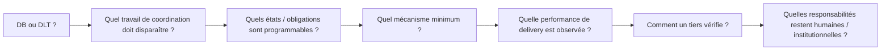

# `/expertises/blockchain/` — Programmability EU/EUG triage v3

**Target page:** `https://mickael-umt.com/expertises/blockchain/`  
**NeoFort page:** `page:source:8.1`  
**Evidence policy:** `policy:blockchain:programmability-performance-evidence-v1`  
**Status:** `COPYWRITING_TRIAGE_ONLY` — this document does **not** modify the landing page.  
**Revision:** 2026-09-01

This revision changes the evidence priority from generic blockchain-market adoption toward a bounded architecture question:

> **A database can be faster at raw storage/execution. Programmability is justified only when coordination, conditional execution, shared verification or governed authority outweigh the ledger overhead.**

The prior macro/micro market layer remains historical context, but no longer owns the primary proof slots when a stronger programmability or delivery-performance EU/EUG exists.

## 1. Canonical traversal and placement contract

The copy and evidence graph is traversed in one deterministic order:

```text
PageSection.order
  → UIComponent
    → CopySubcomponent
      → CopySequence
        → NLP semantic role + buyer question
          → XPath
            → EUP | EUGP
              → source + metric + population + period + boundary
```

Definitions:

- **EU** — bounded Evidence Unit. A quantitative EU must preserve variable, value, unit, population, period and source. A mechanism-only EU may explain causality/mechanism but must not be rendered as a numeric claim.
- **EUP** — `EvidencePlacement` binding one EU to one copy sequence and one XPath. `placement_kind=MECHANISM_SUPPORT_EUP` is allowed for mechanism-only evidence and is explicitly non-numeric.
- **EUG / QGEU** — question-driven graph Evidence Unit. It answers a bounded decision question with statistical/probability data and a `GraphQualityGate=PASS`.
- **EUGP** — `EvidencePlacement` binding one EUG/QGEU to a sequence/XPath and a graph spec.
- **Alias sequence** — duplicate copy sequence kept for traceability but not allowed to create an additional public evidence placement.
- **Token policy** — current NeoFort `CopySequence.token_count` is not materialized for these sequences. This document therefore preserves the **sequence boundary** and NLP role but does not invent tokenizer counts. Exact token counts must be written only by the repository tokenizer/materialization step.
- **XPath policy** — existing copy uses current text-anchored XPath. New components use the proposed stable DOM contract `//*[@data-copy-seq='<sequence-id>']` and remain `PROPOSED_DOM_CONTRACT__NOT_IN_CURRENT_SITE` until the site implements them.

## 2. Narrative decision series



Architecture candidate only after the process has been formalised:

```text
Process
→ State
→ Rights
→ Conditions
→ Transitions
→ Exceptions
→ Evidence
→ Architecture ∈ {DB, verifiable log, DLT, smart contract, attestation, ZK}
```

## 3. Section 1 — Hero · frontière de vérification

### Component 1.1 — H1 / category positioning

**Sequence:** `seq:blockchain:hero:h1`  
**NLP role:** `CATEGORY_POSITIONING`  
**Current text:** `Ancrez on-chain ce qu’un tiers doit vérifier, jamais ce qu’il suffit de stocker.`  
**Decision:** **KEEP**. This remains the strongest anti-maximalist positioning line.  
**XPath:**

```xpath
//main//h1[normalize-space(.)="Ancrez on-chain ce qu’un tiers doit vérifier, jamais ce qu’il suffit de stocker."]
```

No market-adoption number is needed inside the H1.

### Component 1.2 — architecture-decision proof strip

**Sequence:** `seq:blockchain:hero:evidence-strip:programmability-quality`  
**NLP role:** `ARCHITECTURE_DECISION_PROOF`  
**Current source copy:** tokenised-assets ×5 evidence strip.  
**Action:** replace the market-growth proof with the primary programmability EUG.

**EUGP:** `eugp:blockchain:hero:programmability-quality:2026-09-01`  
**EUG:** `QGEU-PROGRAMMABILITY-QUALITY-DB-VS-DLT-2026`  
**Score:** **99.5/100 · PASS · SELECT_PRIMARY_EUG**  
**Current XPath anchor:**

```xpath
//main//*[contains(normalize-space(.),"Cinq fois plus d’actifs tokenisés sur blockchains publiques en un an") and contains(normalize-space(.),"BCE")]
```

**L1 copy:**

> Une DLT n’est pas automatiquement une meilleure base de données. Sous la même charge cible dans le prototype étudié, la voie database-backed a délivré **924,79 TPS** contre **219,23 TPS** ledger-backed — environ **4,22×** plus de débit brut. La question devient donc : quelle coordination, quelle obligation ou quelle vérification justifie cet overhead ?

**L2 / graph:** `QGEU-DB-VS-DLT-THROUGHPUT-2026` — horizontal bar chart, database-backed vs ledger-backed, same target workload. Source: Wiley, 2026. Boundary: one SSO/TOTP prototype; this does not establish a universal DB-over-DLT performance ratio.

The composite EUG may then progressively disclose Agorá settlement, Pontes fee structure and Pontes operating-window roadmap as **separate panels**. Cross-panel arithmetic is forbidden because those populations answer different layers of the decision.

## 4. Section 2 — Déclencheurs · from privacy-first to programmability triggers

The current section is too narrow if it contains only selective disclosure. The triage becomes three subcomponents.

### Component 2.1 — multi-organisation coordination

**Proposed sequence:** `seq:blockchain:trigger:coordination`  
**NLP role:** `PROBLEM_RECOGNITION / COORDINATION_TRIGGER`  
**Proposed text:**

> Plusieurs organisations maintiennent le même état ou doivent se transmettre des décisions interdépendantes : la friction se déplace vers le messaging, la reconciliation, les exceptions et l’autorité de mise à jour.

**EUP:** `eup:blockchain:triggers:coordination-mechanism:2026-09-01`  
**EU:** `EU-ECB-PROGRAMMABILITY-COORDINATION-MECHANISM-2026`  
**Placement kind:** `MECHANISM_SUPPORT_EUP` — **non numeric**.  
ECB mechanism evidence: collateral substitution, margin management and collateral return can largely be automated on a programmable repo platform, reducing messaging, reconciliation and manual intervention across institutions/infrastructures. It must **not** be converted into a cost-saving or staff-reduction percentage.

**Proposed XPath contract:**

```xpath
//*[@data-copy-seq='seq:blockchain:trigger:coordination']
```

### Component 2.2 — conditional / atomic execution

**Proposed sequence:** `seq:blockchain:trigger:conditional-execution`  
**NLP role:** `PROBLEM_RECOGNITION / EXECUTION_TRIGGER`  
**Proposed text:**

> Une transaction dépend de conditions vérifiables et plusieurs transitions doivent rester cohérentes : formalisez les conditions, les états autorisés et les voies d’exception avant de choisir le rail d’exécution.

The same ECB source can support the mechanism at source level, but this sequence does not create a second public numeric EUP. It is an explanatory continuation of Component 2.1.

**Proposed XPath contract:**

```xpath
//*[@data-copy-seq='seq:blockchain:trigger:conditional-execution']
```

### Component 2.3 — verification without disclosure

**Canonical existing sequence:** `seq:blockchain:trigger:privacy`  
**NLP role:** `PROBLEM_RECOGNITION / SELECTIVE_VERIFICATION_TRIGGER`  
**Current text:** `Un partenaire doit vérifier une affirmation sans avoir accès aux données qui la fondent.`  
**Decision:** KEEP, but demote from sole trigger to the third trigger.

**EUP:** retain `EU-ZKSA-VERIFY-2021` — **1.4 ms/proof** for control-flow analysis on a 2,000-line program in the CCS 2021 prototype. Boundary: prover time was 1,738 s; no production-SLA inference.

**XPath:**

```xpath
//main//*[self::p or self::li][normalize-space(.)="Un partenaire doit vérifier une affirmation sans avoir accès aux données qui la fondent."]
```

## 5. Section 3 — Conséquences · Performance → Integrity → Authority

This section becomes the cost of choosing the wrong architecture boundary.

### Component 3.1 — Performance · the ledger has an overhead

**Canonical sequence:** `seq:blockchain:consequences:platform-first`  
**NLP role:** `FIT_DISCRIMINATOR`  
**EUGP:** `eugp:blockchain:consequences:db-vs-dlt-throughput:2026-09-01`  
**EUG:** `QGEU-DB-VS-DLT-THROUGHPUT-2026` · **98/100 · PASS**.

**Proposed copy:**

> Le ledger a un coût. Dans le benchmark 2026 étudié, le chemin database-backed délivrait **924,79 TPS** contre **219,23 TPS** ledger-backed sous la même charge cible. La DLT doit donc être justifiée par une propriété supplémentaire — coordination, vérification, autorité partagée ou exécution conditionnelle — et non par le stockage seul.

**XPath:**

```xpath
//*[contains(normalize-space(.),"Le projet démarre par une plateforme")][not(.//*[contains(normalize-space(.),"Le projet démarre par une plateforme")])]
```

### Component 3.2 — Integrity · a signature is not an append-only history

**Canonical sequence:** `seq:blockchain:consequence:history`  
**Alias:** `seq:blockchain:consequences:history-integrity` — no second public placement.  
**NLP role:** `OBJECTION_REFRAME`  
**EUP:** `EU-BC-MERKLE-LOG-VERIFY-2026` · **94/100**.

**Proposed copy:**

> Une signature atteste un objet ; elle ne prouve pas, à elle seule, la continuité d’un historique. Dans l’évaluation 2026 étudiée, une vérification d’inclusion a été mesurée à **0,000035 s par enregistrement** sur des jeux de **10³ à 10⁵ logs**, avec **50 répétitions**. Le design doit séparer signature d’objet, engagement d’état et preuve de continuité.

**XPath:**

```xpath
//main//*[self::p or self::div][contains(normalize-space(.),"Signer les exports ne suffit pas") and contains(normalize-space(.),"réécriture de l’historique")]
```

### Component 3.3 — Authority · a key is not governance

**Canonical sequence:** `seq:blockchain:consequences:multisig-governance`  
**NLP role:** `GOVERNANCE_RISK`  
**EUP:** `EU-BC-EIP7702-MALICIOUS-AUTH-2026` · **99/100 · DOMINANT_CANDIDATE**.

**Proposed copy:**

> Une clé ou un seuil de signatures n’est pas toute la gouvernance. Dans l’étude USENIX Security 2026, **plus de 63 %** des transactions d’autorisation EIP-7702 observées sur sept blockchains étaient associées à des attaques ciblant des EOA dans le périmètre étudié. Les droits d’autorisation, de révocation, de reprise et d’exception doivent être spécifiés comme des transitions gouvernées.

**Boundary:** this is EIP-7702-specific and is **not** a multisig compromise-rate estimate.

**XPath:**

```xpath
//*[contains(normalize-space(.),"Un multisig ne répond pas à la question")][not(.//*[contains(normalize-space(.),"Un multisig ne répond pas à la question")])]
```

The existing key-recovery sequence `seq:blockchain:consequence:key-governance` remains useful as a secondary governance branch; it must not compete with the clearer `Performance → Integrity → Authority` primary sequence.

## 6. Section 4 — Proposition · Programmable Process & Transaction Architecture

**Canonical sequence:** `seq:blockchain:proposition:mechanism`  
**NLP role:** `VALUE_DIFFERENTIATOR`.

Replace technology-first `claim/evidence` wording with the process model:

> Je formalise la partie programmable d’un processus : **états, droits, conditions, transitions, exceptions et preuves**. Puis je détermine le mécanisme minimum capable de l’exécuter — **base de données, journal vérifiable, smart contract, attestation ou preuve zero-knowledge**.

**Mechanism support:** `EU-ECB-PROGRAMMABILITY-COORDINATION-MECHANISM-2026`, as mechanism-only evidence. The proposition must not manufacture a cost or speed uplift that the ECB source does not quantify.

**XPath:**

```xpath
//main//*[self::p or self::div][contains(normalize-space(.),"La plupart des projets blockchain paient pour stocker") and contains(normalize-space(.),"frontière claim/evidence")]
```

The duplicate `seq:blockchain:proposition:onchain-offchain` is an alias of the selective-disclosure mechanism and should not receive a second public evidence placement.

## 7. Section 5 — Valeur fonctionnelle · selective disclosure as specialised capability

**Canonical sequence:** `seq:blockchain:functional:selective-disclosure`  
**NLP role:** `MECHANISM_EXPLANATION`.

**Primary EUP:** `EU-JISA-BBS-VERIFY-2024` — approximately **2.136 ms** BBS presentation verification for credentials up to 33 attributes on the evaluated Ryzen 7 5800X configuration.  
**Secondary technical support:** `EU-BC-ZKP-VERIFY-LATENCY-2026` — ZKP verification **<95 ms** in the studied credential-system prototype.

**Proposed copy:**

> La donnée confidentielle n’a pas besoin d’être publiée pour qu’une propriété soit vérifiable. Le design sépare attributs privés, engagement, preuve et règle de divulgation ; BBS, attestation ou ZK ne sont retenus que si la propriété à vérifier le justifie.

**XPath:**

```xpath
//main//*[self::p or self::div][contains(normalize-space(.),"La preuve va on-chain") and contains(normalize-space(.),"donnée confidentielle reste off-chain")]
```

## 8. Section 6 — NEW · What programmability changes in delivery

**Section:** `section:blockchain:delivery-performance` · `order=6` · proposed, not yet present on the site.

This section contains only data visualisation. No decorative architecture diagram is an EUG.

### Component 6.1 — Settlement speed

**Sequence:** `seq:blockchain:delivery-performance:settlement`  
**EUGP:** `eugp:blockchain:delivery:settlement-80s:2026-09-01`  
**EUG:** `QGEU-BIS-AGORA-SETTLEMENT-80S-2026` · **95.5/100 · PASS**.  
**Observed:** approximately **80 seconds** average initiation-to-settlement across **30** Project Agorá real-value-test transactions.  
**Hard boundary:** no matched conventional-payment control; no `× legacy` speedup may be claimed.

**Proposed XPath:**

```xpath
//*[@data-copy-seq='seq:blockchain:delivery-performance:settlement']
```

### Component 6.2 — Delivery fee structure

**Sequence:** `seq:blockchain:delivery-performance:cost`  
**EUGP:** `eugp:blockchain:delivery:pontes-cost:2026-09-01`  
**EUG:** `QGEU-ECB-PONTES-DELIVERY-COST-STRUCTURE-2026` · **93.5/100 · PASS**.

Initial Launch pricing:

- Market participant connection: **€2,500 one-off**
- Market DLT Operator connection: **€15,000 one-off**
- Fixed monthly fee: **€0**
- Settlement fee: **€0**

**Required annotation:** `Initial Launch pricing ≠ total cost of ownership.` Integration, internal labour, liquidity and external platform costs are outside the graph.

**Proposed XPath:**

```xpath
//*[@data-copy-seq='seq:blockchain:delivery-performance:cost']
```

### Component 6.3 — Operating model

**Sequence:** `seq:blockchain:delivery-performance:availability`  
**EUGP:** `eugp:blockchain:delivery:pontes-availability:2026-09-01`  
**EUG:** `QGEU-ECB-PONTES-AVAILABILITY-ROADMAP-2026-2028` · **92.5/100 · PASS**.

**Planned roadmap:** **22.5 h/business day → 24/7 by mid-2028**.  
**Hard boundary:** official plan, not observed uptime, SLA or probabilistic forecast.

**Proposed XPath:**

```xpath
//*[@data-copy-seq='seq:blockchain:delivery-performance:availability']
```

## 9. Section 7 — Résultats · independent verification + assurance coverage

### Component 7.1 — Independent verification

**Canonical sequence:** `seq:blockchain:resultats:independent-verifier`  
**NLP role:** `ACCEPTANCE_CRITERION`  
**Primary EUP:** `eup:blockchain:resultats:irondict-independent-verification:2026-09-01`  
**EU:** `EU-BC-IRONDICT-VERIFY-2026` · **100/100 · DOMINANT_CANDIDATE · JUDGE_PASS**.

**Proposed copy:**

> Le livrable n’est pas seulement un système qui affirme son état : il inclut les artefacts permettant à un tiers de contrôler une propriété déterminée sans dépendre de votre base interne. Dans IRONDICT, un dictionnaire transparent configuré pour **1 milliard d’entrées** est vérifié en environ **35 ms** sur laptop grand public ; le papier rapporte également des preuves de **moins de 8 kB**.

**Boundary:** specific polynomial-commitment construction and benchmark; not a universal registry-performance guarantee.

**XPath:**

```xpath
//*[contains(normalize-space(.),"Un tiers recalcule la preuve sans accès à vos systèmes")][not(.//*[contains(normalize-space(.),"Un tiers recalcule la preuve sans accès à vos systèmes")])]
```

### Component 7.2 — Assurance coverage

**Proposed sequence:** `seq:blockchain:resultats:assurance-coverage`  
**EUP:** `eup:blockchain:resultats:solidity-assurance-coverage:2026-09-01`  
**EU:** `EU-BC-SOLIDITY-TOOLS-COVERAGE-2026` · **100/100 · DOMINANT_CANDIDATE**.

**Proposed copy:**

> L’assurance n’est pas un outil unique. Sur **2 182** instances Solidity annotées ligne par ligne, trois outils complémentaires détectaient jusqu’à **76,78 %** des vulnérabilités du dataset étudié ; aucun outil seul ne couvrait toutes les classes. Le résultat attendu est donc une chaîne de vérification documentée, reproductible et bornée.

**Boundary:** dataset, taxonomy and tool-version bound; not an audit-completeness guarantee.

**Proposed XPath:**

```xpath
//*[@data-copy-seq='seq:blockchain:resultats:assurance-coverage']
```

## 10. Section 10 — Engagements / limites

**Canonical sequence:** `seq:blockchain:engagements:crypto-not-audit`  
**NLP role:** `BOUNDARY_CONDITION`  
**EUP:** retain `EU-BC-SC-SLR-TAXONOMY-2026` · **96/100**.

**Proposed copy:**

> **Programmabilité ≠ sécurité. Preuve cryptographique ≠ audit. Automatisation ≠ suppression de responsabilité.** La revue 2026 a filtré **3 380** études, retenu **222** études de haute qualité, catalogué **192 vulnérabilités** en **13 catégories**, recensé **219 outils** et **133 benchmarks**. Une preuve peut démontrer qu’une propriété est vraie ; elle ne démontre pas que toutes les propriétés pertinentes ont été spécifiées ni que toute la surface d’attaque a été couverte.

**XPath:**

```xpath
//*[contains(normalize-space(.),"Un engagement cryptographique n’est pas un audit de sécurité")][not(.//*[contains(normalize-space(.),"Un engagement cryptographique n’est pas un audit de sécurité")])]
```

## 11. Concatenated sequence order for downstream NLP/materialisation

| Order | Section | Component | CopySequence | NLP role | Evidence placement |
|---:|---|---|---|---|---|
| 1 | Hero | H1 | `seq:blockchain:hero:h1` | CATEGORY_POSITIONING | none in H1 |
| 2 | Hero | evidence strip | `seq:blockchain:hero:evidence-strip:programmability-quality` | ARCHITECTURE_DECISION_PROOF | `eugp:blockchain:hero:programmability-quality:2026-09-01` |
| 3 | Triggers | coordination | `seq:blockchain:trigger:coordination` | COORDINATION_TRIGGER | `eup:blockchain:triggers:coordination-mechanism:2026-09-01` |
| 4 | Triggers | conditional execution | `seq:blockchain:trigger:conditional-execution` | EXECUTION_TRIGGER | mechanism continuation; no duplicate numeric EUP |
| 5 | Triggers | selective verification | `seq:blockchain:trigger:privacy` | SELECTIVE_VERIFICATION_TRIGGER | `EU-ZKSA-VERIFY-2021` retained |
| 6 | Consequences | performance | `seq:blockchain:consequences:platform-first` | FIT_DISCRIMINATOR | `eugp:blockchain:consequences:db-vs-dlt-throughput:2026-09-01` |
| 7 | Consequences | integrity | `seq:blockchain:consequence:history` | OBJECTION_REFRAME | `EU-BC-MERKLE-LOG-VERIFY-2026` |
| 8 | Consequences | authority | `seq:blockchain:consequences:multisig-governance` | GOVERNANCE_RISK | `EU-BC-EIP7702-MALICIOUS-AUTH-2026` |
| 9 | Proposition | process model | `seq:blockchain:proposition:mechanism` | VALUE_DIFFERENTIATOR | ECB mechanism bridge |
| 10 | Functional | selective disclosure | `seq:blockchain:functional:selective-disclosure` | MECHANISM_EXPLANATION | `EU-JISA-BBS-VERIFY-2024` + bounded ZKP support |
| 11 | Delivery | settlement | `seq:blockchain:delivery-performance:settlement` | DELIVERY_SPEED_EVIDENCE | `eugp:blockchain:delivery:settlement-80s:2026-09-01` |
| 12 | Delivery | cost | `seq:blockchain:delivery-performance:cost` | DELIVERY_COST_EVIDENCE | `eugp:blockchain:delivery:pontes-cost:2026-09-01` |
| 13 | Delivery | availability | `seq:blockchain:delivery-performance:availability` | OPERATING_MODEL_EVIDENCE | `eugp:blockchain:delivery:pontes-availability:2026-09-01` |
| 14 | Results | independent verification | `seq:blockchain:resultats:independent-verifier` | ACCEPTANCE_CRITERION | `eup:blockchain:resultats:irondict-independent-verification:2026-09-01` |
| 15 | Results | assurance coverage | `seq:blockchain:resultats:assurance-coverage` | ASSURANCE_COVERAGE | `eup:blockchain:resultats:solidity-assurance-coverage:2026-09-01` |
| 16 | Engagements | boundary | `seq:blockchain:engagements:crypto-not-audit` | BOUNDARY_CONDITION | `EU-BC-SC-SLR-TAXONOMY-2026` retained |

Aliases not concatenated as new public sequences:

- `seq:blockchain:consequences:history-integrity` → alias of canonical history evidence branch.
- `seq:blockchain:proposition:onchain-offchain` → alias of selective-disclosure branch.

## 12. Source register and hard boundaries

| Evidence | Decision value | Source | Hard boundary |
|---|---|---|---|
| `QGEU-DB-VS-DLT-THROUGHPUT-2026` | DB 924.79 TPS vs ledger 219.23 TPS; ≈4.22× | Wiley / CCPE, 2026 | one SSO/TOTP prototype; no universal architecture ranking |
| `EU-ECB-PROGRAMMABILITY-COORDINATION-MECHANISM-2026` | explains reduced messaging/reconciliation/manual intervention mechanism | ECB, 2026-08-28 | mechanism only; no numeric saving |
| `EU-ZKSA-VERIFY-2021` | selective verification | ACM CCS 2021 | research prototype; prover 1,738 s |
| `EU-BC-MERKLE-LOG-VERIFY-2026` | append-only history verification | IEEE OJCS 2026 | one log architecture |
| `EU-BC-EIP7702-MALICIOUS-AUTH-2026` | authority/governance risk | USENIX Security 2026 | EIP-7702 dataset only |
| `EU-JISA-BBS-VERIFY-2024` | selective disclosure verification latency | JISA 2024 | credential benchmark, ≤33 attributes |
| `QGEU-BIS-AGORA-SETTLEMENT-80S-2026` | observed settlement delivery time | BIS Project Agorá 2026 | no matched legacy control |
| `QGEU-ECB-PONTES-DELIVERY-COST-STRUCTURE-2026` | initial fee structure | ECB Pontes Pricing Guide 2026 | not TCO |
| `QGEU-ECB-PONTES-AVAILABILITY-ROADMAP-2026-2028` | operating-window roadmap | ECB 2026 | planned, not observed SLA |
| `EU-BC-IRONDICT-VERIFY-2026` | independent verification | USENIX Security 2026 | construction-specific benchmark |
| `EU-BC-SOLIDITY-TOOLS-COVERAGE-2026` | assurance coverage | Empirical Software Engineering 2026 | dataset/tool-version bound |
| `EU-BC-SC-SLR-TAXONOMY-2026` | security/audit boundary | Journal of Systems and Software 2026 | taxonomy breadth ≠ risk of one contract |

## 13. Capability boundary — `/cv` + public engineering evidence

The positioning is defensible as **architecture of programmable and verifiable systems**, not as an assertion of having operated a bank/CSD/CCP production rail.

- **Solidity / EVM:** first publicly documented smart-contract implementation in May 2023; Lottery dApp provides public contract/state-machine evidence. The existing audit also records a non-forked Tokenized Voting Backend contribution.
- **Rust:** public Folder Mapper implementation from September 2023 demonstrates systems tooling, filesystem traversal and SQLite integration.
- **Solana:** public/bootcamp evidence from October 2023 supports bounded prototype work; it is secondary to the Solidity/EVM proof base.
- **ZK / ZKML:** specialised training plus applied privacy-preserving verification R&D from 2024; sell as architecture/R&D/prototyping rather than a production-scale ZK operating track record.
- **Data architecture / provenance / IAM / evidence stores:** structured internal and consulting work from 2024 onward provides the strongest bridge from blockchain primitives to governed enterprise process architecture.

`RickOwri/yield-sol` stays excluded from the public-proof argument until the `/git` substantial-contribution rule is satisfied for the fork history.

## 14. Publication gates

Before any landing-page update:

1. `xpath_match_count == 1` for every **existing** text anchor.
2. Proposed `data-copy-seq` XPaths must remain blocked until those attributes exist in the rendered DOM.
3. Every EUG must retain `GraphQualityGate=PASS` and its source/materialisation manifest.
4. No cross-panel arithmetic among DB/DLT throughput, Agorá settlement, Pontes pricing and Pontes roadmap.
5. `EU-ECB-PROGRAMMABILITY-COORDINATION-MECHANISM-2026` remains mechanism-only.
6. Planned Pontes availability must be labelled **PLANNED**.
7. Agorá 80 seconds must not be converted into a legacy speedup factor.
8. Pontes fee schedule must state `Initial Launch pricing ≠ TCO`.
9. Alias sequences must not create duplicate public evidence placements.
10. Exact tokenizer counts remain fail-closed until materialized by the repository tokenizer.

This produces the intended commercial progression: **architecture judgement → coordination economics → programmable process formalisation → delivery evidence → independent verification → explicit residual responsibility**.