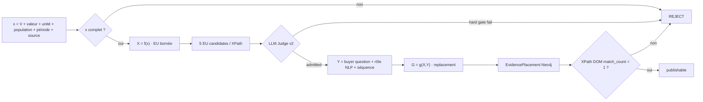

# Expertise — Blockchain & Verifiable Computing

Source de vérité : https://mickael-umt.com/expertises/blockchain/

Run : `EUP-XFY-GXY-2026-08-31`

Statut : `JUDGED_PROPOSED` — les séquences et les EvidencePlacement sont matérialisés dans Neo4j. Les XPath sont ancrés sur le texte observé de la page ; le `match_count` DOM doit encore être asserté avant remplacement automatique du HTML.

## Contrat de preuve

```text
x = variable quantitative atomique
  = V + valeur + unité + population + période + source

X = f(x) = Evidence Unit bornée
Y = séquence du site + buyer question + rôle NLP
G = g(X,Y) = copywriting proposé

REJECT si nombre, unité, population, période ou source manquent.
```

Judge appliqué : `judge:evidence-unit:champion-v2` — EvidenceUnit Dominant Research LLM Judge v2.0.

Hard gates : quantitative-copy, source primaire vérifiable, qualité de recherche, risque de concurrence dans le messaging, séparation fait externe / recommandation, binding offre/page/XPath.

## Capability → offre → preuve publique

| Capability issue du CV | Niveau de preuve exploitable | Implémentation / preuve publique | Rôle dans l’offre |
|---|---|---|---|
| Solidity / EVM | forte ; première preuve publique 2023-05-30 | [Lottery dApp](https://github.com/RickOwri/Encode-Club-Solidity-Bootcamp-Project-W5-LotteryDapp) — Solidity/EVM, ERC-20, logique de rounds et tests | smart contracts, critères d’acceptation, vérification indépendante |
| Rust | forte ; première preuve publique 2023-09-15 | [folder_mapper](https://github.com/RickOwri/folder_mapper) — Rust, CLI, filesystem, SQLite | outillage de vérification reproductible et composants systèmes |
| Solana | preuve à confirmer au niveau certificat + dépôt public existant | [yield-sol](https://github.com/RickOwri/yield-sol) — Rust/Solana et client applicatif | programme Solana, modèle de comptes, intégration on-chain/off-chain |
| ZK / ZKML | certificat + R&D ; dates fines à confirmer | piste Encode Club + travaux ZK/ZKML décrits dans le CV | selective disclosure, attestations, vérification privée |

Offre liée : `offer:blockchain` — **Blockchain & Verifiable Computing**. Stack public : Solidity · Rust · EVM · Solana · Foundry · Hardhat · Anchor · EZKL.

## Table de substitution — page `/expertises/blockchain/`

| Seq | XPath | Buyer question / rôle NLP | Avant | 5 EU candidates passés au Judge | EU retenue : x atomique | G = proposition de remplacement | Capability / offre | Statut |
|---|---|---|---|---|---|---|---|---|
| `seq:blockchain:consequences:history-integrity` | `//*[contains(normalize-space(.), "Signer les exports ne suffit pas")][not(.//*[contains(normalize-space(.), "Signer les exports ne suffit pas")])]` | Une signature de fichier suffit-elle à rendre l’historique vérifiable ? · `OBJECTION_REFRAME / RISK_PROOF` | « Signer les exports ne suffit pas : une signature atteste d’un fichier, pas de l’absence de réécriture de l’historique. » | 1. `EU-BC-MERKLE-LOG-VERIFY-2026` — 94/100 PASS, fit .98 **SELECT**<br>2. `EU-BC-HYBRID-SSO-THROUGHPUT-2026` — 93 PASS, fit .72<br>3. `EU-BC-ZKP-VERIFY-LATENCY-2026` — 99 DOMINANT, fit .65<br>4. `EU-BC-SC-SLR-TAXONOMY-2026` — 96 PASS, fit .61<br>5. `EU-BC-SOLIDITY-TOOLS-COVERAGE-2026` — 100 DOMINANT, fit .52 | V = latence de vérification d’inclusion ; **0,000035 s/log** ; population = logs append-only, datasets 10³/10⁴/10⁵ ; 50 runs ; période = 2026 ; source = IEEE OJCS DOI 10.1109/OJCS.2026.3663463 | **Selon Saengthong et al. (IEEE Open Journal of the Computer Society, 2026), une vérification d’inclusion sur des journaux append-only a été mesurée à 0,000035 s par enregistrement, sur des jeux de 10³ à 10⁵ logs et 50 répétitions. Ici, la question n’est donc pas seulement « le fichier est-il signé ? », mais « un tiers peut-il recomposer l’état d’historique qu’il doit vérifier ? »** | Rust + verifiable data structures + evidence architecture | `PROPOSED_AFTER_LLM_JUDGE`; DOM assert pending |
| `seq:blockchain:consequences:platform-first` | `//*[contains(normalize-space(.), "Le projet démarre par une plateforme")][not(.//*[contains(normalize-space(.), "Le projet démarre par une plateforme")])]` | Quand le coût d’un ledger est-il justifié ? · `FIT_DISCRIMINATOR / COST_VALUE` | « Le projet démarre par une plateforme et cherche ensuite ce qu’elle résout. Le coût est réel, la propriété vérifiable ne l’est pas toujours. » | 1. `EU-BC-HYBRID-SSO-THROUGHPUT-2026` — 93 PASS, fit .99 **SELECT**<br>2. `EU-BC-MERKLE-LOG-VERIFY-2026` — 94 PASS, fit .78<br>3. `EU-BC-ZKP-VERIFY-LATENCY-2026` — 99 DOMINANT, fit .68<br>4. `EU-BC-SC-SLR-TAXONOMY-2026` — 96 PASS, fit .61<br>5. `EU-BC-EIP7702-MALICIOUS-AUTH-2026` — 99 DOMINANT, fit .48 | V = débit endpoint adossé ledger ; **219,23 TPS** ; population = requêtes TOTP sous charge cible 1 000 TPS, prototype SSO 2 organisations ; période = 2026-08 ; source = Wiley DOI 10.1002/cpe.70897. Comparateur observé : 924,79 TPS voie DB. | **Selon Yangeç (Wiley, 2026), sous une charge cible de 1 000 TPS, l’endpoint adossé à un ledger a délivré 219,23 TPS contre 924,79 TPS pour la voie base de données. Une blockchain n’est donc défendable ici que si la preuve répliquée et tamper-evident répond à une propriété qu’un tiers doit réellement vérifier.** | architecture on-chain/off-chain + opportunity note | `PROPOSED_AFTER_LLM_JUDGE`; DOM assert pending |
| `seq:blockchain:consequences:multisig-governance` | `//*[contains(normalize-space(.), "Un multisig ne répond pas à la question")][not(.//*[contains(normalize-space(.), "Un multisig ne répond pas à la question")])]` | Un multisig suffit-il à définir qui contrôle, révoque et arbitre ? · `GOVERNANCE_RISK / KEY_AUTHORITY` | « Un multisig ne répond pas à la question : il déplace la décision sans dire qui l’arbitre ni sous quel délai. » | 1. `EU-BC-GOV-MULTISIG-ATTRIBUTION-2026` — 90 **REJECT hard gate**, fit .99 : bibliométrie insuffisante<br>2. `EU-BC-EIP7702-MALICIOUS-AUTH-2026` — 99 DOMINANT, fit .92 **SELECT**<br>3. `EU-BC-SC-SLR-TAXONOMY-2026` — 96 PASS, fit .70<br>4. `EU-BC-SOLIDITY-TOOLS-COVERAGE-2026` — 100 DOMINANT, fit .61<br>5. `EU-BC-ZKP-VERIFY-LATENCY-2026` — 99 DOMINANT, fit .55 | V = transactions d’autorisation liées à attaques EOA ; **>63 %** ; population = transactions EIP-7702 analysées sur **7 blockchains** ; période = USENIX Security 2026 ; source = Huang et al. | **Selon Huang et al. (USENIX Security 2026), plus de 63 % des transactions d’autorisation EIP-7702 observées sur sept blockchains étaient associées à des attaques ciblant des comptes EOA. Le seuil de signatures n’est donc pas toute la gouvernance : avant déploiement, il faut rendre explicites les droits d’autorisation, de révocation et de reprise.** | Solidity/EVM + account abstraction + key governance | `PROPOSED_AFTER_LLM_JUDGE`; le meilleur fit direct a été rejeté, donc fallback de recherche élite |
| `seq:blockchain:proposition:onchain-offchain` | `//*[contains(normalize-space(.), "La preuve va on-chain, la donnée confidentielle reste off-chain")][not(.//*[contains(normalize-space(.), "La preuve va on-chain, la donnée confidentielle reste off-chain")])]` | Peut-on vérifier une propriété sans publier la donnée confidentielle ? · `MECHANISM_EXPLANATION / PRIVACY_VERIFICATION` | « La preuve va on-chain, la donnée confidentielle reste off-chain. » | 1. `EU-BC-ZKP-VERIFY-LATENCY-2026` — 99 DOMINANT, fit .99 **SELECT**<br>2. `EU-BC-MERKLE-LOG-VERIFY-2026` — 94 PASS, fit .84<br>3. `EU-BC-HYBRID-SSO-THROUGHPUT-2026` — 93 PASS, fit .72<br>4. `EU-BC-EIP7702-MALICIOUS-AUTH-2026` — 99 DOMINANT, fit .65<br>5. `EU-BC-SC-SLR-TAXONOMY-2026` — 96 PASS, fit .58 | V = latence de vérification ZKP ; **<95 ms** ; population = opérations ZKP d’un prototype de credentials privacy-preserving dual-chain ; période = 2026-07 ; source = JISA DOI 10.1016/j.jisa.2026.104465 | **Selon Zheng et al. (Journal of Information Security and Applications, 2026), la vérification ZKP de leur architecture de credentials préservant la confidentialité s’exécute en moins de 95 ms. Cela montre qu’une propriété peut être vérifiée sans publier la donnée sous-jacente ; le choix on-chain/off-chain reste à borner par le besoin de vérification.** | ZK/ZKML + attestations + selective disclosure | `PROPOSED_AFTER_LLM_JUDGE`; DOM assert pending |
| `seq:blockchain:resultats:independent-verifier` | `//*[contains(normalize-space(.), "Un tiers recalcule la preuve sans accès à vos systèmes")][not(.//*[contains(normalize-space(.), "Un tiers recalcule la preuve sans accès à vos systèmes")])]` | Comment démontrer que la vérification ne dépend pas d’un outil unique ? · `ACCEPTANCE_CRITERION / THIRD_PARTY_VERIFICATION` | « Un tiers recalcule la preuve sans accès à vos systèmes, avec l’outil de son choix, et obtient le même résultat. » | 1. `EU-BC-SOLIDITY-TOOLS-COVERAGE-2026` — **100 DOMINANT**, fit .91 **SELECT**<br>2. `EU-BC-MERKLE-LOG-VERIFY-2026` — 94 PASS, fit .89<br>3. `EU-BC-SC-SLR-TAXONOMY-2026` — 96 PASS, fit .78<br>4. `EU-BC-ZKP-VERIFY-LATENCY-2026` — 99 DOMINANT, fit .70<br>5. `EU-BC-EIP7702-MALICIOUS-AUTH-2026` — 99 DOMINANT, fit .68 | V = vulnérabilités détectées par ensemble complémentaire de 3 outils ; **76,78 %** ; population = vulnérabilités annotées manuellement sur **2 182 instances Solidity**, 19 outils + LLM évalués ; période = 2026-05 ; source = Empirical Software Engineering | **Selon Salzano et al. (Empirical Software Engineering, 2026), trois détecteurs complémentaires couvraient jusqu’à 76,78 % des vulnérabilités annotées sur 2 182 instances, et aucun outil unique ne couvrait toutes les classes. L’acceptation doit donc être reproductible par une chaîne de vérification documentée, pas par la confiance dans un seul outil.** | Solidity/EVM + Foundry/Hardhat + test/verification | `PROPOSED_AFTER_LLM_JUDGE`; EU score maximal 100/100 |
| `seq:blockchain:engagements:crypto-not-audit` | `//*[contains(normalize-space(.), "Un engagement cryptographique n’est pas un audit de sécurité")][not(.//*[contains(normalize-space(.), "Un engagement cryptographique n’est pas un audit de sécurité")])]` | Une preuve cryptographique remplace-t-elle un audit de sécurité ? · `BOUNDARY_CONDITION / SECURITY_ASSURANCE` | « Un engagement cryptographique n’est pas un audit de sécurité. » | 1. `EU-BC-SC-SLR-TAXONOMY-2026` — 96 PASS, fit .99 **SELECT**<br>2. `EU-BC-SOLIDITY-TOOLS-COVERAGE-2026` — 100 DOMINANT, fit .96<br>3. `EU-BC-EIP7702-MALICIOUS-AUTH-2026` — 99 DOMINANT, fit .81<br>4. `EU-BC-MERKLE-LOG-VERIFY-2026` — 94 PASS, fit .72<br>5. `EU-BC-ZKP-VERIFY-LATENCY-2026` — 99 DOMINANT, fit .60 | V = types de vulnérabilités catalogués ; **192 vulnérabilités / 13 catégories** ; population = **222 études de haute qualité** retenues sur 3 380 ; période = 2026-06 ; source = Journal of Systems and Software | **Selon Iuliano et Di Nucci (Journal of Systems and Software, 2026), 222 études de haute qualité ont permis de cataloguer 192 vulnérabilités en 13 catégories, 219 outils et 133 benchmarks. Un engagement cryptographique atteste une propriété bornée ; il ne remplace pas l’analyse de surface d’attaque ni l’audit de sécurité.** | Solidity/EVM assurance + boundary entre proof et security audit | `PROPOSED_AFTER_LLM_JUDGE`; DOM assert pending |

## Registre des Evidence Units utilisées

| EU | Score Judge | Hard gate | Bibliométrie | Source primaire | Boundary |
|---|---:|---|---|---|---|
| `EU-BC-MERKLE-LOG-VERIFY-2026` | 94 | PASS | non vérifiée → non-dominant | [IEEE OJCS](https://doi.org/10.1109/OJCS.2026.3663463) | benchmark d’une architecture de vérification de logs ; aucune généralisation à toute signature/blockchain |
| `EU-BC-HYBRID-SSO-THROUGHPUT-2026` | 93 | PASS | non vérifiée → non-dominant | [Wiley](https://onlinelibrary.wiley.com/doi/10.1002/cpe.70897) | prototype SSO/TOTP ; ratio de débit non universel |
| `EU-BC-GOV-MULTISIG-ATTRIBUTION-2026` | 90 | **REJECT** | insuffisante pour le policy v2 | [Frontiers in Blockchain](https://www.frontiersin.org/journals/blockchain/articles/10.3389/fbloc.2026.1853465/full) | très bon fit sémantique mais non éligible au copy commercial final sous le hard gate actuel |
| `EU-BC-EIP7702-MALICIOUS-AUTH-2026` | 99 | PASS | Shuai Wang h-index 43 (AD Scientific Index) | [USENIX Security 2026](https://www.usenix.org/conference/usenixsecurity26/presentation/huang-mingyuan) | EIP-7702 seulement ; ne mesure pas un taux de compromission multisig |
| `EU-BC-ZKP-VERIFY-LATENCY-2026` | 99 | PASS | Yang Xiang h-index 91 | [JISA](https://doi.org/10.1016/j.jisa.2026.104465) | prototype credential ; pas une garantie universelle de latence ZK |
| `EU-BC-SOLIDITY-TOOLS-COVERAGE-2026` | **100** | PASS | Rocco Oliveto h-index 86 | [Empirical Software Engineering](https://link.springer.com/article/10.1007/s10664-026-10867-7) | 76,78 % sur jeux/taxonomie/outils étudiés ; pas une garantie d’audit complet |
| `EU-BC-SC-SLR-TAXONOMY-2026` | 96 | PASS | non vérifiée dans ce run → non-dominant | [Journal of Systems and Software](https://www.sciencedirect.com/science/article/pii/S0164121226000221) | largeur de la littérature ; ne donne pas le risque d’un contrat précis |

## Décision graph



## Neo4j materialization

Créé / mis à jour :

- 6 `CopySequence` ciblées par XPath ;
- 7 `EvidenceUnit` quantitatives complètes ;
- 7 `EvidenceMetric` ;
- 30 `EvidenceCandidateMatch` = exactement 5 candidats × 6 XPath ;
- 6 `EvidencePlacement` retenus ;
- 6 `CopyRewriteProposal` ;
- binding `EvidenceUnit → ConsultingOffer offer:blockchain` ;
- binding `EvidenceUnit → WebPage page:source:8.1` ;
- binding des 7 EU vers `judge:evidence-unit:champion-v2`.

Le write est volontairement **fail-closed** : l’EU Frontiers multisig reste dans la liste de candidats mais n’est pas éligible au copy final, ce qui documente le fonctionnement effectif du Judge au lieu de masquer les rejets.

## Prochaine gate avant modification de la page source

Exécuter le DOM assertion sur chaque XPath et n’autoriser le remplacement automatique que si `xpath_match_count = 1`, puis faire passer la page rendue dans le contrôle de claims pour vérifier que chaque chiffre conserve source, unité, population, période et boundary.