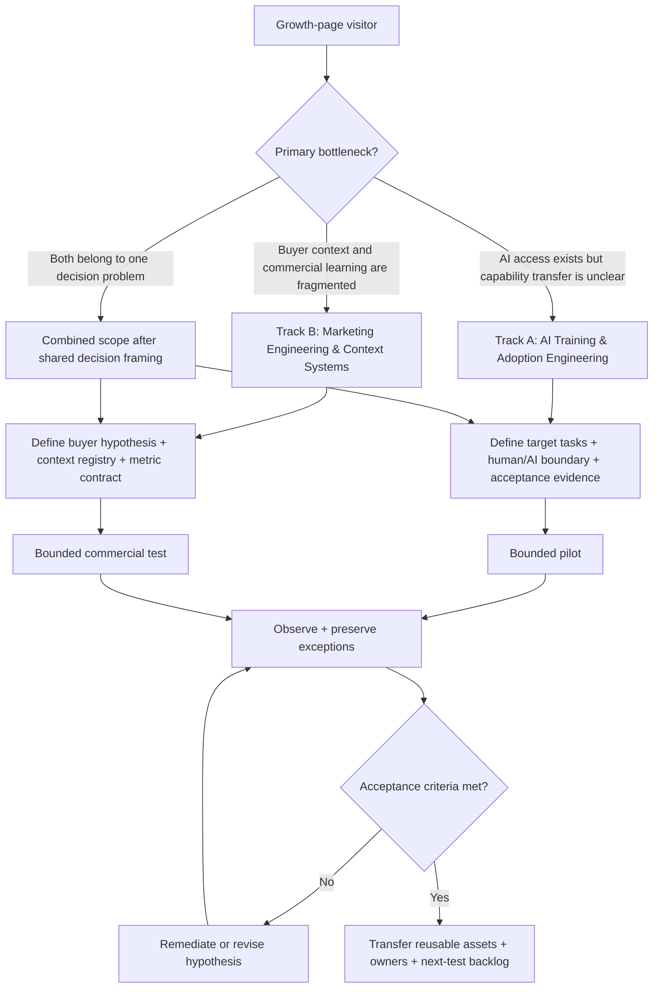

# Adoption & Growth — Evidence-Grounded Landing Page

Source page: https://mickael-umt.com/expertises/growth/

## 0. Current-page diagnosis

The live category body is concise: a category promise, the two canonical Growth offers, three capability cards, a next-step CTA and a qualification flow. The commercial gap is not lack of content volume; it is lack of a buyer decision sequence.

The proposed page preserves the existing category and the two existing offers:

1. **AI Training & Adoption Engineering — Governed Capability Transfer**
2. **Marketing Engineering & Context Systems**

It adds the missing decision path:

`problem -> self-recognition -> track selection -> mechanism -> delivery -> acceptance -> evidence boundary -> CTA`

Core thesis:

> **Make capability and commercial learning observable before you try to scale them.**

---

# 1. XYZ Statement

**[P] — Problem**

AI capability and commercial context often become distributed across people, workshops, documents, prompts, CRM fields, dashboards and agencies. The organisation can accumulate activity without preserving the logic needed to answer: what changed, what evidence supports it, who owns the decision, what is reusable, and what must remain under human review.

**[X] — Product / Service**

**Adoption & Growth Engineering** — a category-level engagement combining governed AI capability transfer with marketing context and measurement engineering.

**[Y] — Ideal Client / Customer**

Two primary buyer situations:

- **AI Transformation / L&D / Enablement leaders** who need AI use to translate into observable workplace capability with explicit human/AI boundaries.
- **Marketing / Revenue Operations leaders** who need buyer context, offers, sources, prompts, analytics and experiments to become a versioned operating system rather than institutional memory.

**[Z] — Benefit**

A reusable operating capability in which decisions, context, evidence, ownership, measurement and handover are explicit enough for another operator to inspect and continue.

**[O] — Offer Delivery Method**

A bounded operating-system engagement:

`frame -> baseline -> design -> pilot -> instrument -> review -> transfer`

First-party offer boundaries from `/site`:

- Training: framing, a pilot cohort of **at most 12**, then a **3–6 month** programme if expansion is justified.
- Marketing Engineering: a **3–6 month** marketing operating-system and automation engagement.

---

# 2. Elevator Pitch

## Turn scattered capability and commercial context into systems your team can measure, reuse and improve.

Adoption & Growth Engineering is for teams that already have activity — AI licences, training, campaigns, content, CRM data, prompts and dashboards — but still depend on tacit knowledge to decide what to do next. The engagement routes the problem into one of two tracks: governed AI capability transfer or a versioned marketing context system. The result is not “more activity.” It is an inspectable operating layer connecting **fact, hypothesis, test, decision, owner and next action**.

---

# 3. Landing-Page Information Architecture

| Order | Section | Buyer question | NLP / commercial role |
|---|---|---|---|
| S0 | Hero | What does this category solve? | PROBLEM_REFRAME |
| S1 | Recognition | Is this my problem? | SELF_IDENTIFICATION |
| S2 | Two tracks | Which operating problem do I have? | ROUTING |
| S3 | Product | What exactly gets built? | MECHANISM |
| S4 | Delivery | How does the engagement work? | RISK_REDUCTION |
| S5 | Modules | What is included? | VALUE_STACK |
| S6 | Outcomes | What becomes observable or reusable? | ACCEPTANCE |
| S7 | Problems → solutions | Where does it intervene? | OBJECTION_HANDLING |
| S8 | Evidence boundary | What is fact, context, or recommendation? | PROOF |
| S9 | Capacity & guarantee | What is actually constrained or guaranteed? | RISK_REVERSAL |
| S10 | FAQ | What still blocks the decision? | OBJECTION_RESOLUTION |
| S11 | CTA | What is the smallest next step? | CONVERSION |

For production, every evidence-bearing atomic claim should receive a stable `data-seq-id`. The live page currently has no @neofort-materialized CopySequence/XPath graph for this new copy, so final placement remains blocked until deployment.

---

# 4. Landing-Page Copy

## HERO

**Eyebrow:** ADOPTION & GROWTH ENGINEERING

# Turn scattered capability and commercial context into systems your team can measure, reuse and improve.

AI access is not the same thing as transferable capability. Marketing activity is not the same thing as a reusable growth system. This category is for teams that need to make roles, context, evidence, tests and next actions explicit before scaling what they do.

**Primary CTA:** Qualify the engagement  
**Secondary CTA:** Choose your Growth track

**Microcopy:** Two tracks. One operating principle: make the work observable before scaling it.

---

## [C1] Compelling offer for [O]

# The Adoption & Growth Operating System

A bounded engagement that converts fragmented know-how into an operating layer your team can inspect, measure and hand over.

### Track A — AI Training & Adoption Engineering

For teams that need **governed capability transfer**, not attendance as a proxy for adoption.

Build:

- role / task / competency matrix;
- scenario-based exercises tied to real work;
- assessment rubrics;
- human/AI responsibility and escalation rules;
- data-classification boundaries;
- transfer-evidence protocol;
- manager handover kit.

### Track B — Marketing Engineering & Context Systems

For teams whose buyer knowledge and campaign logic are distributed across slides, people, CRM fields, prompts and disconnected analytics.

Build:

- versioned avatars and buyer questions;
- offer and positioning architecture;
- source and evidence register;
- message and hook hypotheses;
- structured prompt/context assets;
- metric contracts and experiment definitions;
- decision logs connecting observations to next actions.

### Shared operating object

`FACT -> HYPOTHESIS -> TEST -> OBSERVATION -> DECISION -> OWNER -> NEXT ACTION`

You do not have to buy both tracks. A combined scope is justified only when both bottlenecks belong to the same decision problem.

---

## [C2] Who is this offer for?

### AI Transformation / L&D / Enablement leaders

You already have AI access, training or internal champions, but you cannot yet show which target tasks changed, what competence is required, what remains human-owned, or what evidence demonstrates transfer.

Decision question:

> **Which tasks should change, what competence is required, what remains human-owned, and what evidence is enough to accept transfer?**

### Marketing / Revenue Operations leaders

You already have campaigns, CRM, analytics, content and perhaps agencies, but buyer context and decision logic are repeatedly reconstructed from memory.

Decision question:

> **Which buyer hypothesis are we testing, what evidence supports it, which signal changes the next action, and how will that learning be reused?**

### Not a fit

This is not the right offer when you only need a one-off content batch, a generic awareness seminar, an unqualified automation mandate, or a guarantee of revenue/productivity/adoption without a causal measurement design.

---

## [C3] What is the product?

This is an **operating-system engagement**, not a software licence and not a disconnected bundle of workshops.

The product is a set of inspectable decision assets:

**Decision map** — the decision, owner, users, constraints, admissible evidence and escalation path.

**Context registry** — avatars, offers, sources, approved claims, assumptions, prompts and unresolved questions under version control.

**Capability map** — target tasks connected to required competence, allowed AI use, review and observable performance.

**Experiment register** — each message, workflow or offer change recorded as a hypothesis with a metric, population, period and decision rule.

**Evidence layer** — external fact, internal observation, recommendation, forecast and assumption kept distinct.

**Handover layer** — reusable templates, operating rules, unresolved risks and a next-test backlog.

---

## [C4] Why do they need it? What does [Y] desire?

They want continuity without depending on one trainer, marketer, prompt author or operator.

They want to be able to answer:

- What capability actually transferred?
- Which buyer hypothesis was tested?
- Which source supports this claim?
- Which observation changed the decision?
- Which result is observed versus inferred?
- Which action can be repeated?
- Which boundary requires human review?
- What can another operator continue without reconstructing the project from memory?

External evidence can strengthen this rationale, but no external source is allowed to “prove” the consulting offer itself. Current @neofort evidence and recent web candidates are separated in Section 5.

---

## [C5] How do they get it?

### Phase 1 — Frame the decision
Define one business decision, the accountable owner, target users, current workflow, constraints and acceptance criteria.

### Phase 2 — Establish the baseline
Inventory the current sources, tools, prompts, training assets, CRM/analytics fields, handoffs and known failure modes.

### Phase 3 — Build the minimum operating layer
Create only the objects required for the selected track.

### Phase 4 — Pilot on bounded work
Training starts with a pilot cohort of at most 12. Marketing Engineering starts with a bounded buyer/offer/message or workflow slice.

### Phase 5 — Instrument and review
Measure the predeclared signals. Preserve positive, negative and null observations. Do not rewrite an observation to fit the preferred narrative.

### Phase 6 — Transfer
Handover the operating rules, evidence register, reusable assets, unresolved risks and next-test backlog.

---

## [C6] Benefits

- Replace tacit context with versioned operating knowledge.
- Make role, buyer and workflow assumptions explicit before scaling activity.
- Connect tests to metrics and next-action rules.
- Preserve negative and null findings so failed experiments are not repeated as fresh ideas.
- Clarify human accountability around AI-assisted work.
- Reduce dependency on individual memory.
- Make handover inspectable.
- Keep fact, observation, recommendation and forecast epistemically separate.

These are deliverable/mechanism benefits, not guaranteed external business outcomes.

---

## [C7] Eight modules

### Module 1 — Decision & Buyer Map
Define the decision owner, target user/buyer, workflow, constraints and acceptance criteria.

### Module 2 — Evidence & Context Registry
Version sources, facts, hypotheses, offer context, approved claims and unresolved questions.

### Module 3 — Capability / Task Architecture
Map real tasks to competence, permissions, review and escalation.

### Module 4 — Offer & Message Architecture
Translate buyer problems into bounded offers, message hypotheses, proof requirements and next actions.

### Module 5 — Measurement & Experiment Design
Define the metric contract: variable, unit, population, period, comparator and decision threshold.

### Module 6 — Workflow & Automation
Connect context to prompts, analytics and automation without obscuring consequential decisions.

### Module 7 — Pilot & Review
Run a bounded cohort or commercial test and record the observations, including contradictory results.

### Module 8 — Transfer & Governance
Deliver reusable context, ownership, review cadence, documentation and the next-test backlog.

---

## [C8] Three best outcomes

### Outcome 1 — Observable capability
Managers can point to target tasks, rubrics, escalation rules and transfer evidence instead of treating participation as proof of adoption.

### Outcome 2 — Reusable commercial context
Avatars, offers, evidence, messages, prompts and metrics are versioned rather than rebuilt for each campaign or operator.

### Outcome 3 — A decision loop that survives handover
The team can distinguish what was observed, what remains a hypothesis, what decision was made, who owns it and what should be tested next.

No outcome above is a guarantee of revenue growth, productivity uplift, regulatory compliance or a specific adoption rate.

---

## [C9] Top recurring problems + offer position

| Problem | Offer position |
|---|---|
| Training participation is reported as adoption. | Track A defines target tasks, rubrics and transfer evidence. |
| AI use expands faster than role boundaries. | Track A maps allowed use, human ownership and escalation. |
| Buyer context lives in individual memory. | Track B versions avatars, buyer questions, sources and offer logic. |
| Positioning changes without decision history. | Track B records hypotheses, observations and why the copy changed. |
| Content volume rises while learning remains unclear. | Track B binds message tests to metric contracts and next actions. |
| CRM/analytics capture events but not decision rationale. | Track B adds hypothesis and decision context around operational signals. |
| Automation starts before acceptance criteria exist. | The shared layer defines authority, acceptance and escalation first. |
| Negative results disappear. | The experiment register preserves null and contradictory observations. |
| One expert becomes the system. | Handover externalizes the minimum reusable objects. |
| Dashboards cannot reconstruct why a decision changed. | Decision logs connect evidence, interpretation, owner and action. |

---

## [C10] Direct solution to each problem

**1. Attendance is used as adoption.** Define the work that must change, then evaluate observable performance against a rubric.

**2. AI boundaries are implicit.** Create a human/AI task matrix naming assistance, review, escalation and accountable owner.

**3. Buyer context is tacit.** Move buyer problems, objections, sources and offer logic into a versioned registry.

**4. Positioning drifts.** Treat material positioning changes as hypotheses with a reason, source and test.

**5. Content is produced without learning.** Bind each message family to a metric and next-action rule.

**6. CRM lacks explanatory context.** Preserve the operational signal while attaching the hypothesis and decision it informs.

**7. Automation precedes governance.** Define authority, acceptance and escalation before automating the workflow.

**8. Negative results disappear.** Record them with the same structure as positive results.

**9. One person holds the system together.** Externalize reusable context, templates and operating rules.

**10. Dashboards cannot explain the decision.** Add a decision log from evidence to interpretation to owner to action.

---

## [C11] Scarcity

No artificial countdown.

The only first-party capacity constraint currently documented for this category is the Training pilot: **at most 12 participants per pilot cohort**.

Engagement availability is confirmed during qualification. Do not publish invented “last slot” scarcity.

---

## [C12] Guarantee

### Acceptance guarantee proposal — requires contractual/legal approval before publication

Each deliverable should have written acceptance criteria before build. If an agreed deliverable does not meet those criteria at handover, the remediation needed to meet the agreed criterion is completed before that deliverable is accepted.

The guarantee is on **delivery against agreed acceptance criteria**, not on revenue, productivity, compliance or adoption outcomes outside the engagement's causal control.

---

## [C13] Call to action

# Start with the decision, not the tool.

Bring one adoption or commercial problem that currently depends on scattered capability, context or evidence.

Qualification should establish:

1. the decision that must improve;
2. the people and workflow involved;
3. the evidence already available;
4. the signal that would change the next action;
5. the Growth track that fits the problem.

**Primary CTA:** Qualify the engagement  
**Secondary CTA:** Compare the two Growth tracks

---

## [C14] Customer testimonial

**BLOCKED — no verified customer quotation is available in the evidence supplied for this task.**

Do not fabricate a first-person testimonial.

Replace the testimonial module with a proof card linking to verifiable first-party evidence such as the documented training track, public projects, capability records, or an approved case study when one exists.

---

## [C15] Positive review

**BLOCKED — no independently verified review is available in the evidence supplied for this task.**

Do not generate a synthetic review in the buyer's voice.

Use a provenance-labeled proof card instead.

---

## [C16] FAQ

### Is this a marketing agency?
No. Marketing Engineering builds the context, measurement and decision system around marketing execution. It can coexist with internal marketers, agencies and media specialists.

### Is this an AI training course?
Not by default. The Training track starts from target workplace tasks, competence, human/AI boundaries and transfer evidence. A course can be one delivery component.

### Do we need both tracks?
No. Use Training when the bottleneck is capability transfer. Use Marketing Engineering when the bottleneck is commercial context and measurement. Combine them only when both belong to one operating problem.

### Can you guarantee revenue growth?
No. The engagement can improve the quality and traceability of decisions and tests; uncontrolled market outcomes cannot be guaranteed truthfully.

### Can you guarantee a specific AI-adoption rate?
No. The work defines target tasks and acceptance evidence so adoption can be evaluated in context.

### Do you replace our CRM, LMS or analytics stack?
Not by default. The default is to structure the decision layer around the systems already in use unless replacement is independently justified.

### Can the system automate decisions?
Bounded steps can be automated when authority, acceptance and escalation are explicit. Consequential decisions retain named ownership unless governance explicitly says otherwise.

### What happens to failed experiments?
They remain in the evidence register with the same provenance discipline as positive observations.

### How do we start?
Bring one decision that is hard to make because capability, context or evidence is fragmented.

---

## [C17] Ten problems [Y] deals with

**Problem 1:** Participation is confused with capability transfer.  
**Problem 2:** AI use expands without role-level boundaries.  
**Problem 3:** Buyer context is scattered across people and files.  
**Problem 4:** Positioning changes faster than its evidence trail.  
**Problem 5:** Marketing activity is measured without a decision contract.  
**Problem 6:** Operational systems capture events but not hypotheses.  
**Problem 7:** Facts and persuasive assumptions are mixed.  
**Problem 8:** Automation arrives before acceptance and escalation rules.  
**Problem 9:** Learning disappears when a key operator leaves.  
**Problem 10:** Leadership sees metrics but cannot reconstruct why the next action changed.

---

## [C18] Position the offer as the solution

**Problem 1 →** use task-level rubrics and transfer evidence.  
**Problem 2 →** build a human/AI authority matrix.  
**Problem 3 →** version buyer questions, sources and offer context.  
**Problem 4 →** attach positioning changes to hypotheses and tests.  
**Problem 5 →** give each experiment a metric contract and decision rule.  
**Problem 6 →** connect operational events to the hypothesis they inform.  
**Problem 7 →** label fact, observation, hypothesis, recommendation and forecast separately.  
**Problem 8 →** define permission, review and escalation before automation.  
**Problem 9 →** deliver reusable context and decision logs as handover assets.  
**Problem 10 →** make the evidence-to-action path inspectable.

---

## [C19] Landing-page headlines

1. **Turn scattered capability and commercial context into systems your team can measure, reuse and improve.**
2. **AI access is not transferable capability. Marketing activity is not a reusable growth system.**
3. **Make the work observable before you scale it.**
4. **From training participation to inspectable capability transfer.**
5. **From marketing memory to a versioned context system.**
6. **One Growth category. Two operating problems. No forced bundle.**
7. **Stop rebuilding buyer context every time the campaign, prompt or operator changes.**
8. **Give every hypothesis a metric, every decision an owner and every result a boundary.**
9. **Build the context layer that survives the campaign.**
10. **Build AI capability that survives the workshop.**
11. **Preserve what did not work, not just what did.**
12. **Start with the decision, not the tool.**

---

# 5. Evidence Registry

## 5.1 Current @neofort EvidenceUnits relevant to Growth

These objects pass the current deterministic Factfulness/agent-exploitability gate in @neofort, but **none currently has a Growth EvidencePlacement**. Therefore they are evidence candidates for Level-2 disclosure; they are **not treated as publication-authorized inline claims** in the landing copy above.

### EU-CANON-IAB-MEASUREMENT-2026

- **Source fact:** In the IAB 2026 Outlook Study, 72% of buyer respondents expected increased focus on cross-platform measurement, 66% on agentic AI ad buying/campaign execution, and 62% on incrementality measurement in 2026.
- **Population:** n=205 buyer respondents for the cited question.
- **Period:** 2026 outlook compared with 2025.
- **Boundary:** buyer priorities/expectations, not measured causal returns.
- **@neofort state:** `current=true; preflight=PASS; factfulness=PASS; agent_exploitability=ALLOWED; admission=CANONICAL_FACTFULNESS_PASS`.
- **Source:** https://www.iab.com/wp-content/uploads/2026/01/IAB_2026_Outlook_Study_January_2026.pdf
- **Use:** supports the importance of explicit measurement as a buyer priority; does not prove the Marketing Engineering offer improves ROI.

### EU-CANON-GARTNER-MKT-AUTOMATION-SURVEY-2026

- **Source fact:** In a Gartner survey of 402 CMOs, respondents expected AI-driven automation of marketing work to rise from 16% in 2026 to 36% by 2028.
- **Population:** 402 CMOs.
- **Survey period:** August–October 2025.
- **Boundary:** reported expectation, not observed 2028 automation and not causal impact.
- **@neofort state:** `current=true; preflight=PASS; factfulness=PASS; agent_exploitability=ALLOWED; admission=CANONICAL_FACTFULNESS_PASS`.
- **Source:** https://www.gartner.com/en/newsroom/press-releases/2026-05-11-gartner-survey-reveals-marketing-leaders-expect-ai-automation-of-marketing-work-to-double-to-36-percent-by-2028
- **Use:** contextualizes automation demand; does not prove that more automation is desirable.

### EU-CANON-WEF-SKILLS-GAP-2025

- **Source fact:** WEF reports that 63% of surveyed employers cite skills gaps as a major barrier to business transformation, while about 39% of workers' existing skill sets are expected to transform or become outdated over 2025–2030.
- **Population:** Future of Jobs Survey respondents drawing on data from more than 1,000 companies.
- **Boundary:** employer survey/outlook; 39% is an expectation, not realized skill loss.
- **@neofort state:** `current=true; preflight=PASS; factfulness=PASS; agent_exploitability=ALLOWED; admission=CANONICAL_FACTFULNESS_PASS`.
- **Source:** https://www.weforum.org/publications/the-future-of-jobs-report-2025/digest/
- **Use:** capacity-building context only; does not prove the Training offer's effect.

## 5.2 Recent web EvidenceUnit candidates — not yet admitted to @neofort

### CAND-GR-EU-AI-LITERACY-2026

- **Source:** consolidated Regulation (EU) 2024/1689, current version 27 July 2026; European Commission AI-literacy guidance updated August 2026.
- **Atomic fact:** Article 4 requires providers and deployers to take measures supporting AI literacy for staff and other persons using AI systems on their behalf, taking technical knowledge, experience, education, training and use context into account. The amended text does not require a specific individual level of AI literacy.
- **Epistemic class:** `NORMATIVE / PRIMARY LAW`.
- **Boundary:** this does not prove that any specific training engagement creates compliance or legal safe harbour.
- **Primary sources:**  
  https://eur-lex.europa.eu/eli/reg/2024/1689  
  https://digital-strategy.ec.europa.eu/en/faqs/ai-literacy-questions-answers
- **Candidate status:** `WEB_VERIFIED; NOT_MATERIALIZED_IN_NEOFORT; NOT_PLACEMENT_AUTHORIZED`.

### CAND-GR-WORKPLACE-AI-ACTIONS-2608.15550

- **Source:** Yu et al., *Adoption of Generative AI in the Workplace: Increasing and Shifting the Balance of Productivity and Communication Activity*, arXiv:2608.15550, submitted 16 August 2026.
- **Method:** digital trace data from Microsoft M365 across multiple large international companies; propensity-score matched later adopters; Difference-in-Differences; human-triggered actions only.
- **Atomic observation:** among users with at least 100 AI uses during the first 20 weeks, the study reports a 21.2% increase in productivity-application actions and a 7.1% increase in communication-application actions relative to matched later adopters.
- **Epistemic class:** `QUASI_EXPERIMENTAL / ASSOCIATIONAL-CAUSAL CAUTION`.
- **Important limitations:** selection bias remains possible; application actions are not direct productivity measures; sample is concentrated in large companies; several authors are affiliated with Microsoft.
- **Source:** https://arxiv.org/abs/2608.15550
- **Candidate status:** `METHOD_VISIBLE; RECENT; VENDOR_AFFILIATION_PRESENT; NOT_ADMITTED; DO_NOT_USE_AS_DOMINANT_PUBLIC_PROOF`.
- **Permitted rationale if later admitted:** AI adoption can change work patterns, so workplace adoption should be measured at task/workflow level rather than inferred from licence access alone.

### CAND-GR-CAUSAL-MARKETING-2608.10182

- **Source:** Wei et al., *From Prediction to Incrementality: Causal Optimization for Large-Scale Targeting and Recommendation*, arXiv:2608.10182, submitted 10 August 2026.
- **Method:** causal treatment-effect model + uncertainty-aware bandit + constrained allocation; offline simulations and an online A/B test on LinkedIn Feed marketing traffic.
- **Atomic observation:** the authors report a statistically significant +7.20% lift in their primary long-term-value metric for the evaluated treatment policy.
- **Epistemic class:** `EXPERIMENTAL / PRODUCT-SPECIFIC`.
- **Boundary:** product/platform-specific result; not evidence that this consulting offer increases conversion or ROI.
- **Source:** https://arxiv.org/abs/2608.10182
- **Candidate status:** `RECENT; METHOD_ONLY; VENDOR/PLATFORM-SPECIFIC; NOT_ADMITTED; NUMERIC RESULT NOT FOR LANDING-PAGE CLAIM`.
- **Permitted rationale if later admitted:** when the business question is incremental impact, predictive scoring and causal measurement answer different questions.

## 5.3 Rejected / quarantined claim patterns

| Claim pattern | Decision | Reason |
|---|---|---|
| “This engagement increases revenue by X%.” | REJECT | No matched causal client evidence. |
| “AI training guarantees compliance.” | REJECT | Regulatory duty does not entail compliance from a specific programme. |
| “More AI automation improves marketing performance.” | REJECT | Adoption/expectation evidence does not establish causal value. |
| Synthetic customer testimonial/review | REJECT | Fabricated social proof. |
| Vendor case-study conversion numbers used as general market proof | QUARANTINE | Product/promotional scope and transfer problem. |
| Forecast treated as observation | REJECT | Violates prediction hygiene. |
| Attendance treated as capability transfer | REJECT | Metric does not entail workplace capability. |

---

# 6. Evidence Placement Plan

Current @neofort state:

- the page object exists as `page:source:4.1`;
- no current PageSection/CopySequence graph is attached to `/expertises/growth/`;
- the three current relevant EvidenceUnits above have no current Growth EvidencePlacement.

Therefore no proposed claim can honestly receive `xpath_match_count == 1` yet.

Recommended production anchors after implementation:

| Seq ID | Atomic claim class | Candidate evidence | Status |
|---|---|---|---|
| `growth:hero:category-promise` | first-party positioning | /site offer semantics | `COPY_READY` |
| `growth:training:offer-format` | first-party operational fact | /site Training offer | `COPY_READY` |
| `growth:marketing:offer-format` | first-party operational fact | /site Marketing Engineering offer | `COPY_READY` |
| `growth:context:measurement-priority` | external contextual fact | EU-CANON-IAB-MEASUREMENT-2026 | `PENDING_PLACEMENT_ADMISSION` |
| `growth:context:automation-expectation` | external survey expectation | EU-CANON-GARTNER-MKT-AUTOMATION-SURVEY-2026 | `PENDING_PLACEMENT_ADMISSION` |
| `growth:context:skills-gap` | external employer outlook | EU-CANON-WEF-SKILLS-GAP-2025 | `PENDING_PLACEMENT_ADMISSION` |
| `growth:training:ai-literacy-law` | normative legal claim | CAND-GR-EU-AI-LITERACY-2026 | `PENDING_NEOFORT_INGESTION` |
| `growth:training:work-patterns` | quasi-experimental context | CAND-GR-WORKPLACE-AI-ACTIONS-2608.15550 | `QUARANTINE_METHOD_ONLY` |
| `growth:marketing:incrementality` | causal-measurement method | CAND-GR-CAUSAL-MARKETING-2608.10182 | `QUARANTINE_METHOD_ONLY` |

Public Level-1 copy should remain citation-light until a selector-consensus placement exists. Level-2 evidence disclosure should carry the EU id, metric/claim, population, period, source, boundary and verified URL.

---

# 7. Deterministic Validation

## Policy resolution

- [x] `policy:evidence-agent-exploitability:deterministic-preflight-v2`
- [x] `judge:evidence:factfulness-epistemology-methodology-v2`
- [x] `policy:evidence-judge-applicability:v2`
- [x] `policy:evidence-judge-verdict-normalization:v2`
- [x] `policy:llm-judge:deterministic-execution-v2`
- [x] `policy:evidence-placement:claim-span-entailment-v2` current v2.2
- [x] `judge:evidence-placement:presentation-v1.2` current; pass 85; champion 95

## Scope and copy

- [x] Only `/expertises/growth/` is targeted.
- [x] Public copy is English.
- [x] The two canonical Growth offers are preserved.
- [x] Training pilot capacity and engagement formats come from first-party `/site`.
- [x] No fake testimonial or review.
- [x] No revenue, productivity, compliance or adoption guarantee.
- [x] Stale non-current `EU-GR-*` references removed.

## Evidence

- [x] Current @neofort facts keep their population/period/boundary.
- [x] Forecasts/expectations are not represented as observations.
- [x] Recent external research is separated from already admitted @neofort objects.
- [x] Vendor/platform-affiliated research is not used as dominant public proof.
- [x] External evidence is not used to prove price, duration, scarcity, guarantee or CTA.

## Hard blockers

- [ ] Raw source HTML/CSS/JS snapshot could not be materialized because runtime DNS resolution failed.
- [ ] No 100%-faithful night-mode asset snapshot can be claimed.
- [ ] New copy is not deployed to the live DOM.
- [ ] No current @neofort CopySequence/XPath graph exists for this page.
- [ ] No selector consensus can be asserted for the proposed claims.
- [ ] No Growth EvidencePlacement exists for the current relevant @neofort EUs.
- [ ] New web candidates are not yet immutable @neofort EvidenceUnits.
- [ ] The required three-replica semantic placement judge has not been executed on an immutable deployed-page snapshot.

Canonical decision:

```text
COPY_ARTIFACT_PERSISTENCE_TO_GITHUB = ALLOWED
AUTOMATED_PUBLICATION = BLOCKED
AGENT_EXPLOITABILITY_OF_NEW_WEB_CANDIDATES = false
PLACEMENT_FINAL_PASS = false
```

A GitHub commit records the copy/evidence contract. It does not certify publication truth.

---

# 8. Decision Graph



---

# 9. Missing information for FINAL_PASS

1. A materialized source snapshot or equivalent verified origin artifact for every new external EvidenceUnit.
2. Admission of any selected web candidate into @neofort under the current factfulness and exploitability policies.
3. The deployed English DOM for the rewritten `/expertises/growth/` page.
4. Stable `data-seq-id`, TextQuote, TextPosition and DOM refinements resolving the same atomic span.
5. `xpath_match_count == 1` for every public evidence anchor.
6. Three deterministic semantic-judge replicas on the identical immutable evidence/page snapshot.
7. Contract/legal approval before publishing the acceptance guarantee.

Until these conditions are met, this file is the **copywriting and evidence contract**, not an automatic publication authorization.
