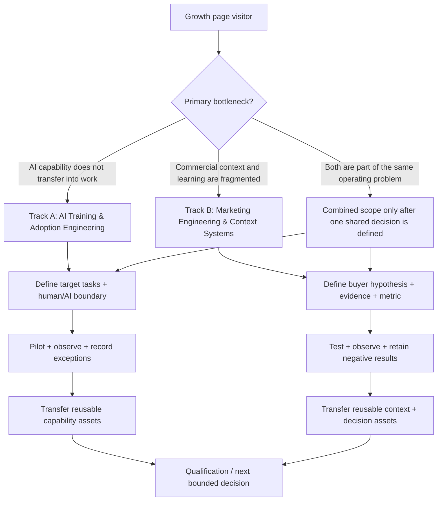

# Adoption & Growth — Evidence-Grounded Landing Page

Source-of-truth page: https://mickael-umt.com/expertises/growth/

## 0. Current page diagnosis

The page currently behaves as a category index, not a decision page. It states the category promise, presents the two Growth offers, surfaces three CV capability cards and sends the visitor to qualification. It does not yet answer the buyer sequence required to convert a category page into a landing page:

`problem -> buyer recognition -> mechanism -> track selection -> delivery -> measurable outcomes -> evidence -> boundary -> CTA`

The upgrade below preserves the existing positioning instead of turning Growth into a generic growth-marketing offer. It keeps the two canonical offers separate:

1. **AI Training & Adoption Engineering — Governed Capability Transfer**
2. **Marketing Engineering & Context Systems**

The category becomes a routing layer around one shared thesis:

> **Do not scale capability or commercial activity that you cannot observe, test and transfer.**

---

# 1. XYZ Statement

**[P] — Problem**

Critical capability and commercial context are dispersed across people, documents, prompts, dashboards and tools. Activity can increase while the organisation still cannot answer: what changed, why it changed, who owns the decision, what should be reused, and what must remain under human review.

**[X] — Product / Service**

**Adoption & Growth Engineering** — a category-level engagement architecture connecting AI Training & Adoption Engineering with Marketing Engineering & Context Systems.

**[Y] — Ideal Client / Customer**

Leaders accountable for adoption or repeatable commercial execution:

- AI Transformation / L&D / Enablement leaders who must turn AI access into observable, governed workplace capability.
- Marketing / Revenue Operations leaders who must turn dispersed positioning, buyer context, offers, prompts and analytics into a reusable operating system.

**[Z] — Benefit**

A measurable and reusable operating capability: explicit decision rights, structured context, instrumented workflows, testable hypotheses, observable transfer and handover assets that survive beyond one campaign, one training cohort or one individual.

**[O] — Delivery Method**

A **3–6 month evidence-led operating-system engagement**, routed into one or both Growth tracks:

`framing -> baseline -> system design -> pilot -> instrumentation -> iteration -> transfer`

Training begins with framing and a pilot cohort of at most 12 participants before programme expansion. Marketing Engineering is delivered as a 3–6 month marketing operating-system and automation engagement.

---

# 2. Elevator Pitch

**Turn scattered capability and commercial context into a system your team can measure, reuse and improve.**

Adoption & Growth Engineering is for leaders who already have activity — AI tools, training, campaigns, content, CRM data, prompts, dashboards — but cannot reliably turn that activity into transferable capability or repeatable commercial decisions. I structure the work into two tracks: governed AI capability transfer for teams, and a versioned marketing context system for revenue execution. The result is not “more activity.” It is a bounded operating system that makes hypotheses, evidence, decisions, ownership and next actions explicit.

---

# 3. Proposed Landing-Page Information Architecture

| Order | Section | Buyer question | NLP / commercial role |
|---|---|---|---|
| S0 | Hero | What does this category solve? | PROBLEM_REFRAME / CATEGORY_PROMISE |
| S1 | Buyer recognition | Is this my problem? | SELF_IDENTIFICATION |
| S2 | Why now | Why is activity alone insufficient? | CONSEQUENCE / DECISION_PRESSURE |
| S3 | Two Growth tracks | Which mechanism fits my situation? | ROUTING / OFFER_SELECTION |
| S4 | Product | What exactly gets built? | MECHANISM_EXPLANATION |
| S5 | Delivery | How does the engagement work? | RISK_REDUCTION / PROCESS |
| S6 | Eight modules | What is included? | SCOPE / VALUE_STACK |
| S7 | Outcomes | What changes after the work? | OUTCOME / ACCEPTANCE |
| S8 | Problems -> solutions | Where does it intervene operationally? | OBJECTION_HANDLING |
| S9 | Evidence | Why use measurement, explicit context and role-based capability? | PROOF / BOUNDARY |
| S10 | Guarantee & capacity | What is and is not guaranteed? | RISK_REVERSAL |
| S11 | FAQ | What still blocks a decision? | OBJECTION_RESOLUTION |
| S12 | CTA | What is the smallest next step? | CONVERSION |

Recommended implementation: add stable `data-seq-id` attributes to each evidence-bearing claim span so TextQuote/TextPosition and DOM refinements can be resolved independently.

---

# 4. Landing Page Copy

## HERO

**Eyebrow**

ADOPTION & GROWTH ENGINEERING

# Turn scattered capability and commercial context into a system your team can measure, reuse and improve.

AI access is not adoption. Marketing activity is not a growth system. This category is for teams that need to convert what lives in people, tools and documents into observable work: explicit roles, structured context, testable hypotheses, instrumented workflows and transferable assets.

**Primary CTA:** Qualify the engagement  
**Secondary CTA:** Choose your Growth track

**Microcopy:** Two tracks. One operating principle: make the work observable before trying to scale it.

---

## [C1] Compelling offer for [O]

# The Adoption & Growth Operating System

A 3–6 month engagement that converts fragmented know-how into an operating layer your team can inspect and reuse.

You do **not** have to buy both tracks.

### Track A — AI Training & Adoption Engineering

For teams that need governed capability transfer, not course attendance.

Build:

- a role / task / competency matrix;
- scenario-based exercises tied to real work;
- evaluation rubrics and escalation rules;
- data-classification and human/AI decision boundaries;
- a transfer-evidence protocol;
- a handover kit that managers can reuse.

### Track B — Marketing Engineering & Context Systems

For teams whose positioning, buyer context and campaign logic are distributed across slides, people, prompts and disconnected systems.

Build:

- versioned avatars and buyer questions;
- offer and positioning architecture;
- source and evidence registers;
- message / hook hypotheses;
- structured prompt and context assets;
- analytics and experiment definitions;
- decision logs connecting what was tested to what changed.

### Shared deliverable

A controlled operating system that distinguishes:

`FACT -> HYPOTHESIS -> TEST -> DECISION -> OWNER -> NEXT ACTION`

---

## [C2] Who is this offer for?

### AI Transformation / L&D / Enablement leaders

You own adoption, but licences, workshops or isolated champions do not tell you whether teams can perform the target work safely and repeatedly.

Your decision is not “Should we train people on AI?”

It is:

> **Which tasks should change, what competence is required, what remains human-owned, and what evidence proves transfer?**

### Marketing / Revenue Operations leaders

You own repeatable revenue execution, but buyer knowledge and campaign logic are fragmented across CRM fields, decks, agency memory, prompt libraries and individual operators.

Your decision is not “Should we create more content?”

It is:

> **Which buyer hypothesis are we testing, what evidence supports it, which signal changes the next action, and how is that learning reused?**

### Not a fit when

- you only need a one-off content batch;
- you want a generic AI-awareness seminar with no workplace-transfer objective;
- you want a guaranteed revenue uplift without a controlled causal design;
- you want automation to replace accountable human decision owners;
- you cannot provide access to the workflows, context or measurement needed to evaluate the problem.

---

## [C3] What is the product?

This is an **operating-system engagement**, not a software licence and not a bundle of disconnected workshops.

The product is the set of decision artefacts, measurement rules, structured context and governed workflows that make adoption or commercial learning transferable.

### Core objects

**Decision map**  
What decision is being improved, who owns it, what evidence is admissible, and when must a human intervene?

**Context registry**  
Avatars, offers, sources, constraints, approved claims, prompt context and unresolved assumptions are versioned instead of reconstructed from memory.

**Capability map**  
For AI adoption, tasks are mapped to required skills, allowed tool use, escalation conditions and observable performance.

**Experiment register**  
Messages, offers or workflow changes are treated as hypotheses with a defined metric, population, period and decision rule.

**Evidence layer**  
External facts, internal observations, recommendations and untested assumptions remain distinct.

**Handover layer**  
The system is documented so another operator can inspect the reasoning, reproduce the workflow and continue the learning loop.

---

## [C4] Why do they need it? What does [Y] desire?

They want **continuity without dependence on one person**.

They want to know:

- which capability actually transferred;
- which buyer message was tested;
- which source supports a claim;
- which workflow changed;
- which signal triggered a decision;
- which result is observed versus inferred;
- which action can be repeated;
- which boundary must not be crossed.

For AI adoption, this matters because the EU AI Act requires providers and deployers to take measures supporting AI literacy while accounting for technical knowledge, experience, education, training and use context. The requirement is contextual, not a mandate for one universal training score.[EU-GR-AI-LITERACY-LAW-2026]

For commercial execution, recent B2B research shows that structured CRM/CPQ variables can contain predictive information that differs materially from expert intuition; that is a reason to preserve decision signals and test them, not evidence that one model or metric should replace sales judgment.[EU-GR-B2B-SALES-SIGNAL-2026]

---

## [C5] How do they get it?

### Phase 1 — Frame the decision

Define the business decision, owner, user group, current workflow, constraints and acceptance criteria.

### Phase 2 — Establish the baseline

Inventory current sources, tools, prompts, training assets, CRM/analytics fields, handoffs and observed failure modes.

### Phase 3 — Build the minimum operating layer

Create only the objects needed for the selected track: capability matrix, context registry, evidence register, experiment plan, workflow rules and decision log.

### Phase 4 — Pilot on bounded work

For Training, start with a pilot cohort of at most 12 participants.  
For Marketing Engineering, start with a bounded buyer / offer / message or workflow slice.

### Phase 5 — Instrument and review

Measure the defined signals. Separate observed outcomes from interpretation. Keep negative and null results.

### Phase 6 — Transfer

Handover the system, decision rules, reusable templates, unresolved risks and next-test backlog.

---

## [C6] Benefits

- Replace scattered context with a versioned source of operating knowledge.
- Make buyer and capability assumptions explicit before scaling activity.
- Connect each test to a metric and a decision rule.
- Preserve negative and null results instead of repeating failed experiments.
- Reduce dependence on one trainer, marketer, prompt author or operator.
- Give managers a clearer boundary between human accountability and AI assistance.
- Build handover artefacts another team member can inspect and continue.
- Keep external evidence, internal observations and recommendations epistemically separate.

---

## [C7] Eight modules

### Module 1 — Decision & Buyer Map
Define the decision owner, buyer/workforce segment, target task, constraints and acceptance criteria.

### Module 2 — Evidence & Context Registry
Version sources, facts, hypotheses, offer context, approved claims and unresolved questions.

### Module 3 — Capability / Task Architecture
Map real tasks to required competence, tool permissions, escalation and observable performance.

### Module 4 — Offer & Message Architecture
Translate buyer problems into bounded offers, message hypotheses, proof requirements and next actions.

### Module 5 — Measurement & Experiment Design
Define metric contracts: variable, unit, population, period, comparator, decision threshold and boundary.

### Module 6 — Workflow & Automation
Connect structured context to prompts, analytics, handoffs and automation without hiding consequential decisions.

### Module 7 — Pilot & Review
Run a bounded cohort or commercial test, inspect observed signals and record what did not work.

### Module 8 — Transfer & Governance
Deliver operating documentation, ownership, reusable templates, review cadence and a prioritized next-test backlog.

---

## [C8] Three best outcomes

### Outcome 1 — Observable capability
Managers can point to defined tasks, rubrics, escalation rules and evidence of transfer instead of using attendance as a proxy for adoption.

### Outcome 2 — Reusable commercial context
Avatars, offers, evidence, messages, prompts and analytics are versioned and connected instead of rebuilt for every campaign or operator.

### Outcome 3 — A decision loop that survives handover
The team can see what was observed, what remains a hypothesis, what decision was made and what should be tested next.

No outcome above is a guarantee of revenue growth, productivity uplift, regulatory compliance or a specific adoption rate.

---

## [C9] Top recurring problems + offer position

| Problem | Offer position |
|---|---|
| Training attendance is reported as adoption. | Track A replaces attendance-only reporting with task-level capability and transfer evidence. |
| AI use grows faster than role boundaries. | Track A maps allowed use, human ownership and escalation to real tasks. |
| Buyer knowledge lives in individual memory. | Track B versions avatars, buyer questions, sources and decision context. |
| Positioning changes without a record of why. | Track B preserves hypotheses, tests, observations and decisions. |
| Content volume rises while learning stays flat. | Track B ties content/message tests to explicit metrics and next actions. |
| CRM data records outcomes but not reasoning. | Track B adds decision context and an evidence/experiment register around the operational data. |
| Teams automate before defining acceptance criteria. | The shared operating layer defines decision and acceptance boundaries first. |
| Negative results disappear. | The experiment register retains null, negative and contradictory evidence. |
| One expert becomes the system. | Handover artefacts externalize reusable context and rules. |
| Leadership sees dashboards but not decision provenance. | Decision logs connect evidence, interpretation, owner and next action. |

---

## [C10] Direct solution to each problem

**Problem 1 — Attendance is used as adoption.**  
Define the tasks that must change, then evaluate observable performance against a rubric and escalation rule.

**Problem 2 — AI boundaries are implicit.**  
Create a human/AI task matrix that names what may be assisted, what requires review and who remains accountable.

**Problem 3 — Buyer context is tacit.**  
Move buyer problems, objections, evidence and offer logic into a versioned context registry.

**Problem 4 — Positioning drifts.**  
Treat each positioning change as a hypothesis with a reason, source and test rather than an undocumented rewrite.

**Problem 5 — Content is produced without learning.**  
Bind each message family to a decision metric and a defined next action.

**Problem 6 — CRM data lacks explanatory context.**  
Preserve the operational signal while attaching the hypothesis and decision that made the signal relevant.

**Problem 7 — Automation arrives before governance.**  
Define authority, acceptance and escalation before automating the workflow.

**Problem 8 — Failed experiments are forgotten.**  
Record negative and null results with the same discipline as wins.

**Problem 9 — One person holds the system together.**  
Externalize the minimum reusable objects needed for another operator to continue the work.

**Problem 10 — Dashboards cannot explain the decision.**  
Add a decision log connecting observation, interpretation, owner, action and boundary.

---

## [C11] Scarcity

No artificial countdown.

The only published capacity constraint in this Growth category is the Training pilot: **at most 12 participants per pilot cohort**.

Other engagement capacity is confirmed during qualification according to actual delivery availability. Do not publish invented “only 2 slots left” scarcity.

---

## [C12] Guarantee

### Proposed acceptance guarantee — requires contractual/legal validation before publication

Every deliverable should have written acceptance criteria before build. If an agreed deliverable does not meet those criteria at handover, the remediation required to meet the agreed criterion is completed before that deliverable is accepted.

**Explicit non-guarantees**

The engagement does not guarantee:

- revenue or pipeline uplift;
- a conversion-rate increase;
- a specific productivity gain;
- a specific adoption rate;
- legal or regulatory compliance by itself;
- model accuracy outside the measured context.

The guarantee is on **delivery against agreed acceptance criteria**, not on an external business outcome the engagement cannot causally control.

---

## [C13] Call to action

# Start with the decision, not the tool.

Bring one adoption or commercial problem that currently depends on scattered context.

In the qualification step, define:

1. the decision that must improve;
2. the people and workflow involved;
3. the evidence already available;
4. the signal that would change the next action;
5. which Growth track fits the problem.

**Primary CTA:** Qualify the engagement  
**Secondary CTA:** Compare the two Growth tracks

---

## [C14] Customer testimonial

**NOT PUBLISHABLE — no verified customer quotation was supplied.**

Do not fabricate a first-person customer testimonial.

### Evidence-safe replacement block

**What can be inspected before engagement**

- the public offer definitions;
- the controlled marketing workbook / context-system proof described in the portfolio;
- documented training experience since 2021;
- public technical repositories and provenance policy;
- the exact deliverables and acceptance criteria proposed for the Growth engagement.

---

## [C15] Positive review

**NOT PUBLISHABLE — no independently verified review was supplied.**

Do not generate a fake review in the voice of the buyer.

### Replacement

Use a **proof card** that states only first-party verifiable facts, then link to the underlying project, repository, credential or evidence record.

---

## [C16] FAQ

### Is this a marketing agency?
No. The Marketing Engineering track builds the context, measurement and decision system around marketing execution. It can coexist with internal marketers, agencies or media specialists.

### Is this an AI training course?
Not by default. The Training & Adoption track starts from target workplace tasks, competence, human/AI boundaries and transfer evidence. A course is only one possible delivery component.

### Do we need both tracks?
No. The Growth page is a routing layer. Use the Training track when the bottleneck is capability transfer; use Marketing Engineering when the bottleneck is commercial context and measurement. Combine them only when both are part of the same decision problem.

### Can you guarantee revenue growth?
No. Revenue is affected by product, market, pricing, distribution, sales execution, timing and other factors. The engagement can instrument decisions and tests; it cannot truthfully guarantee an uncontrolled external outcome.

### Can you guarantee AI adoption?
No universal adoption rate is guaranteed. The work defines target tasks and observable transfer criteria so adoption can be measured in context.

### Do you replace our CRM, LMS or analytics stack?
Not unless replacement is separately justified. The default is to structure the decision layer around the systems already in use.

### Can the system automate decisions?
It can automate bounded steps where authority and acceptance criteria are explicit. Consequential decisions retain named human ownership unless the governance model explicitly establishes otherwise.

### What data do you need?
Only the minimum data needed for the selected decision: current workflow, relevant context, existing evidence and the measurement required to test the proposed change.

### What happens to failed experiments?
They remain in the register. A negative result is information that prevents the team from paying to rediscover the same failure.

### How do we start?
Bring one decision that is currently hard to make because context, capability or evidence is fragmented. Qualification determines the track and the smallest testable scope.

---

## [C17] Ten problems [Y] deals with

**Problem 1:** Training participation is mistaken for capability transfer.  
**Problem 2:** AI use expands without role-level decision boundaries.  
**Problem 3:** Buyer context is scattered across people and files.  
**Problem 4:** Positioning changes faster than evidence can be traced.  
**Problem 5:** Marketing activity is measured without a decision contract.  
**Problem 6:** CRM and analytics record events but not the hypothesis behind them.  
**Problem 7:** Teams cannot distinguish source-backed facts from persuasive assumptions.  
**Problem 8:** Automation is implemented before acceptance and escalation rules are explicit.  
**Problem 9:** Learning disappears when a key operator leaves.  
**Problem 10:** Leadership sees output metrics but cannot reconstruct why the next action was chosen.

---

## [C18] Position the offer as the solution

**Problem 1 -> Solution:** Replace attendance proxies with task-level rubrics and transfer evidence.  
**Problem 2 -> Solution:** Build a human/AI task and authority matrix before scaling use.  
**Problem 3 -> Solution:** Version avatars, buyer questions, sources and offer context in one registry.  
**Problem 4 -> Solution:** Attach each material positioning change to a source, hypothesis and test.  
**Problem 5 -> Solution:** Give every experiment a metric contract and next-action rule.  
**Problem 6 -> Solution:** Connect operational events to the hypothesis and decision they inform.  
**Problem 7 -> Solution:** Label facts, observations, hypotheses, recommendations and forecasts separately.  
**Problem 8 -> Solution:** Define permissions, acceptance, review and escalation before automation.  
**Problem 9 -> Solution:** Deliver reusable context, templates and decision logs as handover assets.  
**Problem 10 -> Solution:** Make the path from evidence to interpretation to action inspectable.

---

## [C19] Landing-page headlines

1. **Turn scattered capability and commercial context into a system your team can measure, reuse and improve.**
2. **AI access is not adoption. Marketing activity is not a growth system.**
3. **Make the work observable before you try to scale it.**
4. **From training attendance to transferable capability.**
5. **From marketing memory to a versioned context system.**
6. **One Growth category. Two operating problems. No forced bundle.**
7. **Stop rebuilding buyer context every time the campaign, prompt or operator changes.**
8. **Give every hypothesis a metric, every decision an owner and every result a boundary.**
9. **Build the context layer that survives the campaign.**
10. **Build AI capability that survives the workshop.**
11. **Measure what changed — and preserve what did not work.**
12. **Start with the decision, not the tool.**

---

# 5. Evidence Registry

## EU-GR-B2B-SALES-SIGNAL-2026

**Source**  
Sormunen, T. et al. “Predicting sales offer success of industrial configure-to-order equipment: evaluating explainable AI approach with B2B sales experts.” *Journal of Marketing Analytics*. Published 27 August 2026. Open access.  
https://link.springer.com/article/10.1057/s41270-026-00518-7

**Epistemic class**  
`PREDICTIVE / COMPARATIVE`, not causal.

**Atomic evidence**

- Cleaned dataset: **439** completed B2B sales cases from two countries.
- Model balanced accuracy: **83.9%** on the full dataset.
- Sales-personnel binary win/loss balanced accuracy on the same dataset: **63.0%**.
- Country-A model: **74.1%**; sales personnel: **54.4%**.
- Five business-operations experts evaluated explanation utility.

**Permitted copy inference**  
Structured CRM/CPQ variables in this measured industrial dataset contained predictive information that differed from expert judgement. This supports preserving measurable decision signals and explicit context.

**Forbidden inference**  
Do not claim AI improves sales, increases win rate, replaces sales experts, or that these accuracy values generalize to another company.

**Placement target**  
S4/S9: “structured CRM/CPQ variables can contain predictive information that differs materially from expert intuition.”

**Status**  
`SOURCE_VERIFIED; METHOD_VISIBLE; BOUNDED; IMMUTABLE_SOURCE_SNAPSHOT_NOT_MATERIALIZED -> BLOCKED_PRECHECK_FOR_AGENT_EXPLOITABILITY`

---

## EU-GR-MESSAGE-BELIEF-2026

**Source**  
Dubé, J.-P. H., Morozov, I., She, F., & Tuchman, A. “The Effects of Ads on Beliefs and Implications for Consumer Search.” NBER Working Paper 35596. August 2026. DOI 10.3386/w35596.  
https://www.nber.org/papers/w35596

**Epistemic class**  
`CAUSAL` inside the experiment.

**Method**  
Incentivized experiment in a simulated online store; randomized ad exposure, ad content and advertised price; beliefs and choices elicited.

**Atomic evidence**  
Ad exposure/content changed beliefs about price and quality, and the study reports causal effects of those belief shifts on search and purchase behavior.

**Permitted copy inference**  
Treat message and visibility choices as hypotheses to test rather than as settled positioning truth.

**Forbidden inference**  
Do not transfer the effect magnitude or causal result to B2B consulting buyers; do not claim a specific conversion lift.

**Placement target**  
S5/S9 methodology rationale; Level-2 evidence only.

**Status**  
`CANONICAL_IDENTIFIER_VERIFIED; NON_PEER_REVIEWED_WORKING_PAPER; NO_NUMERIC_L1_CLAIM; IMMUTABLE_SOURCE_SNAPSHOT_NOT_MATERIALIZED`

---

## EU-GR-AI-ORG-CAPITAL-2026

**Source**  
Babina, T., He, A. X., & Jiang, R. “Canaries in the Gold Mine: Early Productivity Gains from Artificial Intelligence Creating Organization Capital.” NBER Working Paper 35684. August 2026. DOI 10.3386/w35684.  
https://www.nber.org/papers/w35684

**Epistemic class**  
`ASSOCIATIONAL / MECHANISM_INTERPRETATION`.

**Atomic evidence**  
The paper reports recent productivity growth associated with firm AI investment and links the pattern to a constructed measure of organisation capital: durable firm-specific knowledge developed through learning-by-doing.

**Permitted copy inference**  
Reusable organisational knowledge is a legitimate object to model and preserve; the Growth offer can therefore frame context/capability as an operating asset.

**Forbidden inference**  
Do not claim this consulting engagement causes productivity growth.

**Placement target**  
S3/S4, Level-2 mechanism rationale.

**Status**  
`CANONICAL_IDENTIFIER_VERIFIED; NON_PEER_REVIEWED_WORKING_PAPER; IMMUTABLE_SOURCE_SNAPSHOT_NOT_MATERIALIZED`

---

## EU-GR-AI-LITERACY-LAW-2026

**Source**  
European Commission, “AI talent, skills and literacy,” current page updated in 2026.  
https://digital-strategy.ec.europa.eu/en/policies/ai-talent-skills-and-literacy

**Epistemic class**  
`NORMATIVE / REGULATORY`.

**Atomic evidence**  
Article 4 requires providers and deployers of AI systems to take measures supporting AI literacy of staff and other persons using AI on their behalf, taking technical knowledge, experience, education, training and use context into account. Supervision/enforcement is stated as starting in August 2026.

**Permitted copy inference**  
Role/context-sensitive AI literacy is a real governance requirement; a single universal training score is not required by the Commission page.

**Forbidden inference**  
Do not claim the Growth engagement itself creates compliance or legal safe harbour.

**Placement target**  
C4 / S2: role-based AI capability rationale.

**Status**  
`PRIMARY_OFFICIAL_SOURCE_VERIFIED; NORMATIVE_SCOPE_BOUNDED; IMMUTABLE_SOURCE_SNAPSHOT_NOT_MATERIALIZED`

---

## EU-GR-WORKFORCE-SKILLS-2026

**Source**  
International Labour Organization, “Changing landscape of skills in the age of AI.” Published 13 August 2026.  
https://www.ilo.org/publications/changing-landscape-skills-age-ai

**Epistemic class**  
`DESCRIPTIVE / POLICY_RESEARCH`.

**Atomic evidence**  
The joint report states that workplace AI adoption is reshaping cognitive, socioemotional, digital and AI skill requirements and highlights AI literacy, adaptability, resilience and human agency.

**Permitted copy inference**  
Training should be tied to changing task/skill requirements and preserve human agency.

**Forbidden inference**  
Do not claim any specified productivity or adoption uplift from training.

**Placement target**  
S2/S4 Training track evidence layer.

**Status**  
`OFFICIAL_SOURCE_VERIFIED; QUALITATIVE; IMMUTABLE_SOURCE_SNAPSHOT_NOT_MATERIALIZED`

---

## EU-GR-ECB-ADOPTION-BARRIERS-2026

**Source**  
European Central Bank, “AI adoption and the productivity promise: what workers report.” Published 26 August 2026.  
https://www.ecb.europa.eu/press/blog/date/2026/html/ecb.blog20260826~e1c1a89999.en.html

**Epistemic class**  
`OBSERVED_SURVEY / DESCRIPTIVE`.

**Population / method**  
ECB Consumer Expectations Survey; approximately 20,000 respondents per month across 11 euro-area countries, per the ECB article.

**Atomic evidence**  
The ECB reports that workplace AI use has increased, workers report time savings, outcomes vary materially and barriers to uptake remain.

**Permitted copy inference**  
Adoption should be evaluated by role/workflow and measured outcomes rather than treated as a binary licence-access state.

**Forbidden inference**  
Do not claim a specific productivity gain for a client from AI adoption.

**Placement target**  
S2/S5, Level-2 evidence.

**Status**  
`OFFICIAL_PRIMARY_SOURCE_VERIFIED; DESCRIPTIVE; IMMUTABLE_SOURCE_SNAPSHOT_NOT_MATERIALIZED`

---

# 6. Rejected / Quarantined Evidence Candidates

| Candidate | Decision | Reason |
|---|---|---|
| Google Demand Gen “30% increase in conversions/value” | REJECT | Vendor-promotional internal platform data; violates competitor/vendor promotional gate for primary commercial evidence. |
| Generic RevOps “10–20% faster growth / 30% lower CAC” claims | REJECT | Secondary consultancy claims with unverified provenance and causal scope. |
| Gartner AI-literacy assessment | REJECT | Paywalled / subscription research and insufficient accessible method for this evidence pipeline. |
| Small non-attributed vendor interview studies | QUARANTINE | Useful discovery signal, but sample/method/source independence is insufficient for dominant commercial copy. |
| Any invented testimonial or review | REJECT | Fabricated social proof violates provenance and factfulness. |
| “This engagement increases revenue/productivity/adoption by X%” | REJECT | No matched causal client evidence. |
| “AI training guarantees compliance” | REJECT | Regulatory requirement does not entail compliance from a specific programme. |

---

# 7. Evidence Placement Plan

The current live page does **not** contain the proposed copy, so `xpath_match_count == 1` cannot truthfully be asserted yet.

The production implementation should add stable sequence identifiers and preserve the exact atomic evidence-bearing claim text.

| Seq ID | Proposed DOM refinement | Atomic claim | EU | Current status |
|---|---|---|---|---|
| `growth:need:ai-literacy` | `//*[@data-seq-id='growth:need:ai-literacy']` | “Article 4 requires providers and deployers to take measures supporting AI literacy ... taking ... use context into account.” | EU-GR-AI-LITERACY-LAW-2026 | `PENDING_DEPLOYMENT_SELECTOR_ASSERT` |
| `growth:proof:b2b-signal` | `//*[@data-seq-id='growth:proof:b2b-signal']` | “In this measured industrial dataset, structured CRM/CPQ variables contained predictive information that differed from expert judgement.” | EU-GR-B2B-SALES-SIGNAL-2026 | `PENDING_DEPLOYMENT_SELECTOR_ASSERT` |
| `growth:method:message-test` | `//*[@data-seq-id='growth:method:message-test']` | “Message and visibility choices should be treated as hypotheses to test, not settled truth.” | EU-GR-MESSAGE-BELIEF-2026 | `RECOMMENDATION; L2_SOURCE_BASIS; PENDING_SELECTOR_ASSERT` |
| `growth:mechanism:org-capital` | `//*[@data-seq-id='growth:mechanism:org-capital']` | “Reusable organisational knowledge is an operating asset worth preserving.” | EU-GR-AI-ORG-CAPITAL-2026 | `MECHANISM_RECOMMENDATION; PENDING_SELECTOR_ASSERT` |
| `growth:training:skills` | `//*[@data-seq-id='growth:training:skills']` | “Workplace AI adoption is reshaping cognitive, socioemotional, digital and AI skill requirements.” | EU-GR-WORKFORCE-SKILLS-2026 | `PENDING_DEPLOYMENT_SELECTOR_ASSERT` |
| `growth:adoption:barriers` | `//*[@data-seq-id='growth:adoption:barriers']` | “Reported AI outcomes vary and barriers to uptake remain.” | EU-GR-ECB-ADOPTION-BARRIERS-2026 | `PENDING_DEPLOYMENT_SELECTOR_ASSERT` |

### Level-1 citation rule

Use quiet numeric markers only after the smallest entailed claim span. Do not attach citations to CTAs, guarantees, duration, capacity or delivery terms unless supported by first-party contractual/operational evidence.

### Level-2 disclosure

Each disclosure must expose:

- EU id;
- metric or bounded source statement;
- population / context;
- period;
- source;
- boundary;
- internal evidence route;
- verified external source URL.

---

# 8. Deterministic Validation

## Policy resolution

- [x] Current @neofort policies resolved.
- [x] `judge:evidence-placement:presentation-v1.2` is current.
- [x] No object named `graph judge:eu:placementv14` exists in current @neofort; the current applicable placement judge is v1.2.
- [x] Judge execution contract: temperature 0, top_p 1, 3 replicas, hard-gate AND, minimum score.
- [x] Inapplicable programmability judges excluded.

## Copy scope

- [x] Only `/expertises/growth/` is targeted.
- [x] Existing two Growth offers preserved.
- [x] No unrelated page mutation proposed.
- [x] Public copy is English.
- [x] Commercial promise remains bounded to deliverables and operating capability.

## Factfulness

- [x] No fabricated statistics.
- [x] No fabricated sources.
- [x] No fabricated testimonials.
- [x] No guaranteed revenue/productivity/adoption result.
- [x] B2B predictive study kept predictive, not causal.
- [x] NBER organisation-capital evidence kept associational.
- [x] Regulatory evidence kept normative; no compliance guarantee.
- [x] Vendor-promotional conversion claim rejected.
- [x] Population and transfer boundaries are explicit.

## Commercial terms

- [x] Training pilot capacity (<=12) comes from first-party `/site` offer data.
- [x] 3–6 month delivery cadence comes from first-party `/site` Growth offer data.
- [x] Proposed guarantee is explicitly marked as requiring contractual/legal validation.
- [x] No external research is used to “prove” price, duration, guarantee or CTA.

## Deterministic preflight blockers

- [ ] Immutable source snapshots with verified hashes are not materialized in @neofort.
- [ ] Proposed copy is not yet deployed to the live DOM.
- [ ] TextQuote + TextPosition + DOM selector consensus cannot yet be asserted.
- [ ] `xpath_match_count == 1` cannot yet be asserted on the proposed claims.
- [ ] Three external semantic-judge replicas have not been materialized against an immutable evidence snapshot.

Therefore:

```text
DETERMINISTIC_SOURCE_PREFLIGHT = BLOCKED
SEMANTIC_JUDGE_EXECUTION = NOT_RUN
AGENT_EXPLOITABILITY = false
PLACEMENT_FINAL_PASS = false
PUBLICATION = BLOCKED
COPY_ARTIFACT_PERSISTENCE_TO_GITHUB = ALLOWED
```

This is intentional fail-closed behaviour. A GitHub commit records the proposed copy/evidence contract; it does not certify evidence truth or authorize automatic publication.

---

# 9. Integration Decision Graph



---

# 10. Missing information required for FINAL_PASS

1. Materialized immutable snapshots of the selected primary sources, with verified hashes or equivalent current @neofort origin artifacts.
2. The deployed English DOM for `/expertises/growth/`.
3. Exact TextQuote, TextPosition and DOM refinements resolved against the same page snapshot.
4. `xpath_match_count == 1` for every public citation anchor.
5. Three deterministic semantic-judge replicas on the identical immutable evidence snapshot.
6. Contract/legal approval if the proposed acceptance guarantee is to be published.

Until those exist, the copy may be reviewed and integrated manually, but the evidence-placement pipeline must remain fail-closed.
